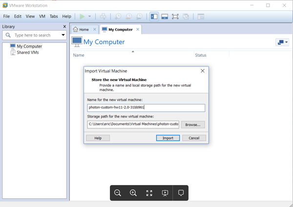
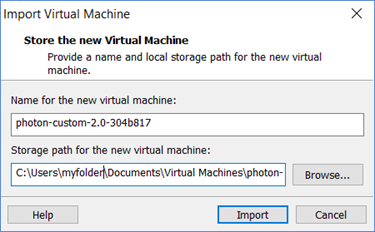
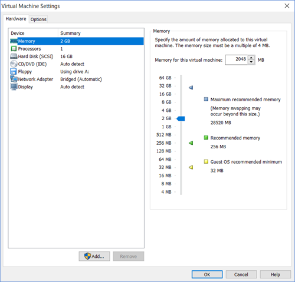
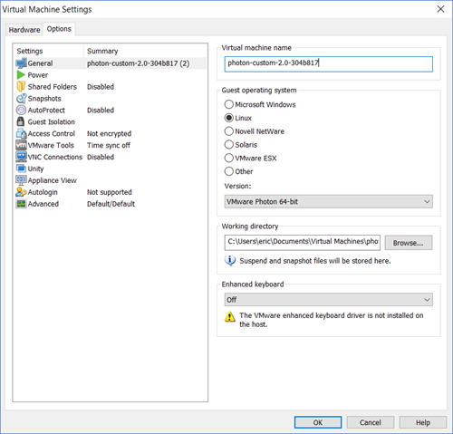
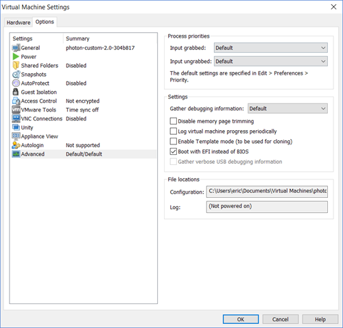

# Importing the OVA for Photon OS 3.0

Using the OVA is the easiest way to create a Photon OS VM on VMware Workstation. 

After you have downloaded the the OVA file (OVA with Hardware Version 11), perform the following steps:

1. Start the Import Process

    - Double-click it to start the import process, or
    - Start VMware Workstation and, from the File menu, choose **Open**.

    

1. Specify the Name and Storage Location

    Change the name and storage location, if you want.
    
    
    
    Choose **Import**.
    
    
    
    Review the License Agreement and choose **Accept**.

1. Configure VM Settings

    Once the OVA is imported, Workstation displays a summary of the settings for your Photon OS VM.
    
    
    
    Choose **Edit virtual machine settings**. Workstation displays the Virtual Machine settings. You can either accept the defaults or change settings as needed.
    
    
    
    Select the Options tab.
    
    

    Under Guest operating system, select **Linux**.
    
    For Version, click the list and select **VMWare Photon 64-bit**.
    
    
    
    **Note:**  If you want to configure a secure boot for the Photon OS VM, select **Advanced**  and select (check) **Boot with EFI instead of BIOS**. The EFI boot ensures that the ISO content is signed by VMware and that the entire stack is secure.
    
    
    
    Choose **OK**.

1. Power on the VM

    From the tab, choose  **Power on this virtual machine**.
    
    
    
    After the splash screen, Workstation will prompt you to log in.

1. Update Login Credentials

    **Note** : Because of limitations within OVA support on Workstation, it was necessary to specify a default password for the OVA option. However, all Photon OS instances that are created by importing the OVA will require an immediate password change upon login. The default account credentials are:
    
    - Username: ``root``
    - Password: ``changeme``
    
    After you provide these credentials, Workstation prompts you to create a new password and type it a second time to verify it. For security, Photon OS forbids common dictionary words for the root password. Once logged in, you will see the shell prompt.
    
    
    
    Once complete, proceed to [Deploying a Containerized Application in Photon OS](deploying-a-containerized-application-in-photon-os.md).