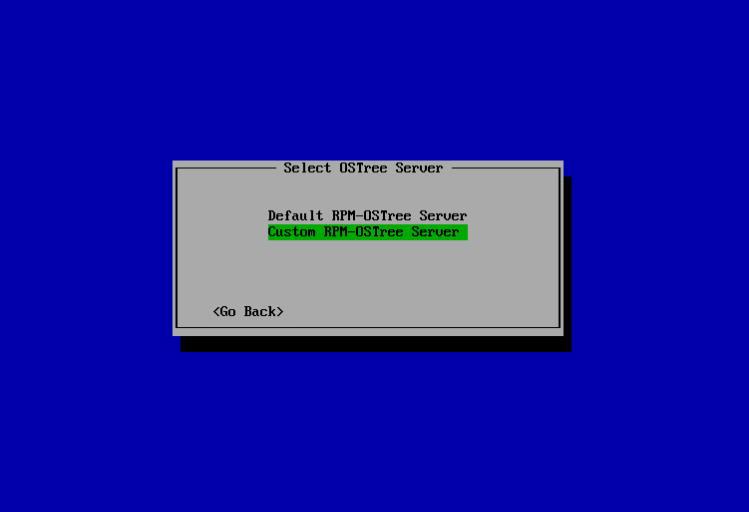

Organizations that maintain their own OSTree servers create custom image trees suited to their needs from which hosts can be deployed and upgraded. One single server may make available several branches to install, for example "base", "minimal" and "full". Or, if you think in terms of Windows OS SKUs - "Home", "Professional" or "Enterprise" edition.

So in fact there are two pieces of information the OSTree host installer needs - the server URL and the branch ref. Also, there are two ways to pass this info - manually via keyboard, when prompted and automated, by reading from a config file.

## Manual install of a custom host

For Photon 1.0 or 1.0 Revision 2, installing a Photon RPM-OSTree host that will pull from a server repository of your choice is very similar to the way we installed the host against the default server repo in [Chapter 2](../installing-a-host-against-default-server-repository/).  

We will follow the same steps, selecting "Photon OSTree Host", and after assigning a host name like **photon-host** and a root password, this time we will click on "Custom RPM-OSTree Server".  



An additional screen will ask for the URL of server repo - just enter the IP address or fully qualified domain name of the [server installed in the previous step](../creating-a-rpm-ostree-server/).  


Once this is done and the installation finished, reboot and you are ready to use it.
You may verify - just like in [Chapter 3.1](../concepts-in-action/#querying-the-deployed-filetrees) - that you can get an rpm-ostree status. The value for the CommitID should be identical to the [host that installed from default repo](../installing-a-host-against-default-server-repository/), if the [server](../creating-a-rpm-ostree-server/) has been installed fresh, from the same ISO.  

## Automated install of a custom host via kickstart

Photon 3.0 supports automated install that will not interact with the user, in other words installer will display its progress, but will not prompt for any keys to be clicked, and will boot at the end of installation.  

If not familiar with the way kickstart works, visit [Kickstart Support in Photon OS](../../../user-guide/working-with-kickstart/). The kickstart json config for OSTree is similar to minimal or full, except for these settings that should sound familiar: 

```
    ...
    "type": "ostree_host",
    "ostree_repo_url": "http://192.168.218.249",
    "ostree_repo_ref": "photon/3.0/x86_64/minimal",
    ...
```
Or, for default installation

```
    ....
    "type": "ostree_host",
    "default_repo": true,
    ....
```

If the server is a future version of Photon OS, say Photon OS 4.0, and the administrator composed trees for the included json files, the ostree_repo_ref will take either value: **photon/4.0/x86_64/base**, **photon/4.0/x86_64/minimal**, or **photon/4.0/x86_64/full**.

In most situations, kickstart file is accessed via http from PXE boot. That enables booting from network and end to end install of hosts from pre-defined server URL and branch without assistance from user. 
