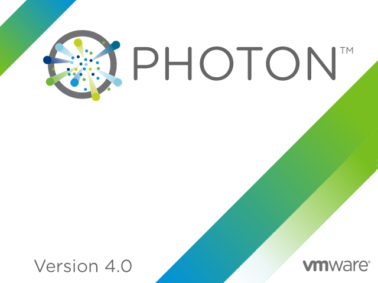

The Photon OS Documentation provides information about how to install, configure, and use VMware Photon OS&trade;.

 

**Product version: 4.0**

This documentation applies to all 4.0.x releases.

## Intended Audiences

This information is intended for Photon OS administrators and developers:

|**Description of Task**|**Relevant Documentation**|
|---|---|
|Understand Photon OS|[Overview of Photon OS](overview/)|
|Download and Install Photon OS|[Installation Guide](installation-guide/)|
|Fundamentals of administering Photon OS |[Administration Guide](administration-guide/)|
|Using Photon OS|[User Guide](user-guide/)|
|Using Photon OS command-line utilities|[Command-Line Interface Reference](command-line-reference/)|
|Solutions for common problems |[Troubleshooting Guide](troubleshooting-guide/)|

----------
