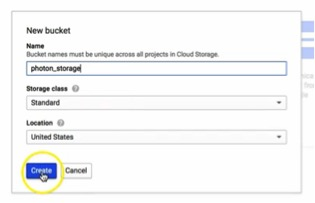
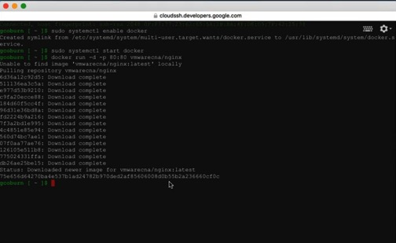

# Running Photon OS on Google Compute Engine

This guide describes how to get started using Photon OS as a virtual machine on Google Compute Engine (GCE). Once Photon OS is installed as an image on GCE, this document shows how to deploy a containerized application in Docker with a single command.

- [About Photon OS](#about-photon-os)
- [Prerequisites for Photon OS on GCE](#prerequisites-for-photon-os-on-gce)
- [Downloading Photon OS](#downloading-photon-os)
- [Installing Photon OS on Google Compute Engine](#installing-photon-os-on-google-compute-engine)
- [Deploying a Containerized Application in Photon OS](#deploying-a-containerized-application-in-photon-os)

## About Photon OS

Photon OS™ is an open source Linux container host optimized for cloud-native applications, cloud platforms, and VMware infrastructure. Photon OS provides a secure run-time environment for efficiently running containers. For an overview, see  [https://vmware.github.io/photon/](https://vmware.github.io/photon/).

## Prerequisites for Photon OS on GCE

Using Photon OS on Google Compute Engine requires the following resources:

* An account on Google Compute Engine
* The Google Cloud SDK
* The Photon OS image for GCE

Keep in mind that, if you try the examples in this document, Google will charge your account for the cloud services that you use. The GCE-ready version of Photon OS, however, comes for free.

## Downloading Photon OS

VMware recommends that administrators use the Photon OS image for Google Compute Engine (GCE) to create Photon OS instances on GCE. Although earlier releases of Photon OS required heavy modification of the Photon instance to make the image compatible with GCE, Photon OS 1.0 comes with pre-modified images for popular cloud providers, including GCE.

You can download the Photon OS image for GCE from the following URL:

[https://bintray.com/vmware/photon](https://bintray.com/vmware/photon)

For instructions, see [Downloading Photon OS](Downloading-Photon-OS.md).

## Installing Photon OS on Google Compute Engine

After you download the Photon OS image for GCE, log into GCE and complete the following steps.

### Step 1: Create a New Bucket

Create a new bucket to store your Photon OS image for GCE.

### Step 2: Upload the Photon OS Image

Once you’ve created the bucket, you’re ready to upload the Photon OS image. While viewing the bucket that you’ve created, click the `Upload files` button, navigate to your Photon OS image and click the `Choose` button. 

As the image below shows, when the upload finishes, you should see your Photon OS compressed image in the file list for the bucket that you created.

### Step 3: Create a New Image

Next, you need to create a new image. Click on `Images` in the `Compute` category in the left panel; then, click on the `New Image` button. 

Enter a name for the image in the `Name` field and change the `Source` to `Cloud Storage file` using the pull-down menu. Then, in the `Cloud Storage file` field, enter the bucket name and filename as the path to the Photon OS image for GCE. In this example, where the bucket was named `photon_storage,` the path is as follows:
 
	photon_storage/photon-gce-2.0-tar.gz

*Note: The new image form will autopopulate the `gs://` file path prefix.*

After you’re finished completing the name and Cloud Storage object path, click the `Create` button to create your image. You should be returned to your Images catalog and your Photon OS image should be at the top of the list. 

### Step 4: Create a New Instance

To create an instance, check the box next to the Photon OS image and click the `Create Instance` button. 

On the `Create a new instance` form, provide a name for this instance, confirm the zone into which this instance is to be deployed and, before clicking `Create,` place a check in the boxes for `Allow HTTP traffic` and `Allow HTTPS traffic.` 

Outside of this demo, your application may or may not require these firewall rules. Please choose accordingly outside of this demo. However, since we will demonstrate a running web server container, we want these ports to be open for our instance. 

When the instance is created you will be returned to your list of VM instances. If you click on the instance, the status page for the instance will allow you to SSH into your Photon OS environment using the SSH button at the top of the panel. 

At this point, your instance is running and you are ready to start the Docker engine and run a container workload.

## Deploying a Containerized Application in Photon OS

Now that you have your container runtime environment up and running, you can easily deploy a containerized application. For this example, you will deploy the popular open source Web Server Nginx. The Nginx application has a customized VMware package that is published as a dockerfile and can be downloaded directly through the Docker module from the Docker Hub.

### Step 1: Run Docker

To run Docker from the command prompt, enter the command below to initialize the Docker engine:

    systemctl start docker

To ensure Docker daemon service runs on every subsequent VM reboot, enter:
 
    systemctl enable docker

### Step 2: Run the Nginx Web Server

Now that the Docker daemon service is running, it is a simple task to pull and then start the Nginx Web Server container from Docker Hub.  To do this, type the following command:
 
    docker run -d -p 80:80 vmwarecna/nginx

This command pulls the Nginx Web Server files and the dependent containers to ensure this containerized application can run.  You will see a screenshot similar to the one below, as the container and dependencies are downloaded and the container is prepared to run:

Once the `docker run` process is completed, you will be returned to the command prompt.  You now have a fully active website up and running through typing just a single command within Photon OS using containers.

### Step 3: Test the Web Server

**Note** : Please make sure that the proper security policies have been enabled on the Google GCE side to enable traffic to port 80 on the VM.

To test that your web server is active, we need to get the IP address of the Photon OS virtual machine. To get the IP address, enter the following command:

This command displays a list of network adapters connected to the virtual machine. Typically, the web server daemon will be bound to `eth0;` record the IP address associated with `eth0.` Alternatively, visit the status page of your Photon OS instance in GCE where the IP address is listed under `External IP.`

Start a browser on your host machine and enter the IP address of your Photon OS virtual machine. The following screen should appear, showing that your web server is active:

You can now run any other containerized application from Docker Hub or your own containerized application within Photon OS.
