# Running Photon OS on vSphere

This guide describes how to get started using Photon OS as a virtual machine within VMware vSphere. It provides instructions for downloading Photon OS (as an OVA or ISO file), describes the various installation options, and walks through the steps of installing the Photon OS distribution on vSphere. Once Photon OS is installed, this document highlights how to deploy a containerized application in Docker with a single command.

- [About Photon OS](#about-photon-os)
- [Deciding Whether to Use OVA or ISO](#deciding-whether-to-use-ova-or-iso)
- [Downloading Photon OS](#downloading-photon-os)
- [Importing the OVA for Photon OS 2.0](#importing-the-ova-for-photon-os-20)
- [Installing the ISO Image for Photon OS 2.0](#installing-the-iso-image-for-photon-os-20)
- [Deploying a Containerized Application in Photon OS](#deploying-a-containerized-application-in-photon-os)
- [Installing Photon OS v1.0](#installing-photon-os-10)

**Note**: If you want to upgrade an existing Photon 1.0 VM, refer to the instructions in [Upgrading to Photon OS 2.0](Upgrading-to-Photon-OS-2.0.md). 

## About Photon OS

Photon OS™ is an open source Linux container host optimized for cloud-native applications, cloud platforms, and VMware infrastructure. Photon OS provides a secure run-time environment for efficiently running containers. For an overview, see  [https://vmware.github.io/photon/](https://vmware.github.io/photon/).

## Requirements

Using Photon OS within VMware vSphere requires the following resources:

| **Resources** | **Description** |
| --- | --- |
| VMware vSphere installed | VMware web client (v6.5) for ESXi hosts (recommended) **Note:** vSphere 6 and vSphere 5.5 (these clients provide limited support; not all features are available). |
| Memory | ESXi host with 2GB of free RAM (recommended) |
| Storage | **Minimal Photon install** : ESXi host with at least 512MB of free space (minimum); **Full Photon install** : ESXi host with at least 4GB of free space (minimum); 16GB is recommended |
| Distribution File | Photon OS ISO or OVA file downloaded from Bintray |

Resource requirements and recommendations vary depending on several factors, including the host environment (for example, VMware vSphere and VMware Fusion), the distribution file used (ISO or OVA), and the selected installation settings (for example, full or basic installation).

**Note:** The setup instructions in this guide use VMware vSphere 6 and the vSphere web client.

## Deciding Whether to Use OVA or ISO

The first step is decide whether to use the OVA or ISO distribution to set up Photon OS.

- **OVA import** : Because of the nature of an OVA, you're getting a pre-installed version of Photon OS. You can choose the hardware version you want (OVA with hardware version 13 or 11). The OVA benefits from a simple import process and some kernel tuning for VMware environments. However, because it's a pre-installed version, the set of packages that are installed are predetermined. Any additional packages that you need can be installed using tdnf.
- **ISO install** : The ISO, on the other hand, allows for a more complete installation or automated installation via kickstart.

If you're just looking for the fastest way to get up and running, start with the OVA.

## Downloading Photon OS

Once you've decided which way to install, you'll need to download the correct binaries. Go to the following Bintray URL and download the latest release of Photon OS:

[https://bintray.com/vmware/photon/](https://bintray.com/vmware/photon/)

For instructions, see [Downloading Photon OS](Downloading-Photon-OS.md).

**Note:** For ISO installation, you will need to upload to a datashare that is attached to the ESXi host, or mount the file share (where the ISO resides) as a data store.

## Importing the OVA for Photon OS 2.0

Using the OVA is a fast and easy way to create a Photon OS VM on VMware vSphere.

After you've downloaded the OVA, log in to your vSphere environment.

### Step 1: Start the Import Process

From the Actions pull-down menu, choose **Create/Register VM**.

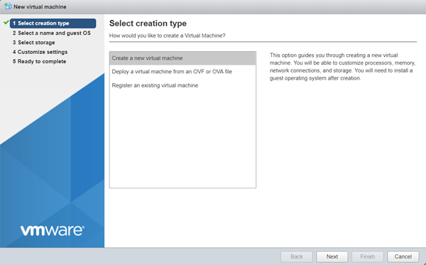

In the Select creation type window, choose  **Deploy a virtual machine from an OVF or OVA file**.

(images/vs-ova-new-vm-ova.png)

Choose **Next**.

### Step 2: Select the OVA File

Enter a name for the virtual machine, and select the OVA file.

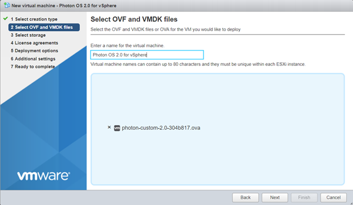

Choose **Next**.

### Step 3: Specify the Target Datastore

From the Select storage screen, select the target datastore for your VM.

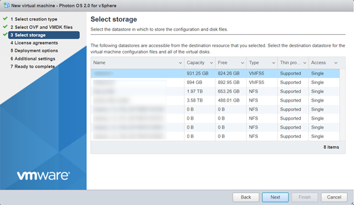

Choose  **Next**.

### Step 4: Accept the License Agreement

Read through the Photon OS License Agreement, and then choose **I Agree**.

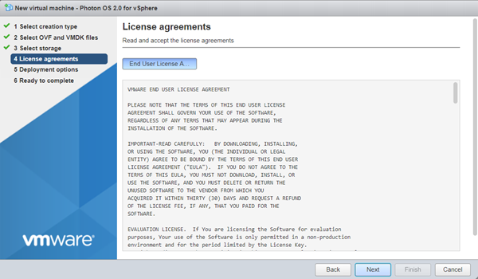

Choose **Next**.

### Step 5: Select Deployment Options

Select deployment options.

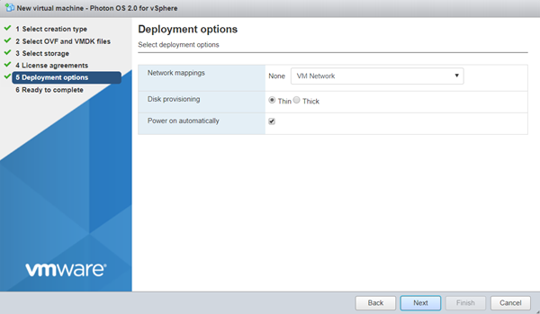

Photon OS is provisioned with a maximum disk size. By default, Photon OS uses only the portion of disk space that it needs, usually much less that the entire disk size ( **Thin** client). If you want to pre-allocate the entire disk size (reserving it entirely for Photon OS instead), select **Thick**  instead.

Choose **Next**.

### Step 6: Verify Deployment Settings

Verify your deployment settings.

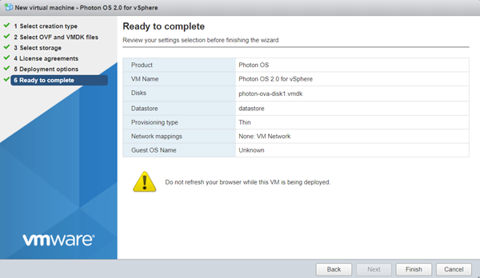

Click **Finish**. vSphere uploads and validates your OVA. Depending on bandwidth, this operation might take a while.

When finished, vShield powers up a new VM based on your selections.

### Step 7: Change Login Settings

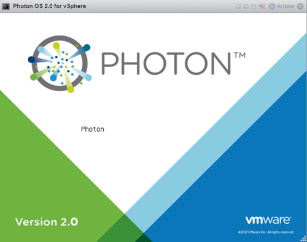

After the VM is booted, open the command window. vSphere prompts you to log in.

**Note**: Because of limitations within OVA support on vSphere, it was necessary to specify a default password for the OVA option. However, all Photon OS instances that are created by importing the OVA will require an immediate password change upon login. The default account credentials are:

| **Setting** | **Value** |
| --- | --- |
| Username | ``root`` |
| Password | ``changeme`` |

After you provide these credentials, vSphere prompts you to create a new password and type it a second time to verify it.

**Note:** For security, Photon OS forbids common dictionary words for the root password.  

Once logged in, you will see the shell prompt.

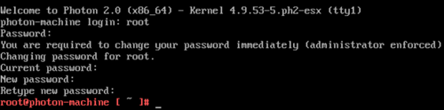

Once complete, proceed to [Deploying a Containerized Application in Photon OS](#deploying-a-containerized-application-in-photon-os).

### Step 9: Export the VM as a Template (Optional)

Consider converting this imported VM into a template (from the Actions menu, choose **Export** ) so that you have a master Photon OS instance that can be combined with vSphere Guest Customization to enable rapid provisioning of Photon OS instances.

## Installing the ISO Image for Photon OS 2.0

After you have downloaded the Photon OS ISO image into a folder of your choice, complete the following steps.

### Step 1: Upload the ISO Image

Upload the ISO image to a datastore that is attached to the host on which you'll create the Photon OS virtual machine.

### Step 2: Create a New VM

Log in to your vSphere environment. In the Virtual Machines window, choose **Create/Register VM**.

On the Select creation type screen, select **Create a new virtual machine**.

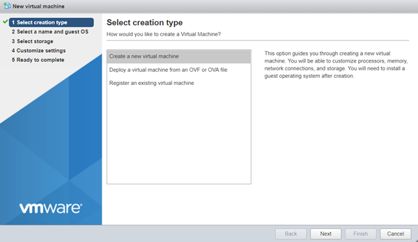

Choose **Next**.

### Step 3: Configure VM Settings

Specify a VM name.

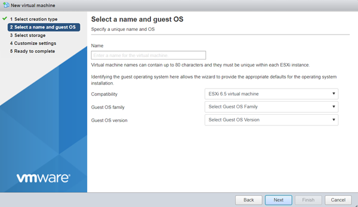

Specify a guest operating system.

- For Compatibility, select **ESXi 6.5**.
- For Guest OS family, select **Linux**.
- For Guest OS version, select **VMware Photon OS (64-bit)**.

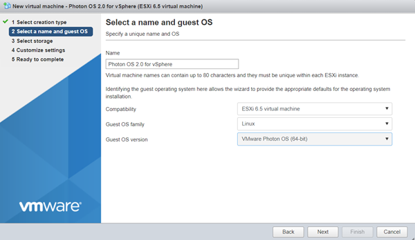

Choose  **Next**.

### Step 4: Select the Target Datastore

Select the datastore where you want to store the VM.

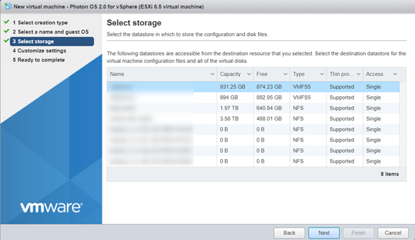

Click **Next**.

### Step 5: Customize VM Settings

Customize the virtual machine settings.

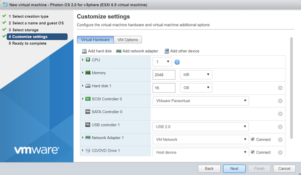

For CD/DVD Drive 1, click the drop-down and select **Datastore ISO file**.

In the Datastore browser, select the ISO that you want to import.

Change other settings as applicable.

- The recommended virtual hardware settings for your Photon VM are heavily dependent upon the container load you intend to run within Photon OS – more containers or more intensive containers will require you to adjust these settings for your application load. VMware suggests 2 vCPU, 1024MB memory, 20GB hard disk. Any unwanted devices should be removed. Be sure to mount the Photon OS ISO on the CD/DVD Drive and put a check in the box next to, Connect At Power On.
- If you want to configure a secure boot for the Photon OS VM you created, choose the VM Options tab, expand Boot Options, and select EFI from the firmware drop-down.  An EFI boot ensures that the ISO content is signed by VMware and that the entire stack is secure.

Choose **Next**.

### Step 6: Verify VM Settings

The installer displays a summary of your selected settings.

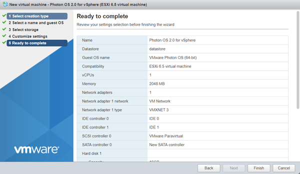

Click **Finish**. vSphere creates the VM.

### Step 7: Power on the VM

Select the VM and power it on.

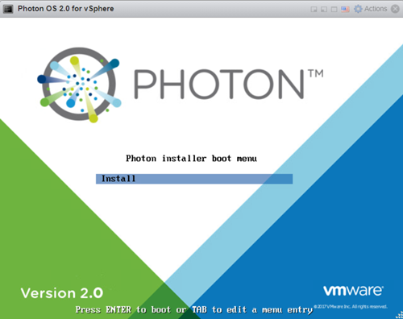

When you see the Photon Installer boot menu, press Enter on your keyboard to start installing.

### Step 8: Accept the License Agreement

Read the License Agreement and press the Enter key to accept.

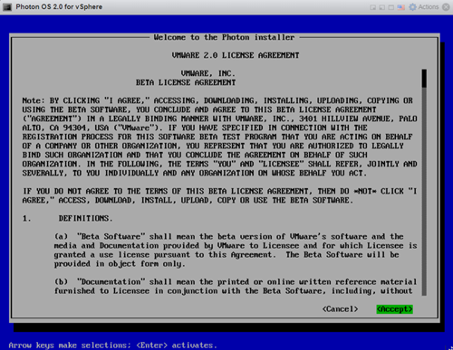

### Step 9: Configure the Partition

The installer will detect one disk, which should be the 16GB volume configured as part of the virtual machine creation. Choose **Auto**  to have the installer automatically allocate the partition, or choose **Custom**  if you want to configure individual partitions, and then press the Enter key.

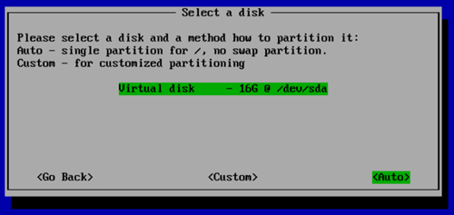

**Note:**  If you choose Custom, the installer displays the following screen.

For each custom partition, choose **Create New**  and specify the following information:

**Size** - Preallocated size of this partition, in MB.

**Type** - One of the following options:

- **ext3** - ext3 file system
- **ext4** - ext4 file system
- **swap** - swap partition

**Mountpoint** - Mount point for this partition.

Choose **OK** and press the Enter key. When you are done defining custom partitions, choose **Next** and press the Enter key.

The installer prompts you to confirm that you want to erase the entire disk.

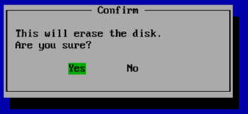

Choose **Yes** and press the Enter key.

### Step 10: Select an Installation Option

After partitioning the disk, the installer will prompt you to select an installation option.

Each install option provides a different run-time environment, depending on your requirements.

| **Option** | **Description** |
| --- | --- |
| **Photon Minimal** | Photon Minimum is a very lightweight version of the container host runtime that is best suited for container management and hosting. There is sufficient packaging and functionality to allow most common operations around modifying existing containers, as well as being a highly performant and full-featured runtime. |
| **Photon Full** | Photon Full includes several additional packages to enhance the authoring and packaging of containerized applications and/or system customization. For simply running containers, Photon Full will be overkill. Use Photon Full for developing and packaging the application that will be run as a container, as well as authoring the container, itself. For testing and validation purposes, Photon Full will include all components necessary to run containers. |
| **Photon OSTree Server** | This installation profile will create the server instance that will host the filesystem tree and managed definitions for rpm-ostree managed hosts created with the "Photon OSTree Host" installation profile. Most environments should need only one Photon OSTree Server instance to manage the state of the Photon OSTree Hosts. Use Photon OSTree Server when you are establishing a new repository and management node for Photon OS hosts. |

**Note:**  The option you choose determines the disk and memory resources required for your installation.

Select the option you want and press the Enter key.

### Step 11: Select the Linux Kernel

Select a Linux kernel to install.

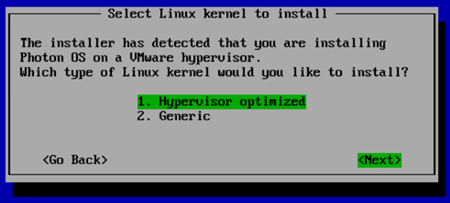

- **Hypervisor**  optimized means that any components that are not needed for running under a VMware hypervisor have been removed for faster boot times.
- **Generic**  means that all components are included.

Choose **Next** and press the Enter key.

### Step 12: Specify the Hostname

The installer prompts you for a hostname and suggest a randomly generated, unique hostname that you can change if you want.

Press the Enter key.

### Step 13: Specify the System root Password

The installer prompts you to enter the system root password.

_Note: Photon OS will not permit commonly used dictionary words to be set as a root password._

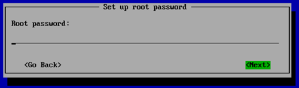

Type a password and press the Enter key.

The installer prompts you to confirm your root password by typing it a second time.

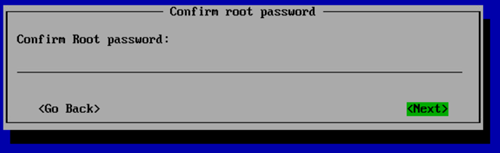

**Note:** If you have trouble with unintentional repeated characters in the Remote Console, follow VMware KB 196 ( [http://kb.vmware.com/kb/196](http://kb.vmware.com/kb/196)) for a setting to apply to the virtual machine.

Press the Enter key. The installer proceeds to install the software. Installation times will vary based on the system hardware and installation options you selected. Most installations complete in less than one minute.

### Step 14: Reboot the VM and Log In

Once finished, the installer displays a confirmation message (which includes how long it took to install Photon OS) and prompts you to press a key on your keyboard to boot the new VM.

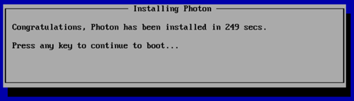

As the initial boot process begins, the installer displays the Photon splash screen, and then a login prompt.

At the login prompt, type **root**  as the username and provide the password chosen during the installation.

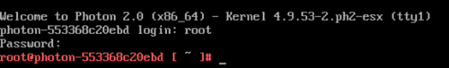

You have now successfully setup Photon OS and are ready to use your container runtime environment. Proceed to the next section to deploy a containerized application.

## Deploying a Containerized Application in Photon OS

Now that you have your container runtime environment up and running, you can easily deploy a containerized application. For this example, you will deploy the popular open source Web Server Nginx. The Nginx application has a customized VMware package that is published as a dockerfile and can be downloaded, directly, through the Docker module from the Docker Hub.

### Step 1: Run Docker

To run Docker from the command prompt, enter the following command, which initializes the docker engine:

    systemctl start docker

To ensure Docker daemon service runs on every subsequent VM reboot, enter the following command:

    systemctl enable docker

### Step 2: Run the Nginx Web Server

Now the Docker daemon service is running, it is a simple task to "pull" and start the Nginx Web Server container from Docker Hub. To do this, type the following command:

    docker run -d -p 80:80 vmwarecna/nginx

This pulls the Nginx Web Server files and appropriate dependent container filesystem layers required for this containerized application to run.

After the **docker run**  process completes, you return to the command prompt. You now have a fully active website up and running in a container!

### Step 3: Test the Web Server

To test that your Web Server is active, run the ifconfig command to get the IP address of the Photon OS Virtual Machine.

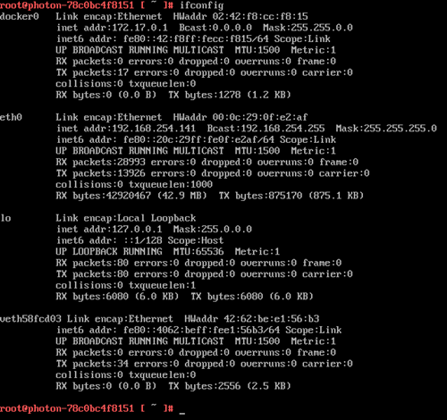

The output displays a list of adapters that are connected to the virtual machine. Typically, the web server daemon will be bound on **eth0**.

Start a browser on your host machine and enter the IP address of your Photon OS Virtual Machine. You should see a screen similar to the following example as confirmation that your web server is active.

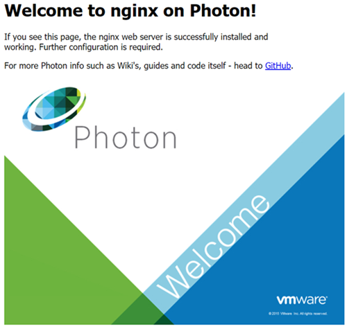

You can now run any other containerized application from Docker Hub or your own containerized application within Photon OS.

## Installing Photon OS v1.0

This section provides installation instructions for Photon OS v1.0.

### Photon OS 1.0 Prerequisites

In order to install and start using Photon OS with VMware vSphere, the following pre-requisites must be satisfied: 

* VMware vSphere 5.5 or VMware vSphere 6.0 installed 
* ESXi host with recommended 2GB of free RAM
* ESXi host with recommended 8GB of free disk space
* The Photon OS ISO downloaded from Bintray

This document uses VMware vSphere 6. VMware recommends that you use the latest version, though vSphere 5.5 or later should work as well. 

### Importing the Photon OS 1.0 OVA

Using the OVA is a fast and easy way to create a Photon OS VM. Once you’ve downloaded the OVA, log in to your vSphere environment and, from the `Actions` pull-down menu, select, `Deploy OVF Template …` On the popup window, point vSphere to the OVA file that you’ve downloaded. 

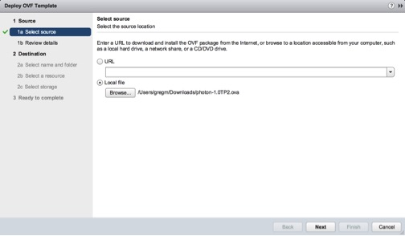

Click the `Next` button at the bottom of the window and vSphere will upload and validate your OVA. Depending on bandwidth, this operation might take a while. 

After validating the image, vSphere will present a summary of the details of the OVA. Click the `Next` button to proceed to selecting a location to store the imported Photon OS instance.

Click `Finish`

At this point, you’ve got a Photon OS instance ready to go; but before you power on that Photon OS instance, consider first converting this VM into a template. By converting this imported VM to a template, you have a master Photon OS instance that can be combined with vSphere Guest Customization to enable rapid provisioning of Photon OS instances. 

The OVA contains a default password of "changeme" for the root account that must be changed upon initial login. For security, Photon OS forbids common dictionary words for the root password.
 
### Installing the Photon OS 1.0 ISO Image

Once the ISO image has been uploaded to a datastore that is attached to the host on which you’ll create the Photon OS virtual machine, start the installation process by creating a new virtual machine.
When creating a new VM, the first thing you’ll need to specify is the compatibility of that VM with ESXi versions. Select a compatibility level for your VM, as shown below. Photon OS shouldn’t require any particular compatibility, but VMware recommends that you choose the latest available option for your release of vSphere.

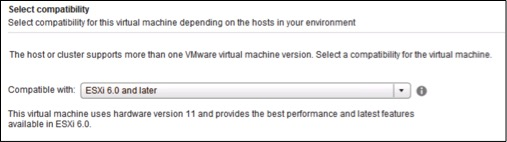

When prompted for the `Guest OS Family,` choose `Linux` and, for Guest OS Version, choose `Other 3.x Linux (64-bit)`. 

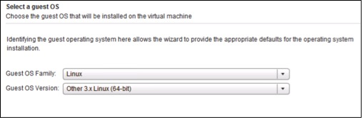

The recommended virtual hardware settings for your Photon VM are heavily dependent upon the container load you intend to run within Photon OS – more containers or more intensive containers will require you to adjust these settings for your application load. VMware suggests 2 vCPU, 1024MB memory, 20GB hard disk. Any unwanted devices should be removed.  Be sure to mount the Photon OS ISO on the CD/DVD Drive and put a check in the box next to, `Connect At Power On.`

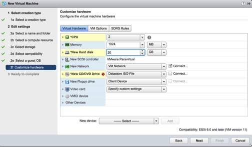

To summarize, these are the settings we recommend as a starting point for your Photon OS container runtime host: Thin provisioned, hardware compatibility: ESXi 6.0 and later (VM version 11).

Power on the Photon OS virtual machine and, within a few seconds, the Photon Installer Boot Menu will appear.  Download and install the Remote Console if you do not have it already; otherwise, click `Launch Remote Console` to interact with the installer.

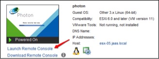

Once connected to the remote console, select `Install` to proceed.

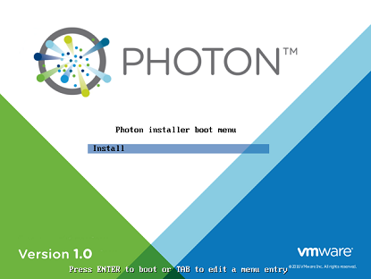

After you accept the EULA, the installer will detect one disk, which should be the 20GB volume configured as part of the virtual machine creation. Select the disk and press enter.  When you are prompted to confirm that it is okay to erase the entire disk, select `Yes` to accept and proceed with the installation.

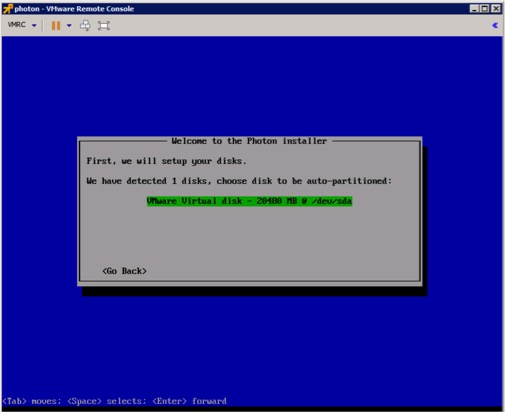

You will now be presented with several installation options:

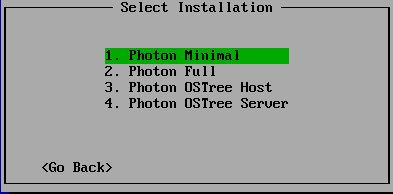

Each install option provides a different runtime environment:

* Photon Minimal: Photon Minimum is a very lightweight version of the container host runtime that is best suited for container management and hosting. There is sufficient packaging and functionality to allow most common operations around modifying existing containers, as well as being a highly performant and full-featured runtime. 

* Photon Full: Photon Full includes several additional packages to enhance the authoring and packaging of containerized applications and system customization. For simply running containers, Photon Full will be overkill. Use Photon Full for developing and packaging the application that will be run as a container, as well as authoring the container itself. For testing and validation purposes, Photon Full will include all components necessary to run containers. 

* Photon OSTree Host: This installation profile creates a Photon OS instance that will source its packages from a central rpm-ostree server and continue to have the library and state of packages managed by the definition that is maintained on the central rpm-ostree server. Use Photon OStree Hosts when you are interested in experimenting with the concept of a centrally authored and maintained OS version. This concept of treating the OS as a versioned, atomic entity can simplify lifecycle management and security at scale. 

* Photon OSTree Server: This installation profile will create the server instance that will host the filesystem tree and managed definitions for rpm-ostree managed hosts created with the Photon OSTree Host installation profile. Most environments should need only one Photon OSTree Server instance to manage the state of the Photon OSTree Hosts. Use Photon OSTree Server when you are establishing a new repository and management node for Photon OS hosts.  

For the purposes of this how-to guide, select the option to install Photon Minimal. Once `Photon Minimal` is highlighted, press the Enter key on your keyboard.

You will now be prompted for a hostname. Photon OS will prepopulate a randomly generated, unique hostname; you can either use this suggestion or enter your own hostname, as shown in the screenshot below:

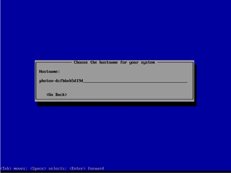

After selecting a hostname and pressing Enter, you will be prompted to first type and, then, confirm the system root password. If you have trouble with unintentional repeated characters in the Remote Console, follow VMware KB 196 (http://kb.vmware.com/kb/196) for a setting to apply to the virtual machine.

*Note: Photon OS will not permit commonly used dictionary words to be set as a root password.*

After confirming the password, the installation process should begin.

Installation times will vary based on system hardware and installation options, but most installations complete in less than a minute. Once the installation completes, press any key and the virtual machine will reboot into Photon OS.

As the initial boot process begins, you will see the Photon splash screen before you are taken to a login prompt.

At the login prompt, enter `root` as the username and provide the password chosen during the installation. 

You have now successfully setup Photon OS and are ready to use your container runtime environment.
 
### Installing a Containerized Application in Photon OS 1.0
Now that you have your container runtime environment up and running, you may be wondering, “what can I do now?” A command prompt is not the most exciting thing. To help demonstrate the ease with which you can deploy a containerized application, this section showcases how you can quickly get a web server up and running.

For this example, we will use the popular open source web server Nginx. The Nginx application has a customized VMware package  published as a dockerfile that can be downloaded directly in Docker from the Docker Hub.

To run Docker from the command prompt, enter the command below to initialize the docker engine:

`systemctl start docker`

To ensure the docker daemon service runs on every subsequent VM reboot, enter:

`systemctl enable docker`

Now that the docker daemon service is running, it is a simple task to pull and start the Nginx Web Server container from Docker Hub.  To do this, enter the following command:

`docker run -d -p 80:80 vmwarecna/nginx`

This will then pull the Nginx Web Server files and appropriate dependent containers to ensure this containerized application can run.  You will see a screenshot similar to below, as the container and dependencies are downloaded and the container is prepared to run: 

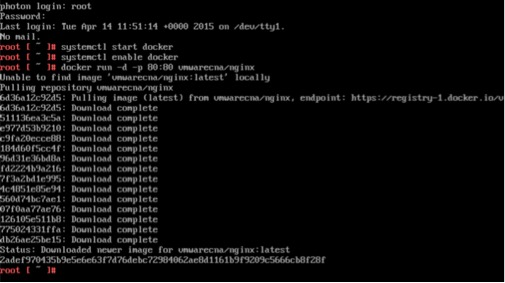

Once the `docker run` process is completed, you will be returned to the command prompt.  You now have a fully active web server up and running through typing just a single command within Photon OS using containers.

To test that your web server is active, we need to get the IP address of the Photon OS Virtual Machine. To get the IP address, enter the following command: 

	ifconfig

This will now display a list of adapters connected to the virtual machine.  Typically, the web server daemon will be bound to `eth0.`  

Start a browser on your host machine and enter the IP address of your Photon OS Virtual Machine.  The following screen will appear showing that your web server is active:

You can now run any other containerized application from Docker Hub or your own containerized application within Photon OS.

If you are having trouble viewing the screen that shows the web server is active, you might have to add an iptables rule to your container VM to allow traffic on Port 80:

`iptables -I INPUT 1 -p tcp --dport 80 -j ACCEPT`

In addition, you might have to modify /etc/httpd/httpd.conf to listen on Port 80 by adding the following line:  

`Listen 0.0.0.0:80`

