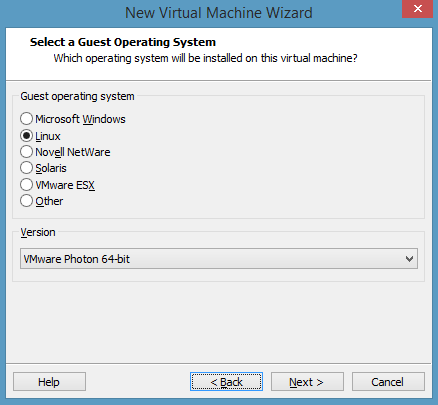

# Photon OS Administration Guide

-   [Introduction](#introduction)
    -   [Examining the Packages in the SPECS Directory on
        Github](#examining-the-packages-in-the-specs-directory-on-github)
    -   [Looking at the Differences Between the Minimal and the Full
        Version](#looking-at-the-differences-between-the-minimal-and-the-full-version)
    -   [The Root Account and the `sudo` and `su`
        Commands](#the-root-account-and-the-sudo-and-su-commands)
-   [Getting Started with Photon OS 2.0](#getting-started-with-photon-os-20)
-   [Quick Start for Photon OS 1.0](#quick-start-for-photon-os-10)
    -   [Obtaining the ISO from Bintray and Creating a Photon OS VM
        in VMware
        Workstation](#obtaining-the-iso-from-bintray-and-creating-a-photon-os-vm-in-vmware-workstation)
    -   [Installing the OVA for the Minimal Version in
        vSphere](#installing-the-ova-for-the-minimal-version-in-vsphere)
    -   [Rapidly Deploying the Photon OS OVA in VMware Workstation
        12
        Pro](#rapidly-deploying-the-photon-os-ova-in-vmware-workstation-12-pro)
    -   [Root Password Rules](#root-password-rules)
    -   [Permitting Root Login with
        SSH](#permitting-root-login-with-ssh)
    -   [PXE Boot](#pxe-boot)
    -   [Kickstart](#kickstart)
    -   [Checking the Version and Build
        Number](#checking-the-version-and-build-number)
-   [Tiny DNF for Package
    Management](#tiny-dnf-for-package-management)
    -   [Configuration Files and
        Repositories](#configuration-files-and-repositories)
    -   [Options for Commands](#options-for-commands)
    -   [Commands](#commands)
    -   [Adding a New Repository](#adding-a-new-repository)
    -   [Adding the Dev Repository to Get New Packages from the
        GitHub Dev
        Branch](#adding-the-dev-repository-to-get-new-packages-from-the-github-dev-branch)
-   [Managing Services with
    systemd](#managing-services-with-systemd)
    -   [Using the Photon Management Daemon](#using-the-photon-management-daemon)
    -   [Using the Network Configuration Manager](#using-the-network-configuration-manager)
    -   [Viewing Services](#viewing-services)
    -   [Controlling Services](#controlling-services)
    -   [Creating a Startup Service](#creating-a-startup-service)
    -   [Disabling the Photon OS
        httpd.service](#disabling-the-photon-os-httpd.service)
    -   [Auditing System Events with
        auditd](#auditing-system-events-with-auditd)
    -   [Analyzing systemd Logs with
        journalctl](#analyzing-systemd-logs-with-journalctl)
    -   [Migrating Scripts to
        systemd](#migrating-scripts-to-systemd)
-   [Managing the Network
    Configuration](#managing-the-network-configuration)
    -   [Using the Photon Management Daemon](#using-the-photon-management-daemon)
    -   [Using the Network Configuration Manager](#using-the-network-configuration-manager)
    -   [Use `ip` and `ss` Commands Instead of `ifconfig` and
        `netstat`](#use-ip-and-ss-commands-instead-of-ifconfig-and-netstat)
    -   [Configuring Network
        Interfaces](#configuring-network-interfaces)
    -   [Setting a Static IP Address](#setting-a-static-ip-address)
    -   [Turning Off DHCP](#turning-off-dhcp)
    -   [Adding a DNS Server](#adding-a-dns-server)
    -   [Setting Up Networking for Multiple
        NICs](#setting-up-networking-for-multiple-nics)
    -   [Combining DHCP and Static IP Addresses with IPv4 and
        IPv6](#combining-dhcp-and-static-ip-addresses-with-ipv4-and-ipv6)
    -   [Clearing the Machine ID of a Cloned Instance for
        DHCP](#clearing-the-machine-id-of-a-cloned-instance-for-dhcp)
    -   [Using Predictable Network Interface
        Names](#using-predictable-network-interface-names)
    -   [Inspecting the Status of Network Links with
        `networkctl`](#inspecting-the-status-of-network-links-with-networkctl)
    -   [Turning on Network
        Debugging](#turning-on-network-debugging)
    -   [Mounting a Network File
        System](#mounting-a-network-file-system)
    -   [Installing the Packages for tcpdump and netcat with
        tdnf](#installing-the-packages-for-tcpdump-and-netcat-with-tdnf)
-   [Cloud-Init on Photon OS](#cloud-init-on-photon-os)
    -   [Creating a Stand-Alone Photon Machine with
        cloud-init](#creating-a-stand-alone-photon-machine-with-cloud-init)
    -   [Customizing a Photon OS Machine on
        EC2](#customizing-a-photon-os-machine-on-ec2)
    -   [Running a Photon OS Machine on
        GCE](#running-a-photon-os-machine-on-gce)
-   [Docker Containers](#docker-containers)
-   [Kubernetes](#kubernetes)
-   [Installing Sendmail](#installing-sendmail)
    -   [Fixing Sendmail If Installed Before an FQDN Was
        Set](#fixing-sendmail-if-installed-before-an-fqdn-was-set)
-   [Changing the Locale](#changing-the-locale)
-   [The Default Security Policy of Photon
    OS](#the-default-security-policy-of-photon-os)
    -   [Default Firewall Settings](#default-firewall-settings)
    -   [Default Permissions and
        umask](#default-permissions-and-umask)
-   [Disabling TLS 1.0 to Improve Transport Layer
    Security](#disabling-tls-1.0-to-improve-transport-layer-security)
-   [Working with Repositories and
    Packages](#working-with-repositories-and-packages)
    -   [Photon OS Package
        Repositories](#photon-os-package-repositories)
    -   [Examining Signed Packages](#examining-signed-packages)
    -   [Building a Package from a Source
        RPM](#building-a-package-from-a-source-rpm)
    -   [Compiling C++ Code on the Minimal Version of Photon
        OS](#compiling-c-code-on-the-minimal-version-of-photon-os)
-   [References](#references)

## Introduction

This guide describes the fundamentals of administering Photon OS, the open-source minimalist Linux operating system from VMware that is optimized for cloud computing platforms, VMware vSphere deployments, and applications native to the cloud. 

The guide covers the basics of managing packages, controlling services with systemd, setting up networking, initializing Photon OS with cloud-init, running Docker containers, and working with other technologies, such as Kubernetes. The guide also includes a section to get you started using Photon OS quickly and easily. 

Photon OS is a Linux container host optimized for vSphere and cloud-computing platforms such as Amazon Elastic Compute and Google Compute Engine. As a lightweight and extensible operating system, Photon OS works with the most common container formats, including Docker, Rocket, and Garden. Photon OS includes a yum-compatible, package-based lifecycle management system called tdnf.

When used with development tools and environments such as VMware Fusion, VMware Workstation, HashiCorp (Vagrant and Atlas), and production runtime environments (vSphere, vCloud Air), Photon OS lets you seamlessly migrate container-based applications from development to production. With a small footprint and fast boot and run times, Photon OS is optimized for cloud computing and cloud  applications.  

There are two versions of Photon OS: a minimal version and a full version. 

The minimal version of Photon OS is lightweight container host runtime environment best suited to managing and hosting containers. The minimal version contains just enough packaging and functionality to manage and modify containers while remaining a fast runtime environment. The minimal version is ready to work with appliances. 

The full version of Photon OS includes additional packages to help you customize the system and create containerized applications. For  running containers, the full version is excessive. The full version is targeted at helping you create, develop, test, and package an application that runs a container. 

Two characteristics of Photon OS stand out: It manages services with systemd and it manages packages with an open source, yum-compatible package manager called tdnf, for Tiny DNF. 

By using systemd, Photon OS adopts a contemporary Linux standard to manage system services. Photon OS bootstraps the user space and concurrently starts services with systemd. The systemctl utility controls services on Photon OS. For example, instead of running the /etc/init.d/ssh script to stop and start the OpenSSH server on a init.d-based Linux system, you run the following systemctl commands on Photon OS: 

	systemctl stop sshd
	systemctl start sshd

Tdnf keeps the operating system as small as possible while preserving yum's robust package-management capabilities. On Photon OS, tdnf is the default package manager for installing new packages. It is a C implementation of DNF package manager. 

### Examining the Packages in the SPECS Directory on Github

The SPECS directory of the GitHub website for Photon OS contains all the packages that can appear in Photon OS repositories:  

https://github.com/vmware/photon/tree/master/SPECS

To see the version of a package, in the SPECS directory, click the name of the subdirectory of the package that you want to examine, and then click the `.spec` filename in the subdirectory. For example, the version of OpenJDK, which contains the openjre package that installs the Java class library and the javac Java compiler, looks like this: 

<pre>
%define _use_internal_dependency_generator 0
Summary:	OpenJDK 
Name:		openjdk
Version:	1.8.0.72
Release:	1%{?dist}
License:	GNU GPL
URL:		https://openjdk.java.net
Group:		Development/Tools
Vendor:		VMware, Inc.
Distribution:   Photon
AutoReqProv: 	no
Source0:	http://anduin.linuxfromscratch.org/files/BLFS/OpenJDK-%{version}/OpenJDK-%{version}-x86_64-bin.tar.xz
%define sha1 OpenJDK=0c705d7b13f4e22611d2da654209f469a6297f26
%description
The OpenJDK package installs java class library and javac java compiler. 

%package	-n openjre
Summary:	Jave runtime environment
AutoReqProv: 	no
%description	-n openjre
It contains the libraries files for Java runtime environment
#%global __requires_exclude ^libgif.*$
#%filter_from_requires ^libgif.*$...
...
</pre>

### Looking at the Differences Between the Minimal and the Full Version

The minimal version of Photon OS contains about 50 packages. As it is installed, the number of packages increases to nearly 100 to fulfill dependencies. The full version of Photon OS adds several hundred packages to those in the minimal version to deliver a more fully featured operating system. 

You can view a list of the packages that appear in the minimal version by examining the following file: 

[https://github.com/vmware/photon/blob/master/common/data/packages_minimal.json](https://github.com/vmware/photon/blob/master/common/data/packages_minimal.json)

You can view a list of the packages that appear in the full version by examining the following file: 

[https://github.com/vmware/photon/blob/master/common/data/packages_full.json](https://github.com/vmware/photon/blob/master/common/data/packages_full.json)

If the minimal or the full version of Photon OS does not contain a package that you want, you can of course install it with tdnf, which appears in both the minimal and full versions of Photon OS by default. In the full version of Photon OS, you can also install packages by using yum. 

One notable difference between the two versions of Photon OS pertains to OpenJDK, the package that contains not only the Java runtime environment (openjre) but also the Java compiler (javac). The OpenJDK package appears in the full but not the minimal version of Photon OS. To add support for Java programs to the minimal version of Photon OS, install the Java packages and their dependencies: 

	tdnf install openjdk
	Installing:
	openjre 	x86_64    1.8.0.92-1.ph1    95.09 M
	openjdk 	x86_64    1.8.0.92-1.ph1    37.63 M

**NOTE:** openjdk and openjre are available as openjdk8 and openjre8 in Photon OS 2.0

A later section covers tdnf. 

### The Root Account and the `sudo` and `su` Commands

This guide assumes that you are logged in to Photon OS with the root account and running commands as root. The sudo program comes with the full version of Photon OS. On the minimal version, you must install sudo with tdnf if you want to use it. As an alternative to installing sudo on the minimal version, you can switch users as needed with the `su` command to run commands that require root privileges. 

## Getting Started with Photon OS 2.0

**NOTE:** This section applies to Photon OS w.0 only.

To get started with Photon OS 2.0, refer to the installation instructions for your target environment:
- [Running Photon OS on VMware vSphere](https://github.com/vmware/photon/wiki/Running-Photon-OS-on-vSphere)
- [Running Photon OS on VMware Fusion](https://github.com/vmware/photon/wiki/Running-Project-Photon-on-Fusion)
- [Running Photon OS on VMware Workstation](https://github.com/vmware/photon/wiki/Running-Photon-OS-on-Workstation)
- [Running Photon OS on Amazon EC2](https://github.com/vmware/photon/wiki/Running-Photon-OS-on-Amazon-Elastic-Cloud-Compute)
- [Running Photon OS on Google Compute Engine](https://github.com/vmware/photon/wiki/Running-Photon-OS-on-Google-Compute-Engine)
- [Running Photon OS on Microsoft Azure](https://github.com/vmware/photon/wiki/Running-Photon-OS-on-Microsoft-Azure)

**Note**: If you want to upgrade an existing Photon 1.0 VM, refer to the instructions in [Upgrading to Photon OS 2.0](https://github.com/vmware/photon/wiki/Upgrading-to-Photon-OS-2.0). 

## Quick Start for Photon OS 1.0

**NOTE:** This section applies to Photon OS 1.0 only.

This section helps you get Photon OS up and running quickly and easily. There are several ways to deploy Photon OS for free within a matter of minutes:

* Obtain the ISO from Bintray and use it to create a virtual machine running Photon OS.
* Install the OVA for the minimal version of Photon OS in VMware vSphere.
* Rapidly deploy the OVA for the minimal version of Photon OS in VMware Workstation 12 Pro. 

### Obtaining the ISO from Bintray and Creating a Photon OS VM in VMware Workstation

The full version of Photon OS installs from an ISO in VMware Workstation and other hypervisors in a matter of minutes. Photon OS is a free download from the Bintray web site.

This section demonstrates how to create a virtual machine running Photon OS in VMware Workstation 12 Pro. If you are using a different hypervisor, the example set by this section should help you install it in your system. For instructions on how to install Photon OS from an ISO in VMware vSphere, see [Installing Photon OS on VMware vSphere from an ISO Image](https://github.com/vmware/photon/wiki/Running-Project-Photon-on-vSphere).

1. Go to the following Bintray URL and download the ISO for the general availability release of Photon OS:

	https://bintray.com/vmware/photon/iso/view

1. In VMware Workstation, type Ctrl+N to create a new virtual machine. 

1. In the New Virtual Machine Wizard, select `Typical`, and then click `Next`.

1. Select `Installer disk image file (iso)`, click `Browse` to locate the Photon OS ISO that you downloaded from Bintray, and then click `Next`.

1. For the guest operating system, select `Linux`. From the `Version` drop-down menu, select `VMware Photon 64-bit`. If you have an older version of VMware Workstation and Photon does not appear in the list, select `Other Linux 3.x kernel 64-bit`.

1. Click `Next` through the remaining dialog boxes of the wizard,  either accepting the default settings, which is recommended, or making the changes that you want, and then click `Finish`.

1. Power on the virtual machine and, in the Workstation window containing Photon, press Enter to start the installation.

1. During disk setup, the installer might ask you to confirm that this will erase the disk. If so, accept the default value of `yes` by hitting your Enter key.

1. Select the installation that you want. For this example, choose `Photon Full` by using the tab key to move to Photon Full and then hitting the space bar to select it. Press Enter to install it. 

1. Either accept the default hostname that Photon provides or type the name that you want. Press Enter to continue. 

1. Type the root password. Photon OS requires the root password to be a complex string containing no common words or names.

The installation typically completes in about 150 seconds for the full version and in less than 30 seconds for the minimal version. After the installation finishes, boot the system and log in as root with your root password. 

To connect to Photon OS by SSH, see the section on permitting root login with SSH below.  

You can also build an ISO containing Photon OS from its source code on GitHub by following the instructions in the document on [building Photon OS](https://github.com/vmware/photon/blob/master/docs/build-photon.md). 

### Installing the OVA for the Minimal Version in vSphere

You can download the OVA for the minimal version of Photon OS from Bintray and deploy it in vSphere in a matter of seconds. Here's how: 

Download the OVA for the minimal version of Photon OS from the following URL: 

	https://bintray.com/vmware/photon/ova

To install the OVA in vSphere, on the `File` menu, click `Deploy OVF Template`, and then click `Browse` to locate the image that you downloaded. Move through the `Deploy OVF Template` dialog boxes by clicking `Next` to accept the default settings, and then click `Finish`. 

In vSphere Client, turn on the power of the Photon OS virtual machine and open a console to it.

The default password for the root account is `changeme`, and you must change it when you first login. For security, Photon OS forbids common dictionary words for the root password. 

There are other options for installing Photon OS in vSphere, such as building an ISO from the source code. For more information about the versions of Photon and their installation options, see [Running Photon OS on vSphere](https://github.com/vmware/photon/wiki/Running-Project-Photon-on-vSphere).

### Rapidly Deploying the Photon OS OVA in VMware Workstation 12 Pro

Here's how to rapidly deploy the OVA for Photon in VMware Workstation 12 Pro by using an up-to-date version of Firefox. The procedure in other browsers or another version of Workstation might be different. 

In Firefox, download the OVA for the minimal version of Photon OS from this URL: 

	https://bintray.com/vmware/photon/ova

In the download dialog box, select `Open with VMware Workstation (default)`, like this:

In the Workstation Import dialog box, click Import.

Workstation creates a virtual machine from the Photon OS OVA template in a few seconds. In Workstation, power on the virtual machine and log in as root with the initial password of `changeme`.

Photon OS then prompts you to change the root password.  
	
###	Root Password Rules

When you first log on a new Photon OS machine, you must set the root password to a complex string containing no common words or names. Photon OS rejects a root password that contains simplistic patterns, common words, or words derived from the name of your account. The rules apply only to the root password, not other user and group accounts. 

###	Permitting Root Login with SSH

The full version of Photon OS prevents root login with SSH by default. To permit root login over SSH, open `/etc/ssh/sshd_config` with the vim text editor and set `PermitRootLogin` to `yes`. 

Vim is the default text editor available in both the full and minimal versions of Photon OS. (Nano is also in the full version.) After you modify the SSH daemon's configuration file, you must restart the sshd daemon for the changes to take effect. Example: 

	vim /etc/ssh/sshd_config

	# override default of no subsystems
	Subsystem       sftp    /usr/libexec/sftp-server

	# Example of overriding settings on a per-user basis
	#Match User anoncvs
	#       X11Forwarding no
	#       AllowTcpForwarding no
	#       PermitTTY no
	#       ForceCommand cvs server
	PermitRootLogin yes
	UsePAM yes

Save your changes in vim and then restart the sshd daemon: 

	systemctl restart sshd

You can then connect to the Photon OS machine with the root account over SSH:

	steve@ubuntu:~$ ssh root@198.51.100.131

### PXE Boot

Photon OS works with the Preboot Execution Environment, or PXE, to boot by retrieving software from a PXE server over a network connection. For instructions on how to set Photon OS to boot from a PXE server, see [Network PXE Boot](https://github.com/vmware/photon/blob/master/docs/PXE-boot.md).

### Kickstart

Photon OS supports kickstart for unattended installations through a CD-ROM or an HTTP server. On Photon OS, kickstart can set the hostname, password, run post-installation scripts, and add public keys for SSH. See [Kickstart Support](https://github.com/vmware/photon/blob/master/docs/kickstart.md).

### Checking the Version and Build Number

To check the version and build number of Photon OS, concatenate `/etc/photon-release`. Example: 

	cat /etc/photon-release
	VMware Photon Linux 1.0
	PHOTON_BUILD_NUMBER=a6f0f63

The build number in the results maps to the commit number on the VMware Photon OS GitHub [commits page](https://github.com/vmware/photon/commits/master).

## Tiny DNF for Package Management

On Photon OS, Tiny DNF, for [Tiny Dandified Yum](https://github.com/vmware/tdnf), is the default package manager for installing new packages. It is a C implementation of DNF package manager. The standard syntax for `tdnf` commands is the same as that for DNF: 

	tdnf [options] <command> [<arguments>...]

You can view its help information like this: 

	tdnf --help
	tdnf -h

**Photon OS 1.0 only**: In the minimal version of Photon OS, tdnf serves as the sole package manager to streamline the operating system. The full version of Photon OS includes yum, a common utility that checks for, downloads, and automatically installs RPM packages. On the minimal version of Photon OS, you can install yum by using tdnf if you are unconcerned with the size of the operating system: ``tdnf install yum``

### Configuration Files and Repositories

The main configuration files reside in /etc/tdnf/tdnf.conf. The configuration file looks like this: 

	cat /etc/tdnf/tdnf.conf
	[main]
	gpgcheck=1
	installonly_limit=3
	clean_requirements_on_remove=true
	repodir=/etc/yum.repos.d
	cachedir=/var/cache/tdnf

The cache files for data and metadata reside in /var/cache/tdnf. 

The repositories appear in /etc/yum.repos.d/ with `.repo` file extensions:

	ls /etc/yum.repos.d/
	lightwave.repo
	photon-extras.repo
	photon-iso.repo
	photon-updates.repo
	photon.repo 

**Note:** Photon OS 1.0 (only) also includes the lightwave.repo.

You can list the the repositories by using the `tdnf repolist` command. Tdnf filters the results with `enabled`, `disabled`, and `all`. Running the command without specifying an argument returns the enabled repositories:  

	tdnf repolist
	repo id             repo name                               status
	photon-updates      VMware Photon Linux 2.0(x86_64)Updates  enabled
	photon-extras       VMware Photon Extras 2.0(x86_64)        enabled
	photon              VMware Photon Linux 2.0(x86_64)         enabled

**Note:** Photon OS 1.0 (only) also includes the lightwave repository.

The photon-iso.repo, however, does not appear in the list of repositories because it is unavailable on the virtual machine from which these examples are taken. Photon-iso.repo is the default repository; it points to /media/cdrom. The contents of photon-iso.repo look like this: 

	cat /etc/yum.repos.d/photon-iso.repo
	[photon-iso]
	name=VMWare Photon Linux 2.0(x86_64)
	baseurl=file:///mnt/cdrom/RPMS
	gpgkey=file:///etc/pki/rpm-gpg/VMWARE-RPM-GPG-KEY
	gpgcheck=1
	enabled=0
	skip_if_unavailable=True

The local cache is populated with data from the repository: 

	ls -l /var/cache/tdnf/photon
	total 8
	drwxr-xr-x 2 root root 4096 May 18 22:52 repodata
	d-wxr----t 3 root root 4096 May  3 22:51 rpms

You can clear the cache to help troubleshoot a problem, but keep in mind that doing so might slow the performance of tdnf until the cache becomes repopulated with data. Here is how to clear the cache: 

	tdnf clean all
	Cleaning repos: photon photon-extras photon-updates lightwave
	Cleaning up everything

The command purges the repository data from the cache: 

	ls -l /var/cache/tdnf/photon
	total 4
	d-wxr----t 3 root root 4096 May  3 22:51 rpms

### Options for Commands

You can add the following options to `tdnf` commands. If the option to override a configuration is unavailable in a command, consider adding it to the configuration file, /etc/tdnf/tdnf.conf.

	OPTION                     DESCRIPTION
	--allowerasing             Allow erasing of installed packages to resolve dependencies
	--assumeno                 Answer no for all questions
	--best                     Try the best available package versions in transactions
	--debugsolver              Dump data aiding in dependency solver debugging info.
	--disablerepo=<repoid>     Disable specific repositories by an id or a glob.
	--enablerepo=<repoid>      Enable specific repositories
	-h, --help                 Display help
	--refresh                  Set metadata as expired before running command
	--nogpgcheck               Skip gpg check on packages
	--rpmverbosity=<debug level name>
	                           Debug level for rpm
	--version                  Print version and exit
	-y, --assumeyes            Answer yes to all questions
	-q, --quiet                Quiet operation

Here is an example that adds the short form of the `assumeyes` option to the install command:

	tdnf -y install gcc
	Upgrading:
	gcc 	x86_64	5.3.0-1.ph1 	91.35 M

### Commands

**check**: Checks for problems in installed and available packages for all enabled repositories. Command has no arguments. You can use ``--enablerepo`` and ``--disablerepo`` to control the repos used. Supported in Photon OS 2.0 (only).

**check-local**: This command resolves dependencies by using the local RPMs to help check RPMs for quality assurance before publishing them. To check RPMs with this command, you must create a local directory and place your RPMs in it. The command, which includes no options, takes the path to the local directory containing the RPMs as its argument. The command does not, however, recursively parse directories; it checks the RPMs only in the directory that you specify. For example, after creating a directory named `/tmp/myrpms` and placing your RPMs in it, you can run the following command to check them:  

	tdnf check-local /tmp/myrpms
	Checking all packages from: /tmp/myrpms
	Found 10 packages
	Check completed without issues

**check-update**: This command checks for updates to packages. It takes no arguments. The `tdnf list updates` command performs the same function. Here is an example of the `check update` command: 

	tdnf check-update
	rpm-devel.x86_64 	4.11.2-8.ph1 	photon
	yum.noarch      	3.4.3-3.ph1 	photon

**clean**: This command cleans up temporary files, data, and metadata. It takes the argument `all`. Example: 

	tdnf clean all
	Cleaning repos: photon photon-extras photon-updates lightwave
	Cleaning up everything

**distro-sync**: This command synchronizes the machine's RPMs with the latest version of all the packages in the repository. Abridged example:

	tdnf distro-sync

	Upgrading:
	zookeeper                             x86_64        3.4.8-2.ph1               3.38 M
	yum                                   noarch        3.4.3-3.ph1               4.18 M

	Total installed size: 113.01 M

	Reinstalling:
	zlib-devel                            x86_64        1.2.8-2.ph1             244.25 k
	zlib                                  x86_64        1.2.8-2.ph1             103.93 k
	yum-metadata-parser                   x86_64        1.1.4-1.ph1              57.10 k

	Total installed size: 1.75 G

	Obsoleting:
	tftp                                  x86_64        5.2-3.ph1                32.99 k

	Total installed size: 32.99 k
	Is this ok [y/N]:

**downgrade**: This command downgrades the package that you specify as an argument to the next lower package version. Example: 

	tdnf downgrade boost
	Downgrading:
	boost                                 x86_64        1.56.0-2.ph1              8.20 M
	Total installed size: 8.20 M
	Is this ok [y/N]:y
	Downloading:
	boost                                  2591470    100%
	Testing transaction
	Running transaction
	Complete!

To downgrade to a version lower than the next one, you must specify it by name, epoch, version, and release, all properly hyphenated. Example: 

	tdnf downgrade boost-1.56.0-2.ph1 

**erase**: This command removes the package that you specify as an argument. Example: 

	tdnf erase vim
	Removing:
	vim                                   x86_64        7.4-4.ph1                 1.94 M
	Total installed size: 1.94 M
	Is this ok [y/N]:

You can also erase multiple packages: 

	tdnf erase docker cloud-init

**info**: This command displays information about packages. It can take the name of a package. Or it can take one of the following arguments: all, available, installed, extras, obsoletes, recent, upgrades. Examples: 

	tdnf info ruby
	tdnf info obsoletes
	tdnf info upgrades

**install**: This command takes the name of a package as its argument. It then installs the package and its dependencies. Examples: 

	tdnf install kubernetes

You can also install multiple packages: 

	tdnf install python-curses lsof audit gettext chkconfig ntsysv bindutils 
		 wget gawk irqbalance lvm2 cifs-utils c-ares distrib-compat
	

**list**: This command lists the packages of the package that you specify as the argument. The command can take one of the following arguments: all, available, installed, extras, obsoletes, recent, upgrades. 

	tdnf list updates

The list of packages might be long. To more easily view it, you can concatenate it into a text file, and then open the text file in a text editor: 

	tdnf list all > pkgs.txt
	vi pkgs.txt

**makecache**: This command updates the cached binary metadata for all known repositories. Example:

	tdnf makecache
	Refreshing metadata for: 'VMware Lightwave 1.0(x86_64)'
	Refreshing metadata for: 'VMware Photon Linux 1.0(x86_64)Updates'
	Refreshing metadata for: 'VMware Photon Extras 1.0(x86_64)'
	Refreshing metadata for: 'VMware Photon Linux 1.0(x86_64)'
	Metadata cache created.

**provides**: This command finds the packages that provide the package that you supply as an argument. Examples: 

	tdnf provides docker
	docker-1.11.0-1.ph1.x86_64 : Docker
	Repo     : photon
	docker-1.11.0-1.ph1.x86_64 : Docker
	Repo     : @System

**reinstall**: This command reinstalls the packages that you specify. If some packages are unavailable or not installed, the command fails. Example: 

	tdnf reinstall docker kubernetes

	Reinstalling:
	kubernetes                            x86_64        1.1.8-1.ph1             152.95 M
	docker                                x86_64        1.11.0-1.ph1             57.20 M

	Total installed size: 210.15 M

**remove**: This command removes a package. When removing a package, tdnf by default also removes dependencies that are no longer used if they were was installed by tdnf as a dependency without being explicitly requested by a user. You can modify the dependency removal by changing the `clean_requirements_on_remove` option in /etc/tdnf/tdnf.conf to `false`. 

	tdnf remove packagename

**search**: This command searches for the attributes of packages. The argument can be the names of packages, as this example testifies: 

	tdnf search docker kubernetes
	docker : Docker
	docker : Docker
	docker-debuginfo : Debug information for package docker
	docker : Docker
	kubernetes : Kubernetes cluster management
	kubernetes : Kubernetes cluster management
	kubernetes-debuginfo : Debug information for package kubernetes
	kubernetes : Kubernetes cluster management

The argument of the search command can also be a keyword or a combination of keywords and packages: 

	tdnf search terminal bash
	rubygem-terminal-table : Simple, feature rich ascii table generation library
	ncurses : Libraries for terminal handling of character screens
	mingetty : A minimal getty program for virtual terminals
	ncurses : Libraries for terminal handling of character screens
	ncurses : Libraries for terminal handling of character screens
	bash : Bourne-Again SHell
	bash-lang : Additional language files for bash
	bash-lang : Additional language files for bash
	bash : Bourne-Again SHell
	bash-debuginfo : Debug information for package bash
	bash : Bourne-Again SHell
	bash-lang : Additional language files for bash

**upgrade**: This command upgrades the package or packages that you specify to an available higher version that tdnf can resolve. If the package is already the latest version, the command returns `Nothing to do`. Example: 

	tdnf upgrade boost

	Upgrading:
	boost                                 x86_64        1.60.0-1.ph1              8.11 M

	Total installed size: 8.11 M
	Is this ok [y/N]:y

	Downloading:
	boost                                  2785950    100%
	Testing transaction
	Running transaction

	Complete!

You can also run the `upgrade` command with the `refresh` option to update the cached metadata with the latest information from the repositories. The following example refreshes the metadata and then checks for a new version of tdnf but does not find one, so tdnf takes no action: 

	tdnf upgrade tdnf --refresh
	Refreshing metadata for: 'VMware Lightwave 1.0(x86_64)'
	Refreshing metadata for: 'VMware Photon Linux 1.0(x86_64)Updates'
	Refreshing metadata for: 'VMware Photon Extras 1.0(x86_64)'
	Refreshing metadata for: 'VMware Photon Linux 1.0(x86_64)'
	Nothing to do.

**upgrade-to**: This command upgrades to the version of the package that you specify. Example:

	tdnf upgrade-to ruby2.3

The commands and options of tdnf are, at present, a subset of those of dnf. For more help with `tdnf` commands, see the [DNF documentation](https://media.readthedocs.org/pdf/dnf/latest/dnf.pdf).

### Adding a New Repository

With Photon OS, you can add a new repository from which tdnf installs packages. To do so, you create a repository configuration file with a `.repo` extension and place it in /etc/yum.repos.d. The repository can be on either the Internet or a local server containing your in-house applications. 

Be careful if you add a repository that's on the Internet: Installing packages from untrusted or unverified sources might put the security, stability, or compatibility of your system at risk. It might also make your system harder to maintain.  

On Photon OS, the existing repositories appear in /etc/yum.repos.d:

	ls /etc/yum.repos.d/
	lightwave.repo
	photon-extras.repo
	photon-iso.repo
	photon-updates.repo
	photon.repo 

Looking at one of the `.repo` files reveals the format and information that a new repository configuration file should contain:

	cat /etc/yum.repos.d/lightwave.repo
	[lightwave]
	name=VMware Lightwave 1.0(x86_64)
	baseurl=https://dl.bintray.com/vmware/lightwave
	gpgkey=file:///etc/pki/rpm-gpg/VMWARE-RPM-GPG-KEY
	gpgcheck=1
	enabled=1
	skip_if_unavailable=True

The minimal information needed to establish a repository is an ID and human-readable name of the repository and its base URL. The ID, which appears in square brackets, must be one word that is unique amoung the system's repositories; in the example above, it is `[lightwave]`.

The `baseurl` is a URL for the repository's repodata directory. For a repository on a local server that can be accessed directly or mounted as a file system, the base URL can be a file referenced by `file://`. Example:  

	baseurl=file:///server/repo/

The `gpgcheck` setting specifies whether to check the GPG signature. The `gpgkey` setting furnishes the URL for the repository's ASCII-armored GPG key file. Tdnf uses the GPG key to verify a package if its key has not been imported into the RPM database.

The `enabled` setting tells tdnf whether to poll the repository. If `enabled` is set to `1`, tdnf polls it; if it is set to `0`, tdnf ignores it. 

The `skip_if_unavailable` setting instructs tdnf to continue running if the repository goes offline.

Other options and variables can appear in the repository file. The variables that go with some of the options can reduce future changes to the repository configuration files. There are variables to replace the value of the version of the package and to replace the base architecture. For more information, see the man page for yum.conf on the full version of Photon OS: `man yum.conf`

Here is an example of how to add a new repository for a local server that tdnf polls for packages:

	cat > /etc/yum.repos.d/apps.repo << "EOF"
	[localapps]
	name=Local In-House Applications(x86_64)
	baseurl=file:///appserver/apps
	enabled=1
	skip_if_unavailable=True
	EOF

Because this new repository resides on a local server, make sure the Photon OS machine can connect to it by, for instance, mounting it. 

After establishing a new repository, you must run the following command to update the cached binary metadata for the repositories that tdnf polls. Example:

	tdnf makecache
	Refreshing metadata for: 'VMware Lightwave 1.0(x86_64)'
	Refreshing metadata for: 'VMware Photon Linux 1.0(x86_64)Updates'
	Refreshing metadata for: 'VMware Photon Extras 1.0(x86_64)'
	Refreshing metadata for: 'Local In-House Applications(x86_64)'
	Refreshing metadata for: 'VMware Photon Linux 1.0(x86_64)'
	Metadata cache created.

### Adding the Dev Repository to Get New Packages from the GitHub Dev Branch

If you want to try out new packages or the latest versions of existing packages as they are merged into the dev branch of the Photon OS GitHub site, you can add the dev repository to your repository list. Here's how: 

On your Photon OS machine, run the following command as root to create a repository configuration file named `photon-dev.repo`, place it in /etc/yum.repos.d, and concatenate the repository's information into the file: 

    cat > /etc/yum.repos.d/photon-dev.repo << "EOF" 
    [photon-dev]
    name=VMware Photon Linux Dev(x86_64)
    baseurl=https://dl.bintray.com/vmware/photon_dev_$basearch
    gpgkey=file:///etc/pki/rpm-gpg/VMWARE-RPM-GPG-KEY
    gpgcheck=1
    enabled=1
    skip_if_unavailable=True
    EOF

After establishing a new repository, you must run the following command to update the cached binary metadata for the repositories that tdnf polls:

    tdnf makecache

## Managing Services with systemd

Photon OS manages services with systemd. By using systemd, Photon OS adopts a contemporary Linux standard to bootstrap the user space and concurrently start services--an architecture that differs from traditional Linux systems such as SUSE Linux Enterprise Server. 

A traditional Linux system contains an initialization system called SysVinit. With SLES 11, for instance, SysVinit-style init programs control how the system starts up and shuts down. Init implements system runlevels. A SysVinit runlevel defines a state in which a  process or service runs. 

In contrast to a SysVinit system, systemd defines no such runlevels. Instead, systemd uses a dependency tree of targets to determine which services to start when. Combined with the declarative nature of systemd commands, systemd targets reduce the amount of code needed to run a command, leaving you with code that is easier to maintain and probably faster to execute. For an overview of systemd, see [systemd System and Service Manager](https://www.freedesktop.org/wiki/Software/systemd/) and the [man page for systemd](https://www.freedesktop.org/software/systemd/man/systemd.html).

On Photon OS, you should manage services with systemd and its command-line utility for inspecting and controlling the system, `systemctl`, not the deprecated commands of init.d. 

The following sections present a brief overview of useful systemctl commands and options for examining and managing the state of systemd services. For more information, see the index of all the systemd man pages, including systemctl, at the following URL: 

[https://www.freedesktop.org/software/systemd/man/](https://www.freedesktop.org/software/systemd/man/)

### Viewing Services 

To view a description of all the active, loaded units, execute the systemctl command without any options or arguments: 

	systemctl

To see all the loaded, active, and inactive units and their description, run this command: 

	systemctl --all

To see all the unit files and their current status but no description, run this command: 

	systemctl list-unit-files

The `grep` command filters the services by a search term, a helpful tactic to recall the exact name of a unit file without looking through a long list of names. Example: 

	systemctl list-unit-files | grep network
	org.freedesktop.network1.busname           static
	dbus-org.freedesktop.network1.service      enabled
	systemd-networkd-wait-online.service       enabled
	systemd-networkd.service                   enabled
	systemd-networkd.socket                    enabled
	network-online.target                      static
	network-pre.target                         static
	network.target                             static

### Controlling Services

To control services on Photon OS, you use systemctl. For example, instead of running the /etc/init.d/ssh script to stop and start the OpenSSH server on a init.d-based Linux system, you run the following systemctl commands on Photon OS: 

	systemctl stop sshd
	systemctl start sshd

The systemctl tool includes a range of commands and options for inspecting and controlling the state of systemd and the service manager; for more information, see the [systemctl man page](https://www.freedesktop.org/software/systemd/man/systemctl.html).

### Creating a Startup Service

This section shows you how to create a systemd startup service that changes the maximum transmission unit, or MTU, of the default Ethernet connection, eth0.

First, concatenate the following block of code into a file: 
	
	cat << EOF >> /lib/systemd/system/eth0.service
	[Unit]
	Description=Network interface initialization
	After=local-fs.target network-online.target network.target
	Wants=local-fs.target network-online.target network.target

	[Service]
	ExecStart=/bin/ifconfig eth0 mtu 1460 up
	Type=oneshot

	[Install]
	WantedBy=multi-user.target
	EOF

Second, set the service to auto-start when the system boots: 

	cd /lib/systemd/system/multi-user.target.wants/
	ln -s ../eth0.service eth0.service

### Disabling the Photon OS httpd.service 

If your application or appliance includes its own HTTP server, you should turn off and disable the HTTP server that comes with Photon OS so that it does not conflict with your own HTTP server. 

To stop it and disable it, run the following commands as root: 

	systemctl stop httpd.service
	systemctl disable httpd.service

### Auditing System Events with auditd

Because Photon OS emphasizes security, the Linux auditing service, auditd, is enabled and active by default on the full version of Photon OS: 

	systemctl status auditd
	* auditd.service - Security Auditing Service
	   Loaded: loaded (/usr/lib/systemd/system/auditd.service; enabled; vendor preset: enabled)
	   Active: active (running) since Fri 2016-04-29 15:08:50 UTC; 1 months 9 days ago
	 Main PID: 250 (auditd)
	   CGroup: /system.slice/auditd.service
	           `-250 /sbin/auditd -n

To help improve security, the auditd service can monitor file changes, system calls, executed commands, authentication events, and network access. After you implement an audit rule to monitor an event, the `aureport` tool generates reports to display information about the events. 

You can, for instance, use the auditctl utility to set a rule that monitors the sudoers file for changes:

	auditctl -w /etc/sudoers -p wa -k sudoers_changes

This rule specifies that the auditd service watch (`-w`) the /etc/sudoers file to log permissions changes (`p`) to the write access (`w`) or attributes (`a`) of the file and to identify them in logs as `sudoers_changes`. The auditing logs appear in /var/log/audit/audit.log. You can list the auditing rules like this: 

	auditctl -l
	-w /etc/sudoers -p wa -k sudoers_changes

For more information on the Linux Audit Daemon, see its man page on Photon OS: 

	man auditd

For more information on setting auditing rules and options with auditctl, see its man page:

	man auditctl

For more information on viewing reports on audited events, see the aureport man page:

	man aureport

### Analyzing systemd Logs with journalctl

The journalctl tool queries the contents of the systemd journal. For help troubleshooting systemd, two journalctl queries are particularly useful: showing the log entries for the last boot and showing the log entries for a systemd service unit. 

This command displays the messages that systemd generated during the last time the machine started: 

	journalctl -b

This command reveals the messages for only the systemd service unit specified by the `-u` option, which is auditd in the following example: 

	journalctl -u auditd

For more information, see the journalctl man page by running this command on Photon OS: `man journalctl`

### Migrating Scripts to systemd

Although systemd maintains compatibility with init.d scripts, you should, as a best practice, adapt the scripts that you want to run on Photon OS to systemd to avoid potential problems. Such a conversion standardizes the scripts, reduces the footprint of your code, makes the scripts easier to read and maintain, and improves their robustness on a systemd system.

## Managing the Network Configuration

The network service, which is enabled by default, starts when the system boots. You manage the network service by using systemd commands, such as systemd-networkd, systemd-resolvd, and networkctl. You can check its status of the network service by running the following command: 

	systemctl status systemd-networkd

Here is a healthy result of the command: 

	* systemd-networkd.service - Network Service
	   Loaded: loaded (/usr/lib/systemd/system/systemd-networkd.service; enabled; vendor preset: enabled)
	   Active: active (running) since Fri 2016-04-29 15:08:51 UTC; 6 days ago
	     Docs: man:systemd-networkd.service(8)
	 Main PID: 291 (systemd-network)
	   Status: "Processing requests..."
	   CGroup: /system.slice/systemd-networkd.service
	           `-291 /lib/systemd/systemd-networkd

Because Photon OS relies on systemd to manage services, you should employ the systemd suite of commands, not deprecated init.d commands or other deprecated commands, to manage networking. 

### Using the Photon Management Daemon

The Photon Management Daemon (PMD) that ships with Photon OS 2.0 provides the remote management of a Photon instance via several APIs: a command line client (pmd-cli), a REST API, and a Python API. The PMD provides the ability to manage network interfaces, packages, firewalls, users, and user groups.

#### Installing the pmd Package

The pmd package is included with your Photon OS 2.0 distribution. To make sure that you have the latest version, you can run:
~~~~
# tdnf install pmd
# systemctl start pmd
~~~~
#### Available APIs

##### pmd-cli

The pmd-cli utility enables Photon customers to invoke API requests securely on local and remote servers. For details, see [Photon Management Daemon Command-line Interface (pmd-cli)](https://github.com/vmware/photon/blob/master/docs/pmd-cli.md).

##### PMD REST API

The PMD REST API is an openapi 2.0 specification. Once the pmd package is installed, you can use a Swagger UI tool to browse the REST API specifications (/etc/pmd/restapispec.json).
You can also browse it using the copenapi_cli tool that comes with the pmd package:
~~~~
# copenapi_cli --apispec /etc/pmd/restapispec.json
~~~~
For more information about the copenapi_cli tool, refer to [github.com/vmware/copenapi](https://github.com/vmware/copenapi).

##### PMD Python API

Python3 is included with your Photon OS 2.0 distribution. PMD Python interfaces are available for python3 (pmd-python3) and python2 (pmd-python2). You can use tdnf to ensure that the latest version is installed:
~~~~
# tdnf install pmd-python3
# systemctl start pmd
~~~~
To navigate the help documentation for the pmd Python packages:
~~~~
# python3
>>> import pmd
>>> net = pmd.server().net
>>> help(pmd)
~~~~
To show help text for individual interfaces:
~~~~
>>> help(pmd.server().net)
>>> help(pmd.server().pkg)
>>> help(pmd.server().firewall)
>>> help(pmd.server().user)
~~~~
For details about the network commands, see also the [Network Configuration Manager - Python API](https://github.com/vmware/photon/blob/master/docs/netmgr.python.md).

##### PMD C Documentation

PMD C APIs are defined in the header files (pmd_fwmgmt.h, pmd_netmgr.h, pmd_pkgmgmt.h, pmd_usermgmt.h) that are stored in the following location:  
~~~~
[https://github.com/vmware/pmd/tree/master/include](https://github.com/vmware/pmd/tree/master/include)
~~~~
For details about the network commands, see also the [Network Configuration Manager - C API](https://github.com/vmware/photon/blob/master/docs/netmgr.c.md).

### Using the Network Configuration Manager

The Network Configuration Manager library that ships with Photon OS 2.0 provides a collection of C, Python, and CLI APIs that simplify common onfiguration tasks for:
- interfaces
- IP addresses (IPv4 and IPv6 addresses)
- routes
- DNS server and domain settings
- DHCP DUID and IAID settings
- NTP server settings
- service management
- object parameters (interfaces and files)

For additional details, see:
- **CLI** - see the ``-net`` commands in the [Photon Management Daemon Command-line Interface (pmd-cli)](https://github.com/vmware/photon/blob/master/docs/pmd-cli.md)
- **C APIs** - [Network Configuration Manager - C API](https://github.com/vmware/photon/blob/master/docs/netmgr.c.md)
- **Python APIs** - [Network Configuration Manager - Python API](https://github.com/vmware/photon/blob/master/docs/netmgr.python.md)

### Use `ip` and `ss` Commands Instead of `ifconfig` and `netstat`

Although the `ifconfig` command and the `netstat` command work on Photon OS, VMware recommends that you use the `ip` or `ss` commands. The `ipconfig` and `netstat` commands are deprecated. 

For example, instead of running `netstat` to display a list of network interfaces, run the `ss` command. Similarly, to display information for IP addresses, instead of running `ifconfig -a`, run the `ip addr` command. Examples:

	USE THIS IPROUTE COMMAND 	INSTEAD OF THIS NET-TOOL COMMAND
	ip addr 					ifconfig -a
	ss 							netstat
	ip route 					route
	ip maddr 					netstat -g
	ip link set eth0 up 		ifconfig eth0 up
	ip -s neigh					arp -v
	ip link set eth0 mtu 9000	ifconfig eth0 mtu 9000

Using the `ip route` version of a command instead of the net-tools version often provides more complete, accurate information on Photon OS, as the following example demonstrates: 

	ip neigh
	198.51.100.2 dev eth0 lladdr 00:50:56:e2:02:0f STALE
	198.51.100.254 dev eth0 lladdr 00:50:56:e7:13:d9 STALE
	198.51.100.1 dev eth0 lladdr 00:50:56:c0:00:08 DELAY

	arp -a
	? (198.51.100.2) at 00:50:56:e2:02:0f [ether] on eth0
	? (198.51.100.254) at 00:50:56:e7:13:d9 [ether] on eth0
	? (198.51.100.1) at 00:50:56:c0:00:08 [ether] on eth0

### Configuring Network Interfaces

Network configuration files for systemd-networkd reside in /etc/systemd/network and /usr/lib/systemd/network. Example:

	root@photon-rc [ ~ ]# ls /etc/systemd/network/
	99-dhcp-en.network

By default, when Photon OS starts, it creates a DHCP network configuration file, or rule, which appears in /etc/systemd/network, the highest priority directory for network configuration files with the lowest priority filename:

	cat /etc/systemd/network/99-dhcp-en.network
	[Match]
	Name=e*

	[Network]
	DHCP=yes

Network configuration files can also appear in the system network directory, /usr/lib/systemd/network, as the results of the following search illustrate:

	root@photon-rc [ ~ ]# updatedb
	root@photon-rc [ ~ ]# locate systemd/network
	/etc/systemd/network
	/etc/systemd/network/99-dhcp-en.network
	/usr/lib/systemd/network
	/usr/lib/systemd/network/80-container-host0.network
	/usr/lib/systemd/network/80-container-ve.network
	/usr/lib/systemd/network/99-default.link
	root@photon-rc [ ~ ]#

As you can see, the /usr/lib/systemd/network directory contains several network configuration files. Photon OS applies the configuration files in the [lexicographical order](https://en.wikipedia.org/wiki/Lexicographical_order) specified by the file names without regard for the network configuration directory in which the file resides unless the file name is the same. Photon OS processes files with identical names by giving precedence to files in the /etc directory over the other directory. Thus, the settings in /etc/systemd/network override those in /usr/lib/systemd/network. Once Photon OS matches an interface in a file, Photon OS ignores the interface if it appears in files processed later in the lexicographical order. 

Each .network file contains a matching rule and a configuration that Photon OS applies when a device matches the rule. You set the matching rule and the configuration as sections containing vertical sets of key-value pairs according to the information at https://www.freedesktop.org/software/systemd/man/systemd.network.html. 

To configure Photon OS to handle a networking use case, such as setting a static IP address or adding a name server, you create a configuration file with a `.network` extension and place it in the /etc/systemd/network directory.

After you create a network configuration file with a `.network` extension, you must run the `chmod` command to set the new file's mode bits to `644`. Example: 

    chmod 644 10-static-en.network

For Photon OS to apply the new configuration, you must restart the `systemd-networkd` service by running the following command: 

	systemctl restart systemd-networkd

For information about network configuration files, their processing order, and their matching rules, sections, and keys, see https://www.freedesktop.org/software/systemd/man/systemd.network.html.

For information about creating virtual network device files (`.netdev`), see https://www.freedesktop.org/software/systemd/man/systemd.netdev.html.

### Setting a Static IP Address

Before you set a static IP address, obtain the name of your Ethernet link by running the following command: 

	networkctl
	IDX LINK             TYPE               OPERATIONAL SETUP
	  1 lo               loopback           carrier     unmanaged
	  2 eth0             ether              routable    configured

In the results of the command, you can see the name of an Ethernet link, `eth0`.

To create a network configuration file that systemd-networkd uses to establish a static IP address for the eth0 network interface, execute the following command as root: 

	cat > /etc/systemd/network/10-static-en.network << "EOF"

	[Match]
	Name=eth0

	[Network]
	Address=198.51.0.2/24
	Gateway=198.51.0.1
	EOF

Change the new file's mode bits by running the `chmod` command:

    chmod 644 10-static-en.network

Apply the configuration by running the following command:

	systemctl restart systemd-networkd

For more information, see the man page for systemd-networkd: `man systemd.network`

### Turning Off DHCP

By default, when Photon OS first starts, it creates a DHCP network configuration file, or rule, which appears in /etc/systemd/network, the highest priority directory for network configuration files with the lowest priority filename:
	cat /etc/systemd/network/99-dhcp-en.network
	[Match]
	Name=e*

	[Network]
	DHCP=yes

To turn off DHCP for all Ethernet interfaces, change the value of `DHCP` from `yes` to `no`, save the changes, and then restart the `systemd-networkd` service: 

	systemctl restart systemd-networkd

If you create a configuration file with a higher priority filename (e.g. `10-static-en.network`), it is not necessary but still recommended to turn off DHCP.

### Adding a DNS Server 

Photon OS resolves domain names, IP addresses, and network names for local applications by using systemd-resolved. The systemd-resolved daemon automatically creates and maintains the /etc/resolv.conf file, into which systemd-resolved places the IP address of the DNS server. You should therefore never modify the /etc/resolv.conf file.

(If you want to implement a local resolver like bind instead of systemd-resolved, stop the systemd-resolved service and disable it.)

If you open the default /etc/resolv.conf file after you deploy Photon OS, it looks like this: 

	root@photon-rc [ ~ ]# cat /etc/resolv.conf
	# This file is managed by systemd-resolved(8). Do not edit.
	#
	# Third party programs must not access this file directly, but
	# only through the symlink at /etc/resolv.conf. To manage
	# resolv.conf(5) in a different way, replace the symlink by a
	# static file or a different symlink.

	nameserver 198.51.100.2

To add a DNS server to your static network configuration file, insert a DNS key into the Network section of, in this example, /etc/systemd/network/10-eth0-static.network and set it to the IP address of your DNS server: 

	[Match]
	Name=e*

	[Network]
	Address=198.51.0.2/24
	Gateway=198.51.0.1
	DNS=198.51.0.1

Another way of adding a DNS server is to modify /etc/systemd/resolved.conf--a method that can be particularly useful when your machine is working with DHCP. For more information, see https://www.freedesktop.org/software/systemd/man/resolved.conf.html.

You can optionally activate the local DNS stub resolver of systemd-resolved by adding `dns` and `resolve` to /etc/nsswitch.conf. To do so, make a backup copy of /etc/nsswitch.conf and then execute the following command as root:

	sed -i 's/^hosts.*$/hosts: files resolve dns/' /etc/nsswitch.conf

For more information on the systemd-resolved service, see https://www.freedesktop.org/software/systemd/man/systemd-resolved.service.html.

### Setting Up Networking for Multiple NICs

If your machine contains multiple NICs, you should, as a best practice, create a .network configuration file for each network interface. The following scenario demonstrates how to set one wired network interface to use a static IP address and another wired network interface to use a dynamic IP address obtained through DHCP. Keep in mind that the following configurations are examples: You must change the IP addresses and other information to match your network and requirements.  

First, create the .network file for the static Ethernet connection in /etc/systemd/network. A best practice is to match the exact name of the network interface, which is in this example eth0. This example file also includes a DNS server for the static IP address. As a result, the configuration sets the UseDNS key to false in the DHCP column so that Photon OS ignores the DHCP server for DNS for this interface.  

	cat > /etc/systemd/network/10-eth0-static-en.network << "EOF"
	[Match]
	Name=eth0

	[Network]
	Address=10.137.20.11/19
	Gateway=10.137.23.253
	DNS=10.132.71.1

	[DHCP]
	UseDNS=false
	EOF

Second, create the .network file for the second network interface, which is named eth1 in this example. This configuration file sets the eth1 interface to an IP address from DHCP and sets DHCP as the source for DNS lookups. Setting the DHCP key to `yes` acquires an IP address for IPv4 and IPv6. To acquire an IP address for IPv4 only, set the DHCP key to <code>ipv4</code>.

	cat > /etc/systemd/network/50-eth1-dhcp-en.network << "EOF"

	[Match]
	Name=eth1

	[Network]
	DHCP=yes  

	[DHCP]
	UseDNS=true
	EOF

### Combining DHCP and Static IP Addresses with IPv4 and IPv6 

This section presents examples that demonstrate how to combine DHCP and static IP addresses with both IPv4 and IPv6. 

Here's how to use DHCP to allocate both IPv4 and IPv6 addresses:

	[Network]
	DHCP=yes

Here's how to use DHCP to allocate only IPv4 addresses:

	[Network]
	DHCP=ipv4

Here's how to use DHCP to allocate only IPv6 addresses:

	[Network]
	DHCP=ipv6

Here's how to use DHCP for IPv4 addresses and static IP addresses for IPv6 addresses: 

	[Network]
	DHCP=ipv4
	Address=fd00::1/48
	Gateway=fd00::252

Here's how to use DHCP for IPv6 addresses and static IP addresses for IPv4: 

	[Network]
	DHCP=ipv6
	Address=10.10.10.1/24
	Gateway=10.10.10.253

Here's how to use static IP addresses for both IPv4 and IPv6: 

	[Network]
	DHCP=ipv6
	Address=10.10.10.1/24
	Gateway=10.10.10.253
	Address=fd00::1/48
	Gateway=fd00::252

### Clearing the Machine ID of a Cloned Instance for DHCP

Photon OS uses the contents of `/etc/machine-id` to determine the DHCP unique identifier (duid) that is used for DHCP requests. If you use a Photon OS instance as the base system for cloning to create additional Photon OS instances, you should clear the machine-id with this command: 

    echo -n > /etc/machine-id

With the value cleared, systemd regenerates the machine-id and, as a result, all DHCP requests will contain a unique duid. 

### Using Predictable Network Interface Names

On a virtual machine running Photon OS, just as on a bare-metal machine, the Ethernet network interface name might shift from one device to another if you add or removed a card and reboot the machine. A device named `eth2`, for example, might become `eth1` after a NIC is removed and the machine is restarted.

You can prevent interface names from reordering by turning on [predictable network interface names](https://www.freedesktop.org/wiki/Software/systemd/PredictableNetworkInterfaceNames/). The naming schemes that Photon OS uses can then assign fixed, predictable names to network interfaces even after cards or other firmware are added or removed and the system is restarted. With predictable network interface names enabled, you can select among several options to assign persistent names to network interfaces:

* Apply the `slot` name policy to set the name of networking devices in the `ens` format with a statically assigned PCI slot number.
* Apply the `mac` name policy to set the name of networking devices in the `enx` format a unique MAC address. 
* Apply the `path` name policy to set the name of networking devices in the `enpXsY` format derived from a device connector's physical location.

(Although Photon OS also supports the `onboard` name policy to set in the `eno` format the name of networking devices from index numbers given by the firmware, the `onboard` policy might result in nonpersistent names.) 

The option that you choose depends on your use case and your unique networking requirements. If, for instance, you clone clones virtual machines in a use case that requires the MAC addresses to be different from one another but the interface name to be the same, you should consider using `ens` to keep the slot the same after reboots. 

Alternatively, if the cloning function supports it and it works for your use case, you can use `enx` to set a MAC address, which also persists after reboots. 

Here's how to turn on predictable network interface names.

First, make a backup copy of the following file in case you need to restore it later: 

    cp /boot/grub/grub.cfg /boot/grub/grub.cfg.original

Second, to turn on predictable network interface names, edit `/boot/grub/grub.cfg` to remove the following string: 

    net.ifnames=0

The string appears near the bottom of the file in the `menuentry` section:

    menuentry "Photon" {
        linux "/boot/"$photon_linux root=$rootpartition net.ifnames=0 $photon_cmdline
        if [ "$photon_initrd" ]; then
            initrd "/boot/"$photon_initrd
        fi
    }
    # End /boot/grub2/grub.cfg

Edit out `net.ifnames=0`, but make no other changes to the file, and then save it. 

Third, specify the types of policies that you want to use for predictable interface names by modifying the `NamePolicy` option in `/lib/systemd/network/99-default.link`. Here's what the file looks like: 

    cat /lib/systemd/network/99-default.link
    [Link]
    NamePolicy=kernel database
    MACAddressPolicy=persistent

To use the `ens` or `enx` option, the `slot` policy or the `mac` policy can be added to the space-separated list of policies that follow the `NamePolicy` option in the default link file, `/lib/systemd/network/99-default.link`. The order of the policies matters: Photon OS applies the policy listed first before proceeding to the next policy if the first one fails. Example: 

    /lib/systemd/network/99-default.link
    [Link]
    NamePolicy=slot mac kernel database
    MACAddressPolicy=persistent

With the name policy specified in the above example, it's possible that you could still end up with an Ethernet-style interface name if the two previous policies, `slot` and `mac`, fail. 

For information on setting name policies, see [systemd.link--network device configuration](https://www.freedesktop.org/software/systemd/man/systemd.link.html). 

### Inspecting the Status of Network Links with `networkctl`

The `networkctl` command shows information about network connections that helps you configure networking services and troubleshoot networking problems. You can, for example, progressively add options and arguments to the `networkctl` command to move from general information about network connections to specific information about a network connection. 

Running `networkctl` without options defaults to the list command:  

	networkctl
	IDX LINK             TYPE               OPERATIONAL SETUP
	  1 lo               loopback           carrier     unmanaged
	  2 eth0             ether              routable    configured
	  3 docker0          ether              routable    unmanaged
	 11 vethb0aa7a6      ether              degraded    unmanaged
	 4 links listed.

Running `networkctl` with the status command displays information that looks like this; you can see that there are active network links with IP addresses for not only the Ethernet connection but also a Docker container. 

	root@photon-rc [ ~ ]# networkctl status
	*      State: routable
	     Address: 198.51.100.131 on eth0
	              172.17.0.1 on docker0
	              fe80::20c:29ff:fe55:3ca6 on eth0
	              fe80::42:f0ff:fef7:bd81 on docker0
	              fe80::4c84:caff:fe76:a23f on vethb0aa7a6
	     Gateway: 198.51.100.2 on eth0
	         DNS: 198.51.100.2

You can then add a network link, such as the Ethernet connection, as the argument of the status command to show specific information about the link: 

	root@photon-rc [ ~ ]# networkctl status eth0
	* 2: eth0
	       Link File: /usr/lib/systemd/network/99-default.link
	    Network File: /etc/systemd/network/99-dhcp-en.network
	            Type: ether
	           State: routable (configured)
	            Path: pci-0000:02:01.0
	          Driver: e1000
	      HW Address: 00:0c:29:55:3c:a6 (VMware, Inc.)
	             MTU: 1500
	         Address: 198.51.100.131
	                  fe80::20c:29ff:fe55:3ca6
	         Gateway: 198.51.100.2
	             DNS: 198.51.100.2
	        CLIENTID: ffb6220feb00020000ab116724f520a0a77337

And you can do the same thing with the Docker container: 

	networkctl status docker0
	* 3: docker0
	       Link File: /usr/lib/systemd/network/99-default.link
	    Network File: n/a
	            Type: ether
	           State: routable (unmanaged)
	          Driver: bridge
	      HW Address: 02:42:f0:f7:bd:81
	             MTU: 1500
	         Address: 172.17.0.1
	                  fe80::42:f0ff:fef7:bd81

In the example above, it is OK that the state of the Docker container is unmanaged; Docker handles managing the networking for the containers without using systemd-resolved or systemd-networkd. Instead, Docker manages the container's connection by using its bridge drive.

For more information about `networkctl` commands and options, see https://www.freedesktop.org/software/systemd/man/networkctl.html.

### Turning on Network Debugging

You can set `systemd-networkd` to work in debug mode so that you can analyze log files with debugging information to help troubleshoot networking problems. The following procedure turns on network debugging by adding a drop-in file in /etc/systemd to customize the default systemd configuration in /usr/lib/systemd. 

First, run the following command as root to create a directory with this exact name, including the `.d` extension:

	mkdir -p /etc/systemd/system/systemd-networkd.service.d/

Second, run the following command as root to establish a systemd drop-in unit with a debugging configuration for the network service:

	cat > /etc/systemd/system/systemd-networkd.service.d/10-loglevel-debug.conf << "EOF"
	[Service]
	Environment=SYSTEMD_LOG_LEVEL=debug
	EOF
 
You must reload the systemctl daemon and restart the systemd-networkd service for the changes to take effect: 

	systemctl daemon-reload
	systemctl restart systemd-networkd

Verify that your changes took effect:

	systemd-delta --type=extended

View the log files by running this command: 

	journalctl -u systemd-networkd

When you are finished debugging the network connections, turn debugging off by deleting the drop-in file: 

	rm /etc/systemd/system/systemd-networkd.service.d/10-loglevel-debug.conf

### Mounting a Network File System

To mount a network file system, Photon OS requires nfs-utils. The nfs-utils package contains the daemon, userspace server, and client tools for the kernel Network File System, or NFS. The tools include mount.nfs, umount.nfs, and showmount. 

The nfs-utils package is installed by default in the full version of Photon OS but not in the minimal version. To install nfs-utils in the minimal version, run the following command as root: 

	tdnf install nfs-utils

For instructions on how to use nfs-utils to share files over a network, see [Photon OS nfs-utils](https://github.com/vmware/photon/blob/master/docs/nfs-utils.md).

### Installing the Packages for tcpdump and netcat with tdnf

The minimal version of Photon OS leaves out several useful networking tools to keep the operating system lean. Tcpdump, for example, is absent in the minimal version but available in the repository. The minimal version does, however, include the iproute2 tools by default. 

Tcpdump captures and analyzes packets on a network interface. On Photon OS, you install tcpdump and its accompanying package libpcap, a C/C++ library for capturing network traffic, by using tdnf, Photon's command-line package manager: 

	tdnf install tcpdump

Netcat, a tool for sending data over network connections with TCP or UDP, appears in neither the minimal nor the full version of Photon OS. But since netcat furnishes powerful options for analyzing, troubleshooting, and debugging network connections, you might want to install it. To do so, run the following command: 

	tdnf install netcat

## Cloud-Init on Photon OS

The minimal and full versions of Photon OS include the cloud-init service as a built-in component. Cloud-init is a set of Python scripts that initialize cloud instances of Linux machines. The cloud-init scripts configure SSH keys and run commands to customize the machine without user interaction. The commands can set the root password, create a hostname, configure networking, write files to disk, upgrade packages, run custom scripts, and restart the system. 

There are several ways in which you can deploy Photon OS with cloud-init, including the following: 

* As a stand-alone Photon machine
* In Amazon Elastic Compute Cloud, called EC2
* In the Google cloud through the Google Compute Engine, or GCE
* In a VMware Vsphere private cloud 

When a cloud instance of Photon OS starts, cloud-init requires a data source. The data source can be an EC2 file for Amazon's cloud platform, a seed.iso for a stand-alone instance of Photon OS, or the internal capabilities of a system for managing virtual machines, such as VMware vSphere or vCenter. Cloud-init also includes data sources for OpenStack, Apache CloudStack, and OVF. The data source comprises two parts: 

1. Metadata
2. User data

The metadata gives the cloud service provider instructions on how to implement the Photon OS machine in the cloud infrastructure. Metadata typically includes the instance ID and the local host name. 

The user data contains the commands and scripts that Photon OS executes when it starts in the cloud. The user data commonly takes the form of a shell script or a YAML file containing a cloud configuration. The [cloud-init documentation](https://launchpad.net/cloud-init and https://cloudinit.readthedocs.org/en/latest/) contains information about the types of data sources and the formats for metadata and user data. 

On Photon OS, cloud-init is enabled and running by default. You can check its status like this: 

	systemctl status cloud-init 

The Photon OS directory that contains the local data and other resources for cloud-init is here: 

	/var/lib/cloud

Photon OS stores the logs for cloud-init in the following file:

	/var/log/cloud-init.log

The following sections demonstrate how to use cloud-init to customize a stand-alone Photon OS machine, instantiate a Photon OS machine in the Amazon EC2 cloud, and deploy a virtual machine running Photon OS in vSphere. Each section uses a different combination of the available options for the metadata and the user data that make up the data source. Specifications, additional options, and examples appear in the cloud-init documentation. 

### Creating a Stand-Alone Photon Machine with cloud-init

Cloud-init can customize a Photon OS virtual machine by using the `nocloud` data source. The nocloud data source bundles the cloud-init metadata and user data into a ISO that acts as a seed when you boot the machine. This seed.iso delivers the metadata and the user data without requiring a network connection. 

Here's how customize a Photon OS VM with a nocloud data source:

First, create the metadata file with the following lines in the [YAML](http://www.yaml.org/start.html) format and name it `meta-data`:

	instance-id: iid-local01
	local-hostname: cloudimg

Second, create the user data file with the following lines in YAML and name it user-data:

	#cloud-config
	hostname: testhost
	packages:
	 - vim

Third, generate the ISO that will serve as the seed; the ISO must have the volume ID set to `cidata`. In this example, the ISO is generated on an Ubuntu 14.04 computer containing the files named `meta-data` and `user-data` in the local directory: 

	genisoimage -output seed.iso -volid cidata -joliet -rock user-data meta-data

The ISO now appears in the current directory: 

	steve@ubuntu:~$ ls
	meta-data seed.iso user-data

Optionally, you can check the ISO that you generated on Ubuntu by transferring the ISO to the root directory of your Photon OS machine and then running the following command: 

	cloud-init --file seed.iso --debug init

After running the cloud-init command above, check the cloud-init log file: 

	more /var/log/cloud-init.log

Finally, attach the ISO to the Photon OS virtual machine as a CD-ROM and reboot it so that the changes specified by seed.iso take effect. In this case, cloud-init sets the hostname and adds the vim package.

### Customizing a Photon OS Machine on EC2

This section illustrates how to upload an `ami` image of Photon OS to Amazon Elastic Compute Cloud (EC2) and customize the Photon OS machine by using cloud-init with an EC2 data source. The Amazon machine image version of Photon OS is available as a free download on Bintray:

	https://bintray.com/vmware/photon/

The cloud-init service is commonly used on EC2 to configure the cloud instance of a Linux image. On EC2, for example, cloud-init typically sets the `.ssh/authorized_keys` file to let you log in with a private key from another computer--that is, a computer besides the workstation that you are already using to connect with the Amazon cloud. The cloud-config user-data file that appears in the following example contains abridged SSH authorized keys to show you how to set them. 

Working with EC2 requires Amazon accounts for both AWS and EC2 with valid payment information. If you execute the following examples, you will be charged by Amazon. You will need to replace the `<placeholders>` for access keys and other account information in the examples with your account information. 

The following code assumes you have installed and set up the Amazon AWS CLI and the EC2 CLI tools, including `ec2-ami-tools`. See [Installing the AWS Command Line Interface](http://docs.aws.amazon.com/cli/latest/userguide/installing.html) and [Setting Up the Amazon EC2 Command Line Interface Tools on Linux](http://docs.aws.amazon.com/AWSEC2/latest/CommandLineReference/set-up-ec2-cli-linux.html). Also see [Setting Up the AMI Tools](http://docs.aws.amazon.com/AWSEC2/latest/UserGuide/set-up-ami-tools.html). 

EC2 requires an SSH key and an RSA certificate. The code in the examples  assumes that you have created SSH keys as well as an RSA user signing certificate and its corresponding private RSA key file.  

Here's a code example that shows how to upload the Photon OS `.ami` image to the Amazon cloud and configure it with cloud-init. The correct virtualization type for Photon OS is `hvm`.   

	$ mkdir bundled
	$ tar -zxvf ./photon-ami.tar.gz 
	$ ec2-bundle-image -c ec2-certificate.pem -k ec2-privatekey.pem -u <EC2 account id>  --arch x86_64 --image photon-ami.raw --destination ./bundled/
	$ aws s3 mb s3://<bucket-name>
	$ ec2-upload-bundle --manifest ./bundled/photon-ami.manifest.xml --bucket <bucket-name> --access-key <Account Access Key> --secret-key <Account Secret key>
	$ ec2-register <bucket-name>/photon-ami.manifest.xml --name photon-ami --architecture x86_64 --virtualization-type hvm

In the following command, the `--user-data-file` option instructs cloud-init to import the cloud-config data in `user-data.txt`. The next command assumes you have created the keypair called `mykeypair` and the security group photon-sg as well as uploaded the user-data.txt file; see the EC2 documentation.

    $ ec2-run-instances <ami-ID> --instance-type m3.medium -g photon-sg --key mykeypair --user-data-file user-data.txt

You can now describe the instance to see its ID: 

	$ ec2-describe-instances

And you can run the following command to obtain its public IP address, which you can use to connect to the instance with SSH:

	$ aws ec2 describe-instances --instance-ids <instance-id> --query 'Reservations[*].Instances[*].PublicIpAddress' --output=text
	$ ec2-describe-images

**Important**: When you are done, run the following commands to terminate the machine. Because Amazon charges you while the host is running, make sure to shut it down:  

	$ ec2-deregister <ami-image-identifier>
	$ ec2-terminate-instances <instance-id>

Here are the contents of the user-data.txt file that cloud-init applies to the machine the first time that it boots up in the cloud: 

    #cloud-config
    hostname: photon-on-01
    groups:
    - cloud-admins
    - cloud-users
    users:
    - default
    - name: photonadmin
       gecos: photon test admin user
       primary-group: cloud-admins
       groups: cloud-users
       lock-passwd: false
       passwd: vmware
    - name: photonuser
       gecos: photon test user
       primary-group: cloud-users
       groups: users
       passwd: vmware
    packages:
    - vim
	ssh_authorized_keys:
	 - ssh-rsa MIIEogIBAAKCAQEAuvHKAjBhpwuomcUTpIzJWRJAe71JyBgAWrwqyN1Mk5N+c9X5
	Ru2fazFA7WxQSD1KyTEvcuf8JzdBfrEJ0v3/nT2x63pvJ8fCl6HRkZtHo8zRu8vY
	KYTZS/sdvM/ruubHfq1ldRpgtYSqbkykoe6PCQIDAQABAoIBAEgveQtjVzHDhLTr
	rmwJmO316ERfkQ/chLaElhi9qwYJG/jqlNIISWFyztqD1b3fxU6m5MOBIujh7Xpg
	... ec3test@example.com

Now check the cloud-init output log file on EC2 at `/var/log/cloud-init-output.log`. 

For more information on using cloud-init user data on EC2, see [Running Commands on Your Linux Instance at Launch](http://docs.aws.amazon.com/AWSEC2/latest/UserGuide/user-data.html).

An article on the Photon OS GitHub wiki demonstrates how to get Photon OS up and running on EC2 and run a containerized application in the Docker engine. See [Running Photon OS on Amazon Elastic Cloud Compute](https://github.com/vmware/photon/wiki/Running-Photon-OS-on-Amazon-Elastic-Cloud-Compute).

With Photon OS, you can also build cloud images on Google Compute Engine and other cloud providers; see [Compatible Cloud Images](https://github.com/vmware/photon/blob/master/docs/cloud-images.md).

### Running a Photon OS Machine on GCE

Photon OS comes in a preconfigured image ready for Google Cloud Engine. This section demonstrates how to create a Photon OS instance on Google Cloud Engine with and without cloud-init user data.

This section assumes that you have set up a GCE account and, if you try the examples, are ready to pay Google for its cloud services. The GCE-ready version of Photon OS, however, comes for free. It is, in the parlance of Google cloud services, a private image. You can freely download it without registration from Bintray: 

	https://bintray.com/vmware/photon/gce/view

The GCE-ready image of Photon OS contains packages and scripts that prepare it for the Google cloud to save you time as you implement a compute cluster or develop cloud applications. The GCE-ready version of Photon OS adds the following packages to the [packages installed with the minimal version](https://github.com/vmware/photon/blob/master/common/data/packages_minimal.json): 

	sudo, tar, which, google-daemon, google-startup-scripts, 
	kubernetes, perl-DBD-SQLite, perl-DBIx-Simple, perl, ntp

In addition to a GCE account, the following examples require the gcloud command-line tool; see [https://cloud.google.com/compute/docs/gcloud-compute](https://cloud.google.com/compute/docs/gcloud-compute).

Here are the commands to create an instance of Photon OS from the Photon GCE image without using cloud-init. In the following commands, you must replace `<bucket-name>` with the name of your bucket. You also need to replace the path to the Photon GCE tar file. 

	$ gcloud compute instances list
	$ gcloud compute images list
	$ gcloud config list
	$ gsutil mb gs://<bucket-name>
	$ gsutil cp <path-to-photon-gce-image.tar.gz> gs://<bucket-name>/photon-gce.tar.gz
	$ gcloud compute images create photon-gce-image --source-uri gs://<bucket-name>/photon-gce.tar.gz 
	$ gcloud compute instances create photon-gce-vm --machine-type "n1-standard-1" --image photon-gce-image
	$ gcloud compute instances describe photon-gce-vm
	 

Now, to create a new instance of a Photon OS machine and configure it with a cloud-init user data file, replace the `gcloud compute instances create` command in the example above with the following command. Before running this command, you must upload your user-data file to Google's cloud infrastructure and replace `<path-to-userdata-file>` with its path and file name. 

	gcloud compute instances create photon-gce-vm --machine-type "n1-standard-1" --image photon-gce-vm --metadata-from-file=user-data=<path-to-userdata-file>

You can also add a cloud-init user-data file to an existing instance of a Photon OS machine on GCE: 

	gcloud compute instances add-metadata photon-gce-vm --metadata-from-file=user-data=<path-to-userdata-file>

## Docker Containers

Photon OS includes the open source version of Docker. With Docker, Photon OS becomes a Linux run-time host for containers--that is, a Linux cloud container. A container is a process that runs on the Photon OS host with its own isolated application, file system, and networking.

On Photon OS, the Docker daemon is enabled by default. To view the status of the daemon, run this command: 

	systemctl status docker

Docker is loaded and running by default on the full version of Photon OS. On the minimal version, it is loaded but not running by default, so you have to start it: 

	systemctl start docker

To obtain information about Docker, run this command as root: 

	docker info

After you make sure that docker is enabled and started, you can, for example, run the following docker command as root to create a container running Ubuntu 14.04 with an interactive terminal shell: 

	docker run -i -t ubuntu:14.04 /bin/bash

Photon OS also enables you to run a docker container that, in turn, runs Photon OS: 

	docker run -i -t photon /bin/bash

## Kubernetes

The full version of Photon OS includes Kubernetes so you can manage clusters of containers. For more information, see [Running Kubernetes on Photon OS](https://github.com/vmware/photon/blob/master/docs/kubernetes.md).

## Installing Sendmail

Before you install Sendmail, you should set the fully qualified domain name (FQDN) of your Photon OS machine.

Neither the full nor the minimal version of Photon OS installs Sendmail by default. When you install Sendmail, it provides Photon OS with a systemd service file that typically enables Sendmail. If, however, the service is not enabled after installation, you must enable it. 

Sendmail resides in the Photon extras repository. You can install it with `tdnf` after setting the machine's FQDN. Here's how: 

First, check whether the machine's FQDN is set by running the `hostnamectl status` command:  

         hostnamectl status
       Static hostname: photon-d9ee400e194e
             Icon name: computer-vm
               Chassis: vm
            Machine ID: a53b414142f944319bd0c8df6d811f36
               Boot ID: 1f75baca8cc249f79c3794978bd82977
        Virtualization: vmware
      Operating System: VMware Photon/Linux
                Kernel: Linux 4.4.8
          Architecture: x86-64

In the results above, the FQDN is not set; the Photon OS machine has only a short name. If the FQDN were set, the hostname would be in its full form, typically with a domain name. 

If the machine does not have an FQDN, set one by running `hostnamectl set-hostname new-name`, replacing `new-name` with the FQDN that you want. Example:  

     hostnamectl set-hostname photon-d9ee400e194e.corp.example.com

The `hostnamectl status` command now shows that the machine has an FQDN: 

    root@photon-d9ee400e194e [ ~ ]# hostnamectl status
       Static hostname: photon-d9ee400e194e.corp.example.com
             Icon name: computer-vm
               Chassis: vm
            Machine ID: a53b414142f944319bd0c8df6d811f36
               Boot ID: 1f75baca8cc249f79c3794978bd82977
        Virtualization: vmware
      Operating System: VMware Photon/Linux
                Kernel: Linux 4.4.8
          Architecture: x86-64

Next, install Sendmail: 

    tdnf install sendmail

Make sure it is enabled: 

    systemctl status sendmail

Enable Sendmail if it's disabled and then start it: 

    systemctl enable sendmail
    systemctl start sendmail

### Fixing Sendmail If Installed Before an FQDN Was Set

If Sendmail is behaving improperly or if it hangs during installation, it is likely that an FQDN is not set. Take the following corrective action. 

First, set an FQDN for your Photon OS machine. 

Then, run the following commands in the order below: 

    echo $(hostname -f) > /etc/mail/local-host-names
    
    cat > /etc/mail/aliases << "EOF"
        postmaster: root
        MAILER-DAEMON: root
        EOF

    /bin/newaliases

    cd /etc/mail

    m4 m4/cf.m4 sendmail.mc > sendmail.cf

    chmod 700 /var/spool/clientmqueue

    chown smmsp:smmsp /var/spool/clientmqueue

## Changing the Locale 

You can change the locale if the default locale, shown below by running the `localectl` command, fails to fulfill your requirements: 

    localectl
    System Locale: LANG=en_US.UTF-8
       VC Keymap: n/a
      X11 Layout: n/a

To change the locale, choose the languages that you want from `/usr/share/locale/locale.alias`, add them to `/etc/locale-gen.conf`, and then regenerate the locale list by running the following command as root: 

    locale-gen.sh

Finally, run the following command to set the new locale, replacing the example (`en_US.UTF-8`) with the locale that you want: 

    localectl set-locale LANG="en_US.UTF-8" LC_CTYPE="en_US.UTF-8"

## The Default Security Policy of Photon OS

### Default Firewall Settings

The design of Photon OS emphasizes security. On the minimal and full versions of Photon OS, the default security policy turns on the firewall and drops packets from external interfaces and  applications. As a result, you might need to add rules to iptables to permit forwarding, allow protocols like HTTP, and open ports. In other words, you must configure the firewall for your applications and requirements. 

The default iptables settings on the full version look like this:

    iptables --list
    Chain INPUT (policy DROP)
    target     prot opt source               destination
    ACCEPT     all  --  anywhere             anywhere
    ACCEPT     all  --  anywhere             anywhere             ctstate RELATED,ESTABLISHED
    ACCEPT     tcp  --  anywhere             anywhere             tcp dpt:ssh

    Chain FORWARD (policy DROP)
    target     prot opt source               destination

    Chain OUTPUT (policy DROP)
    target     prot opt source               destination
    ACCEPT     all  --  anywhere             anywhere

To find out how to adjust the settings, see the man page for iptables. 

Although the default iptables policy accepts SSH connections, the `sshd` configuration file on the full version of Photon OS is set to reject SSH connections. See [Permitting Root Login with SSH](#permitting-root-login-with-ssh).

If you are unable to ping a Photon OS machine, one of the first things you should do is check the firewall rules. Do they allow connectivity for the port and protocol in question? You can supplement the `iptables` commands by using `lsof` commands to, for instance, see the processes listening on ports: 

    lsof -i -P -n

### Default Permissions and umask

The umask on Photon OS is set to `0027`.

When you create a new file with the `touch` command as root, the default on Photon OS is to set the permissions to `0640`--which translates to read-write for user, read for group, and no access for others. Here's an example: 

    touch newfile.md
    stat newfile.md
      File: 'newfile.md'
      Size: 0               Blocks: 0          IO Block: 4096   regular empty file
    Device: 801h/2049d      Inode: 316454      Links: 1
    Access: (0640/-rw-r-----)  Uid: (    0/    root)   Gid: (    0/    root)

When you create a directory as root, Photon OS sets the permissions to `0750`:

    mkdir newdir
    stat newdir
      File: 'newdir'
      Size: 4096            Blocks: 8          IO Block: 4096   directory
    Device: 801h/2049d      Inode: 316455      Links: 2
    Access: (0750/drwxr-x---)  Uid: (    0/    root)   Gid: (    0/    root)

Because the `mkdir` command uses the umask to modify the permissions placed on newly created files or directories, you can see `umask` at work in the permissions of the new directory: Its default permissions are set at 0750 after the umask subtracts 0027 from the full set of open permissions, 0777.

Similarly, a new file begins as 0666, which you could see if you were to set umask to 0000. But because umask is set by default to 0027, a new file's permissions are set to 0640. 

So be aware of the default permissions on the directories and files that you create. Some system services and applications might require permissions other than the default. The systemd network service, for example, requires user-defined configuration files to be set to 644, not the default of 640. Thus, after you create a network configuration file with a `.network` extension, you must run the `chmod` command to set the new file's mode bits to `644`. Example: 

    chmod 644 10-static-en.network 

For more information on permissions, see the man pages for `stat`, `umask`, and `acl`.

## Disabling TLS 1.0 to Improve Transport Layer Security

Photon OS includes GnuTLS to help secure the transport layer. [GnuTLS](http://www.gnutls.org/) is a library that implements the SSL and TLS protocols to secure communications. 

On Photon OS, SSL 3.0, which contains a known vulnerability, is disabled by default. 

However, TLS 1.0, which also contains known vulnerabilities, is enabled by default.

To turn off TLS 1.0, make a directory named `/etc/gnutls` and then in `/etc/gnutls` create a file named `default-priorities`. In the `default-priorities` file, specify GnuTLS priority strings that remove TLS 1.0 and SSL 3.0 but retain TLS 1.1 and TLS 1.2.

After adding a new `default-priorities` file or after modifying it, you must restart all applications, including SSH, with an open TLS session for the changes to take effect.  

Here is an example of a `default-priorities` file that contains GnuTLS priorities to disable TLS 1.0 and SSL 3.0:  

	cat /etc/gnutls/default-priorities
	SYSTEM=NONE:!VERS-SSL3.0:!VERS-TLS1.0:+VERS-TLS1.1:+VERS-TLS1.2:+AES-128-CBC:+RSA:+SHA1:+COMP-NULL

This example priority string imposes system-specific policies. The NONE keyword means that no algorithms, protocols, or compression methods are enabled, so that you can enable specific versions individually later in the string. The example priority string then specifies that SSL version 3.0 and TLS version 1.0 be removed, as marked by the exclamation point. The priority string then enables, as marked by the plus sign, versions 1.1 and 1.2 of TLS. The cypher is AES-128-CBC. The key exchange is RSA. The MAC is SHA1. And the compression algorithm is COMP-NULL.

On Photon OS, you can verify the system-specific policies in the `default-priorities` file as follows. 

Concatenate the `default-priorities` file to check its contents: 

	root@photon-rc [ ~ ]# cat /etc/gnutls/default-priorities
	SYSTEM=NONE:!VERS-SSL3.0:!VERS-TLS1.0:+VERS-TLS1.1:+VERS-TLS1.2:+AES-128-CBC:+RSA:+SHA1:+COMP-NULL

Run the following command to check the protocols that are enabled for the system: 

	root@photon-rc [ /etc/gnutls ]# gnutls-cli --priority @SYSTEM -l
	Cipher suites for @SYSTEM
	TLS_RSA_AES_128_CBC_SHA1                                0x00, 0x2f      SSL3.0

	Certificate types: none
	Protocols: VERS-TLS1.1, VERS-TLS1.2
	Compression: COMP-NULL
	Elliptic curves: none
	PK-signatures: none

For information about the GnuTLS priority strings, see [https://gnutls.org/manual/html_node/Priority-Strings.html](https://gnutls.org/manual/html_node/Priority-Strings.html).

For information about the vulnerability in SSL 3.0, see [SSL 3.0 Protocol Vulnerability and POODLE Attack](https://www.us-cert.gov/ncas/alerts/TA14-290A).

For information about the vulnerabilities in TLS 1.0, see [Guidelines for the Selection, Configuration, and Use of Transport Layer Security (TLS) Implementations](http://nvlpubs.nist.gov/nistpubs/SpecialPublications/NIST.SP.800-52r1.pdf).

## Working with Repositories and Packages

The design of Photon OS simplifies life-cycle management and improves the security of packages. Photon OS seeks to reduce the burden and complexity of managing clusters of Linux machines by providing curated package repositories and by securing packages with GPG signatures. 

### Photon OS Package Repositories

The default installation of Photon OS includes four yum-compatible repositories plus the repository on the Photon OS ISO when it's available in a CD-ROM drive:  

    ls /etc/yum.repos.d/
    lightwave.repo
    photon-extras.repo
    photon-iso.repo
    photon-updates.repo
    photon.repo 

The Photon ISO repository (`photon-iso.repo`) contains the installation packages for Photon OS. All the packages that Photon builds and publishes reside in the RPMs directory of the ISO when it is mounted. The RPMs directory contains metadata that lets it act as a yum repository. Mounting the ISO gives you all the packages corresponding to a Photon OS build. If, however, you built Photon OS yourself from the source code, the packages correspond only to your build, though they will typically be the latest. In contrast, the ISO that you obtain from the Bintray web site contains only the packages that are in the ISO at the point of publication. As a result, the packages may no longer match those on Bintray, which are updated regularly.  

The main Photon OS repository (`photon.repo`) contains all the packages that are built from the ISO or from another source. This repository points to a static batch of packages and spec files at the point of a release. 

The updates repository (`photon-updates.repo`) is irrelevant to a major release until after the release is installed. Thereafter, the updates repository holds the updated packages for that release. The repository, that is, points to updates for the installed version, such as a version of Kubernetes that supersedes the version installed during the major release. 

The Photon extras repository (`photon-extras.repo`) holds Likewise Open, an open source authentication engine, and other VMware software that you can add to Photon OS for free. Photon OS supports but does not build the packages in the extras repository.  
Similarly, the Lightwave repository (`lightwave.repo`) contains the packages that make up the VMware Lightwave security suite for cloud applications, including tools for identity management, access control, and certificate management.

### Examining Signed Packages

Photon OS signs its packages and repositories with GPG signatures to bolster security. The GPG signature uses keyed-hash authentication method codes, typically the SHA1 algorithm and an MD5 checksum, to simultaneously verify the integrity and authentication of a package. A keyed-hash message authentication code combines a cryptographic hash function with a secret cryptographic key.

In Photon OS, GPG signature verification automatically takes place when you install or update a package with the default package manager, tdnf. The default setting in the tdnf configuration file for checking the GPG is set to `1`, for true:  

    cat /etc/tdnf/tdnf.conf
    [main]
    gpgcheck=1
    installonly_limit=3
    clean_requirements_on_remove=true
    repodir=/etc/yum.repos.d
    cachedir=/var/cache/tdnf

On Photon OS, you can view the key with which VMware signs packages by running the following command:  

    rpm -qa gpg-pubkey*

The command returns the GPG public key:

    gpg-pubkey-66fd4949-4803fe57

Once you have the name of the key, you can view information about the key with the `rpm -qi` command, as the following abridged output demonstrates: 

    rpm -qi gpg-pubkey-66fd4949-4803fe57
    Name        : gpg-pubkey
    Version     : 66fd4949
    Release     : 4803fe57
    Architecture: (none)
    Install Date: Thu Jun 16 11:51:39 2016
    Group       : Public Keys
    Size        : 0
    License     : pubkey
    Signature   : (none)
    Source RPM  : (none)
    Build Date  : Tue Apr 15 01:01:11 2008
    Build Host  : localhost
    Relocations : (not relocatable)
    Packager    : VMware, Inc. -- Linux Packaging Key -- <linux-packages@vmware.com>
    Summary     : gpg(VMware, Inc. -- Linux Packaging Key -- <linux-packages@vmware.                        com>)
    Description :
    -----BEGIN PGP PUBLIC KEY BLOCK-----
    Version: rpm-4.11.2 (NSS-3)
    mI0ESAP+VwEEAMZylR8dOijUPNn3He3GdgM/kOXEhn3uQl+sRMNJUDm1qebi2D5b ...

If you have one of the RPMs from Photon OS on another Linux system, such as Ubuntu, you can check the status of the SHA and MD5 for the package to verify that it has not been tampered with:

    rpm -K /home/steve/workspace/photon/stage/SRPMS/kubernetes-1.1.8-4.ph1.src.rpm
    /home/steve/workspace/photon/stage/SRPMS/kubernetes-1.1.8-4.ph1.src.rpm: sha1 md5 OK

And then you can view the SHA1 digest and the MD5 digest by running the following command: 

    rpm -Kv /home/steve/workspace/photon/stage/SRPMS/kubernetes-1.1.8-4.ph1.src.rpm
    /home/steve/workspace/photon/stage/SRPMS/kubernetes-1.1.8-4.ph1.src.rpm:
    Header SHA1 digest: OK (89b55443d4c9f67a61ae0c1ec9bf4ece2d6aa32b)
            MD5 digest: OK (51eee659a8730e25fd2a52aff9a6c2c2)

The above examples show that the Kubernetes package has not been tampered with.

### Building a Package from a Source RPM

This section describes how to install and build a package on the full version of Photon OS from the package's source RPM. You obtain the source RPMs that Photon OS uses from Bintray: 

[https://bintray.com/vmware/photon](https://bintray.com/vmware/photon)

To build a package from its source RPM, or SRPM, Photon OS requires the following packages:  

* rpmbuild. This package is installed by default on the full version of Photon OS, so you should not have to install it. 
* gcc. This package is also installed by default on the full version of Photon OS, so you should not have to install it. 
* make, Cmake, automake, or another make package, depending on the package you are trying to install and build from its source RPM. Cmake is installed by default on Photon OS. You can install other make packages if need be by using tdnf or yum.  

Another requirement is a local unprivileged user account other than the root account. You should build RPMs as an unprivileged user. Do not build a package as root--building an RPM with the root account might damage your system. 

If you are building a package on a virtual machine running Photon OS in VMware vSphere, VMware Workstation, or VMware Fusion, take a snapshot of your virtual machine before building the package. 

VMware recommends that you install and build packages from their source RPMs on the full version of Photon OS. Do not use the minimal version to work with source RPMs.  

Here's how to install and build an example package--sed, in this case--from its source RPM on Photon OS with an unprivileged account. 

First, check whether rpmbuild is installed by running the following command: 

	rpmbuild --version

If it is not installed, install it by running the following command as root: 

	tdnf install rpm-build

Second, create the directories for building RPMs under your local user account's home directory (not under root):

	mkdir -p ~/rpmbuild/{BUILD,RPMS,SOURCES,SPECS,SRPMS}

Next, create a .rpmmacros file under your home directory and override the default location of the RPM building tree with the new one. This command overwrites an existing .rpmmacros file. Before running the following command, make sure you do not already have a .rpmmacros file; if a .rpmmacros file exists, back it up under a new name in case you want to restore it later. 

	echo '%_topdir %(echo $HOME)/rpmbuild' > ~/.rpmmacros

Now place the source RPM file that you want to install and build in the /tmp directory. 

To install the source file, run the following command with your unprivileged user account, replacing the sed example source RPM with the name of the one that you want to install: 

	rpm -i /tmp/sed-4.2.2-2.ph1.src.rpm

The above command unpacks the source RPM and places its .spec file in your ~/rpmbuild/SPECS directory. In the next step, the rpmbuild tool uses the .spec file to build the RPM. 

To build the RPM, run the following commands with your unprivileged user account. Again, replace the sed.spec example file with the name of the .spec file that you want to build. 

	cd ~/rpmbuild/SPECS
	rpmbuild -ba sed.spec

If successful, the rpmbuild -ba command builds the RPM and generates an RPM package file in your ~/rpmbuild/RPMS/x86_64 directory. Example:

	ls RPMS/x86_64/
	sed-4.2.2-2.x86_64.rpm  sed-debuginfo-4.2.2-2.x86_64.rpm  sed-lang-4.2.2-2.x86_64.rpm

The rpmbuild command also generates a new SRPM file and saves it in your ~/rpmbuild/SRPMS directory. Example:  

	ls SRPMS/
	sed-4.2.2-2.src.rpm

If the rpmbuild command is unsuccessful with an error that it cannot find a library, you must install the RPMs for the library that your source RPM depends on before you can successfully build your source RPM. Iterate through installing the libraries that your source RPM relies on until you can successfully build it. 

To install the RPM, run the following command with your unprivileged user account:  

	rpm -i RPMS/x86_64/sed-4.2.2-2.x86_64.rpm

### Compiling C++ Code on the Minimal Version of Photon OS

As a minimalist Linux run-time environment, the minimal version of Photon OS lacks the packages that you need to compile the code for a C++ program. For example, without the requisite packages, trying to compile the file containing the following code with the `gcc` command will generate errors: 

    #include <stdio.h>
    int main()
    {
    return 0;
    }

The errors look something like this: 

    gcc test.c
    -bash: gcc: command not found
    tdnf install gcc -y
    gcc test.c
    test.c:1:19: fatal error: stdio.h: No such file or directory
    compilation terminated.

To enable the minimal version of Photon OS to preprocess, compile, assemble, and link C++ code, you must install the following packages as root with tdnf:

* gcc
* glibc-devel
* binutils

Here's the `tdnf` command to install these packages: 

    tdnf install gcc glibc-devel binutils

## References

* [Photon OS Troubleshooting Guide](https://github.com/vmware/photon/blob/master/docs/photon-os-troubleshooting-guide.md).

The following technical articles and guides appear in the [Photon OS wiki](https://github.com/vmware/photon/wiki): 

* FAQ
* Running Photon OS on vSphere
* Running Photon OS on Fusion
* Install and Configure a Swarm Cluster with DNS Service on Photon OS
* Install and Configure a Production Ready Mesos Cluster on Photon OS
* Install and Configure Marathon for Mesos Cluster on Photon OS
* Install and Configure DCOS CLI for Mesos
* Install and Configure Mesos DNS on a Mesos Cluster
