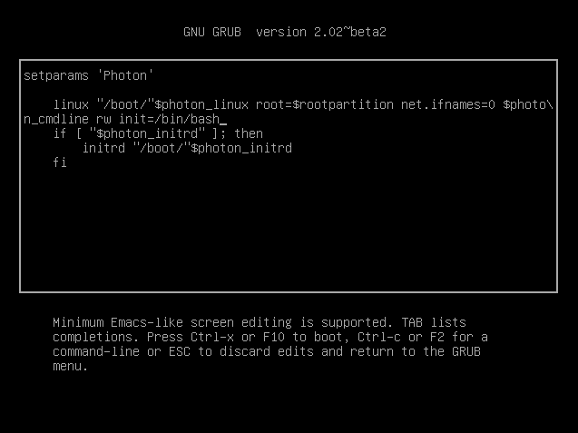
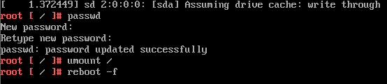
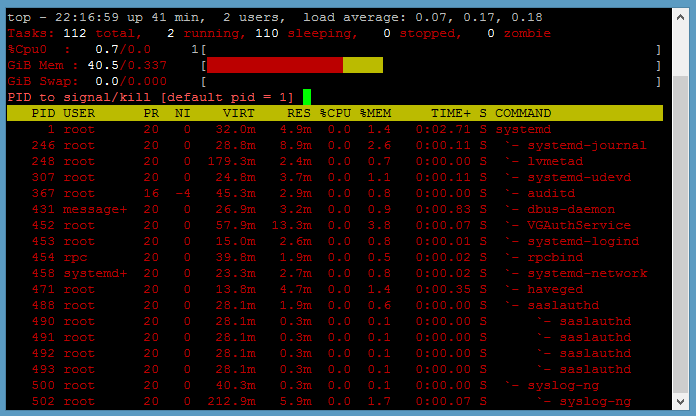
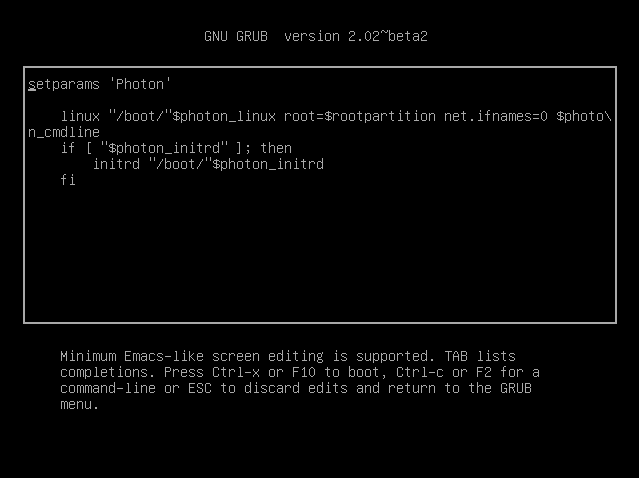

# Photon OS Linux Troubleshooting Guide

-   [Introduction](#introduction)
    -   [Systemd and TDNF](#systemd-and-tdnf)
    -   [The Root Account and the `sudo` and `su`
        Commands](#the-root-account-and-the-sudo-and-su-commands)
    -   [Checking the Version and Build
        Number](#checking-the-version-and-build-number)
    -   [General Best Practices](#general-best-practices)
    -   [Logs on Photon OS](#logs-on-photon-os)
    -   [Troubleshooting Progression](#troubleshooting-progression)
-   [Solutions to Common Problems](#solutions-to-common-problems)
    -   [Resetting a Lost Root
        Password](#resetting-a-lost-root-password)
    -   [Fixing Permissions on Network Config
        Files](#fixing-permissions-on-network-config-files)
    -   [Permitting Root Login with
        SSH](#permitting-root-login-with-ssh)
    -   [Fixing Sendmail If Installed Before an FQDN Was
        Set](#fixing-sendmail-if-installed-before-an-fqdn-was-set)
-   [Common Troubleshooting Tools on Photon
    OS](#common-troubleshooting-tools-on-photon-os)
    -   [Top](#top)
    -   [ps](#ps)
    -   [netstat](#netstat)
    -   [find](#find)
    -   [Locate](#locate)
    -   [df](#df)
    -   [md5sum and sha256sum](#md5sum-and-sha256sum)
    -   [strace](#strace)
    -   [file](#file)
    -   [stat](#stat)
    -   [watch](#watch)
    -   [vmstat and fdisk](#vmstat-and-fdisk)
    -   [lsof](#lsof)
    -   [fuser](#fuser)
    -   [ldd](#ldd)
    -   [gdb](#gdb)
    -   [Other Troubleshooting Tools Installed by
        Default](#other-troubleshooting-tools-installed-by-default)
    -   [Installing More Tools from
        Repositories](#installing-more-tools-from-repositories)
    -   [Linux Troubleshooting Tools Not on Photon
        OS](#linux-troubleshooting-tools-not-on-photon-os)
-   [Systemd](#systemd)
    -   [Viewing Services](#viewing-services)
    -   [Using Systemd Commands Instead of Init.d
        Commands](#using-systemd-commands-instead-of-init.d-commands)
    -   [Analyzing System Logs with
        journalctl](#analyzing-system-logs-with-journalctl)
    -   [Inspecting Services with
        `systemd-analyze`](#inspecting-services-with-systemd-analyze)
-   [Networking](#networking)
    -   [Managing the Network
        Configuration](#managing-the-network-configuration)
    -   [Use `ip` and `ss` Commands Instead of `ifconfig` and
        `netstat`](#use-ip-and-ss-commands-instead-of-ifconfig-and-netstat)
    -   [Inspecting the Status of Network Links with
        `networkctl`](#inspecting-the-status-of-network-links-with-networkctl)
    -   [Turning on Network
        Debugging](#turning-on-network-debugging)
    -   [Installing the Packages for tcpdump and netcat with
        tdnf](#installing-the-packages-for-tcpdump-and-netcat-with-tdnf)
    -   [Checking Firewall Rules](#checking-firewall-rules)
    -   [Netmgr](#netmgr)
-   [File System](#file-system)
    -   [Checking Disk Space](#checking-disk-space)
    -   [Adding a Disk and Partitioning
        It](#adding-a-disk-and-partitioning-it)
    -   [Expanding Disk Partition](#expanding-disk-partition)
    -   [fdisk](#fdisk)
    -   [fsck](#fsck)
    -   [Fixing File System Errors When fsck
        Fails](#fixing-file-system-errors-when-fsck-fails)
-   [Packages](#packages)
-   [Kernel Problems and Boot and Login
    Problems](#kernel-problems-and-boot-and-login-problems)
    -   [Kernel Overview](#kernel-overview)
    -   [Boot Process Overview](#boot-process-overview)
    -   [Blank Screen on Reboot](#blank-screen-on-reboot)
    -   [Investigating Strange
        Behavior](#investigating-strange-behavior)
    -   [Investigating the Guest Kernel When You Cannot Log
        On](#investigating-the-guest-kernel-when-you-cannot-log-on)
    -   [Kernel Log Replication with
        VProbes](#kernel-log-replication-with-vprobes)
-   [Performance Issues](#performance-issues)

## Introduction 

This guide describes the fundamentals of troubleshooting problems on Photon OS. An open-source minimalist Linux operating system from VMware, Photon OS is optimized for cloud computing platforms, VMware vSphere deployments, virtual appliances, and applications native to the cloud.

This guide covers the basics of troubleshooting systemd, packages, network interfaces, services such as SSH and Sendmail, the file system, and the Linux kernel. The guide includes a quick tour of the tools that you can use for troubleshooting and provides examples along the way. The guide also demonstrates how to access the system's log files. 

For information on how to install and manage Photon OS, see the [Photon OS Administration Guide](https://github.com/vmware/photon/blob/master/docs/photon-admin-guide.md).

### Systemd and TDNF

Two characteristics of Photon OS stand out: It manages services with systemd, and it manages packages with its own open source, yum-compatible package manager called tdnf, for Tiny DNF. 

By using systemd, Photon OS adopts a contemporary Linux standard to bootstrap the user space and concurrently start services--an architecture that differs from traditional Linux systems such as SUSE Linux Enterprise Server 11.

<!-- [[Image:photon-logo.png|right]] --> 

A traditional Linux system contains an initialization system called SysVinit. With SLES 11, for instance, SysVinit-style init programs control how the system starts up and shuts down. Init implements system runlevels. A SysVinit runlevel defines a state in which a process or service runs. In contrast to a SysVinit system, systemd defines no such runlevels. Instead, systemd uses a dependency tree of _targets_ to determine which services to start when.

Because the systemd commands differ from those of an init.d-based Linux system, a section later in this guide illustrates how to troubleshoot by using systemctl commands instead of init.d-style commands. 

Tdnf keeps the operating system as small as possible while preserving yum's robust package-management capabilities. On Photon OS, tdnf is the default package manager for installing new packages. Since troubleshooting with tdnf differs from using yum, a later section of this guide describes how to solve problems with packages and repositories by using tdnf commands.

### The Root Account and the `sudo` and `su` Commands

This guide assumes that you are logged in to Photon OS with the root account and running commands as root. The sudo program comes with the full version of Photon OS. On the minimal version, you must install sudo with tdnf if you want to use it. As an alternative to installing sudo on the minimal version, you can switch users as needed with the `su` command to run commands that require root privileges.

### Checking the Version and Build Number

To check the version and build number of Photon OS, concatenate `/etc/photon-release`. Example: 

	cat /etc/photon-release
	VMware Photon Linux 1.0
	PHOTON_BUILD_NUMBER=a6f0f63

The build number in the results maps to the commit number on the VMware Photon OS GitHub [commits page](https://github.com/vmware/photon/commits/master).

### General Best Practices

When troubleshooting, you should follow some general best practices:

* **Take a snapshot.** Before you do anything to a virtual machine running Photon OS, take a snapshot of the VM so that you can restore it if need be. 

* **Make a backup copy.** Before you change a configuration file, make a copy of the original in case you need to restore it later; example: `cp /etc/tdnf/tdnf.conf /etc/tdnf/tdnf.conf.orig`

* **Collect logs.** Save the log files associated with a Photon OS problem; you or others might need them later. Include not only the log files on the guest but also the `vmware.log` file on the host; `vmware.log` is in the host's directory that contains the VM.

* **Know what's in your toolbox.** Glance at the man page for a tool before you use it so that you know what your options are. The options can help focus the command's output on the problem you're trying to solve.

* **Understand the system.** The more you know about the operating system and how it works, the better you can troubleshoot.

### Logs on Photon OS

On Photon OS, all the system logs except the installation log and the cloud-init log are written into the systemd journal. The `journalctl` command queries the contents of the systemd journal.

The installation log files and the cloud-init log files reside in `/var/log`. If Photon OS is running on a virtual machine in a VMware hypervisor, the log file for the VMware tools (vmware-vmsvc.log) also resides in `/var/log`. 

### Troubleshooting Progression

If you encounter a problem running an application or appliance on Photon OS and you suspect it involves the operating system, you can troubleshoot by proceeding as follows. 

First, check the services running on Photon OS:

	systemctl status

Second, check your application's log files for clues. (For VMware applications, see [Location of Log Files for VMware Products](https://kb.vmware.com/selfservice/microsites/search.do?language=en_US&cmd=displayKC&externalId=1021806).)

Third, check the service controller or service monitor for your application or appliance. 

Fourth, check the network interfaces and other aspects of the network service with `systemd-network` commands.

Fifth, check the operating system's log files: 

	journalctl

Next, run the following commands to view all services according to the order in which they were started:

	systemd-analyze critical-chain 

Finally, if the previous steps have not revealed enough information to isolate the problem, turn to the troubleshooting tool that you think is most likely to help with the issue at hand. You could, for example, use `strace` to identify the location of the failure. See the list of troubleshooting tools on Photon OS in a later section. 

## Solutions to Common Problems

This section describes solutions to problems that you're likely to encounter.

### Resetting a Lost Root Password

Here's how to reset a lost root password. 

First, restart the Photon OS machine or the virtual machine running Photon OS. When the Photon OS splash screen appears as it restarts, type the letter `e` to go to the GNU GRUB edit menu. Be quick about it: Because Photon OS reboots so quickly, you won't have much time to type `e`. Remember that in vSphere and Workstation, you might have to give the console focus by clicking in its window before it will register input from the keyboard. 

Second, in the GNU GRUB edit menu, go to the end of the line that starts with `linux`, add a space, and then add the following code exactly as it appears below:

	rw init=/bin/bash

After you add this code, the GNU GRUB edit menu should look exactly like this:

 

Now type `F10`.

At the command prompt, type `passwd` and then type (and re-enter) a new root password that conforms to the password complexity rules of Photon OS. Remember the password. 

Next, type the following command:

	umount /

Finally, type the following command. You must include the `-f` option to force a reboot; otherwise, the kernel enters a state of panic.

	reboot -f

This sequence of commands should look like this:

After the Photon OS machine reboots, log in with the new root password. 

### Fixing Permissions on Network Config Files

If you, as the root user, create a new network configuration file on Photon OS, the network service might be unable to process it until you set the file's mode bits to `644`.

If you query the journal with `journalctl -u systemd-networkd`, you might see the following error message along with an indication that the network service did not start: 

	could not load configuration files. permission denied

The permissions on the network files are the likely cause of this problem. Without the correct permissions, networkd-systemd cannot parse and apply the settings, and the network configuration that you created will not be loaded. 

After you create a network configuration file with a `.network` extension, you must run the `chmod` command to set the new file's mode bits to `644`. Example: 

    chmod 644 10-static-en.network

For Photon OS to apply the new configuration, you must restart the `systemd-networkd` service by running the following command: 

	systemctl restart systemd-networkd

###	Permitting Root Login with SSH

The full version of Photon OS prevents root login with SSH by default. To permit root login over SSH, open `/etc/ssh/sshd_config` with the vim text editor and set `PermitRootLogin` to `yes`. 

Vim is the default text editor available in both the full and minimal versions of Photon OS. (Nano is also in the full version.) After you modify the SSH daemon's configuration file, you must restart the sshd daemon for the changes to take effect. Example: 

	vim /etc/ssh/sshd_config

	# override default of no subsystems
	Subsystem       sftp    /usr/libexec/sftp-server

	# Example of overriding settings on a per-user basis
	#Match User anoncvs
	#       X11Forwarding no
	#       AllowTcpForwarding no
	#       PermitTTY no
	#       ForceCommand cvs server
	PermitRootLogin yes
	UsePAM yes

Save your changes in vim and then restart the sshd daemon: 

	systemctl restart sshd

You can then connect to the Photon OS machine with the root account over SSH:

	steve@ubuntu:~$ ssh root@198.51.100.131

### Fixing Sendmail If Installed Before an FQDN Was Set

If Sendmail is behaving improperly or if it hangs during installation, it is likely that an FQDN is not set. Take the following corrective action. 

First, set an FQDN for your Photon OS machine. 

Then, run the following commands in the order below: 

    echo $(hostname -f) > /etc/mail/local-host-names
    
    cat > /etc/mail/aliases << "EOF"
        postmaster: root
        MAILER-DAEMON: root
        EOF

    /bin/newaliases

    cd /etc/mail

    m4 m4/cf.m4 sendmail.mc > sendmail.cf

    chmod 700 /var/spool/clientmqueue

    chown smmsp:smmsp /var/spool/clientmqueue

## Common Troubleshooting Tools on Photon OS

This section describes tools that can help troubleshoot problems. These tools are installed by default on the full version of Photon OS. On the minimal version of Photon OS, you may have to install a tool before you can use it. 

There is a manual, or man page, on Photon OS for all the tools covered in this section. The man pages provide more information about each tool's commands, options, and output. To view a tool's man page, on the Photon OS command line, type `man` and then the name of the tool. Example: 

	man strace

Some of the examples in this section are marked as abridged with ellipsis (`...`).

### Top

Photon OS includes the Top tool to monitor system resources, workloads, and performance. It can unmask problems caused by processes or applications overconsuming CPUs, time, or RAM. 

To view a textual display of resource consumption, run the `top` command: 

	top

In Top, you can kill a runaway or stalled process by typing `k` followed by its process ID (PID). 

If the percent of CPU utilization is consistently high with little idle time, there might be a runaway process overconsuming CPUs. Restarting the service might solve the problem. 

A handy trick while troubleshooting an unknown issue is to run Top in the background by using batch mode to write its output to a file in order to collect data about performance:

	top d 120 b >> top120second.output

For a list of options that filter top output and other information, see the man page for Top.

### ps

The `ps` tool shows the processes running on the machine. The `ps` tool derives flexibility and power from its options, all of which are covered in the tool's Photon OS man page:

	man ps

Here are several popular invocations of `ps` for troubleshooting. 

Show processes by user: 

	ps aux

Show processes and child processes by user: 

	ps auxf

Show processes containing the string `ssh`:

	ps aux | grep ssh

Show processes and the command and options with which they were started: 

	ps auxww

Example abridged output: 

	ps auxww
	USER        PID %CPU %MEM    VSZ   RSS TTY      STAT START   TIME COMMAND
	root          1  0.0  0.9  32724  3300 ?        Ss   07:51   0:32 /lib/systemd/systemd --switched-root --system --deserialize 22

### netstat

The `netstat` command can identify bottlenecks causing  performance issues. It lists network connections, listening sockets, port information, and interface statistics for different protocols. Examples: 

	netstat --statistics
	netstat --listening

### find

The `find` command can be a useful starting point to troubleshoot a Photon OS machine that has stopped working. The following command, for example, lists the files in the root directory that have changed in the past day: 

		find / -mtime -1 

See the `find` [manual](See https://www.gnu.org/software/findutils/manual/find.html). Take note of the security considerations listed in the `find` manual if you are using `find` to troubleshoot an appliance running on Photon OS. 

### Locate

The `locate` command is a fast way to find files and directories when all you have is a keyword. Similar to `find` and part of the same `findutils` package preinstalled on the full version of Photon OS by default, the `locate` command finds file names in the file names database. Before you can use `locate` accurately, you should update its database: 

	updatedb

Then you can run `locate` to quickly find a file, such as any file name containing `.network`, which can be helpful to see all the system's `.network` configuration files; abridged example: 

	locate .network
	/etc/dbus-1/system.d/org.freedesktop.network1.conf
	/etc/systemd/network/10-dhcp-en.network
	/usr/lib/systemd/network/80-container-host0.network
	/usr/lib/systemd/network/80-container-ve.network
	/usr/lib/systemd/system/busnames.target.wants/org.freedesktop.network1.busname
	/usr/lib/systemd/system/dbus-org.freedesktop.network1.service
	/usr/lib/systemd/system/org.freedesktop.network1.busnname
	/usr/share/dbus-1/system-services/org.freedesktop.network1.service

The `locate` command is also a quick way to see whether a troubleshooting tool is installed on Photon OS. Examples: 

	locate strace
	/usr/bin/strace
	/usr/bin/strace-graph
	/usr/bin/strace-log-merge
	/usr/share/man/man1/strace.1.gz
	/usr/share/vim/vim74/syntax/strace.vim

	locate traceroute

The `strace` tool is there but `traceroute` is not. You can, however, quickly install `traceroute` from the Photon OS repository: 

	tdnf install traceroute

### df

The `df` command reports the disk space available on the file system. Because running out of disk space can lead an application to fail, a quick check of the available space makes sense as an early troubleshooting step: 

	df -h

The `-h` option prints out the available and used space in human-readable sizes. After checking the space, you should also check the number of available inodes. Too few available inodes can lead to difficult-to-diagnose problems:

	df -i

### md5sum and sha256sum

`md5sum` calculates 128-bit MD5 hashes--a message digest, or digital signature, of a file--to uniquely identify a file and verify its integrity after file transfers, downloads, or disk errors when the security of the file is not in question. Photon OS also includes `sha256sum`, which is the preferred method of calculating the authenticity of a file to prevent tampering when security is a concern. Photon OS also includes `shasum`, `sha1sum`, `sha384sum`, and `sha512sum`. See the man pages for  `md3sum`, `sha256sum`, and the other SHA utilities. 

`md5sum` can help troubleshooting installation issues by verifying that the version of Photon OS being installed matches the version on the Bintray download page. If, for instance, bytes were dropped during the download, the checksums will not match. Try downloading it again. 

### strace

The `strace` utility follows system calls and signals as they are executed so that you can see what an application, command, or process is doing. `strace` can trace failed commands, identify where a process obtains its configuration, monitor file activity, and find the location of a crash. 

By tracing system calls, `strace` can help troubleshoot a broad range of problems, including issues with input-output, memory, interprocess communication, network usage, and application performance. 

For troubleshooting a problem that gives off few or no clues, the following command displays every system call: 

	strace ls -al

With strace commands, you can route the output to a file to make it easier to analyze: 

	strace -o output.txt ls -al

`strace` can reveal the files that an application is trying to open with the `-eopen` option. This combination can help troubleshoot an application that is failing because it is missing files or being denied access to a file it needs. If, for example, you see "No such file or directory" in the results of `strace -eopen`, something might be wrong: 

	strace -eopen sshd
	open("/usr/lib/x86_64/libpam.so.0", O_RDONLY|O_CLOEXEC) = -1 ENOENT (No such file or directory)
	open("/usr/lib/libpam.so.0", O_RDONLY|O_CLOEXEC) = 3

In the results above, it's OK that the first file is missing because it is found in the next line. In other cases, the application might be unable to open one of its configuration files or reading the wrong one. If the results say "permission denied" for one of the files, check the permissions of the file with `ls -l` or `stat`.   

When troubleshooting with `strace`, you can include the process ID in its commands. Here's an example of how to find a process ID: 

	ps -ef | grep apache

And you can then use `strace` to examine the file a process is working with: 

	strace -e trace=file -p 1719

A similar command can trace network traffic: 

	strace -p 812 -e trace=network

If an application is crashing, use `strace` to trace the application and then analyze what happens right before the application crashes.

You can also trace the child processes that an application spawns with the fork system call, and you can do so with systemctl commands that start a process to identify why an application crashes immediately or fails to start: 

	strace -f -o output.txt systemctl start httpd

Here's another example. If journalctl is showing that networkd is failing, you can run strace to help determine why: 

	strace -o output.txt systemctl restart systemd-networkd

And then grep inside the results for something, such as _exit_ or _error_: 

	grep exit output.txt

Maybe the results indicate systemd-resolved is going wrong, and you can then strace it, too: 

	strace -f -o output.txt systemctl restart systemd-resolved

### file

The `file` command determines the file type, which can help troubleshoot problems when an application mistakes one type of file for another, leading it to misbehave. Example: 

	file /usr/sbin/sshd
	/usr/sbin/sshd: ELF 64-bit LSB shared object, x86-64, version 1 (SYSV), dynamically linked, interpreter /lib64/ld-linux-x86-64.so.2, for GNU/Linux 2.6.32, stripped

### stat

The `stat` command can help troubleshoot problems with files or the file system by showing the last date it was modified and other information. Example:  

	stat /dev/sda1
	File: '/dev/sda1'
	Size: 0               Blocks: 0          IO Block: 4096   block special file
	Device: 6h/6d   Inode: 6614        Links: 1     Device type: 8,1
	Access: (0660/brw-rw----)  Uid: (    0/    root)   Gid: (    8/    disk)
	Access: 2016-09-02 12:23:56.135999936 +0000
	Modify: 2016-09-02 12:23:52.879999981 +0000
	Change: 2016-09-02 12:23:52.879999981 +0000
	Birth: -

On Photon OS, `stat` is handy to show permissions for a file or directory in both their absolute octal notation and their read-write-execute abbreviation; truncated example: 

	chmod 777 tester.md
	stat tester.md
	  File: 'tester.md'
	  Size: 0               Blocks: 0          IO Block: 4096   regular empty file
	Device: 801h/2049d      Inode: 316385      Links: 1
	Access: (0777/-rwxrwxrwx)  Uid: (    0/    root)   Gid: (    0/    root)

### watch

The `watch` utility runs a command at regular intervals so you can observe how its output changes over time. `watch` can help dynamically monitor network links, routes, and other information when you are troubleshooting networking or performance issues. Examples: 

	watch -n0 --differences ss
	watch -n1 --differences ip route
	
Here's another example with a screenshot of the command's output. This command monitors the traffic on your network links. The highlighted numbers are updated every second so you can see the traffic fluctuating: 

	watch -n1 --differences ip -s link show up

  

### vmstat and fdisk

The `vmstat` tool displays statistics about virtual memory, processes, block input-output, disks, and CPU activity. This tool can help diagnose performance problems, especially system bottlenecks.  

Its output on a Photon OS virtual machine running in VMware Workstation 12 Pro without a heavy load looks like this: 

	vmstat
	procs -----------memory---------- ---swap-- -----io---- -system-- ------cpu-----
	 r  b   swpd   free   buff  cache   si   so    bi    bo   in   cs us sy id wa st
	 0  0      0   5980  72084 172488    0    0    27    44  106  294  1  0 98  1  0

What do all these codes mean? They are explained in the vmstat man page. 

If `r`, the number of runnable processes, is higher than 10, the machine is under stress; consider intervening to reduce the number of processes or to distribute some of the processes to other machines. In other words, the machine has a bottleneck in executing processes.

If `cs`, the number of context switches per second, is really high, there may be too many jobs running on the machine. 

If `in`, the number of interrupts per second, is relatively high, there might be a bottleneck for network or disk IO. 

You can investigate disk IO further by using vmstat's `-d` option to report disk statistics; abridged example on a machine with little load: 

	vmstat -d
	disk- ------------reads------------ ------------writes----------- -----IO------
	       total merged sectors      ms  total merged sectors      ms    cur    sec
	ram0       0      0       0       0      0      0       0       0      0      0
	ram1       0      0       0       0      0      0       0       0      0      0
	loop0      0      0       0       0      0      0       0       0      0      0
	loop1      0      0       0       0      0      0       0       0      0      0
	sr0        0      0       0       0      0      0       0       0      0      0
	sda    22744    676  470604   12908  72888  24949  805224  127692      0    130

The `-D` option summarizes disk statistics:

	vmstat -D
	           26 disks
	            2 partitions
	        22744 total reads
	          676 merged reads
	       470604 read sectors
	        12908 milli reading
	        73040 writes
	        25001 merged writes
	       806872 written sectors
	       127808 milli writing
	            0 inprogress IO
	          130 milli spent IO

You can also get statistics about a partition. First, run the `fdisk -l` command to list the machine's devices. Then run `vmstat -p` with the name of a device to view its stats: 

	fdisk -l
	Disk /dev/ram0: 4 MiB, 4194304 bytes, 8192 sectors
	Units: sectors of 1 * 512 = 512 bytes
	Sector size (logical/physical): 512 bytes / 4096 bytes
	I/O size (minimum/optimal): 4096 bytes / 4096 bytes
	...
	Device        Start      End  Sectors Size Type
	/dev/sda1      2048 16771071 16769024   8G Linux filesystem
	/dev/sda2  16771072 16777182     6111   3M BIOS boot

	vmstat -p /dev/sda1
	sda1          reads   read sectors  writes    requested writes
	               22579     473306      78510     866088

See the vmstat man page for more options. 

### lsof

The `lsof` command lists open files. And this tool's definition of an open file is quite broad--directories, libraries, streams, domain sockets, and Internet sockets are all considered files, making `lsof` broadly applicable as a mid-level troubleshooting tool to identify the files a process is using. Because a Linux system like Photon OS uses files to do its work, you can run `lsof` as root to see how the system is using them and to see how an application works. 

If, for example, you cannot unmount a disk because it is in use, you can run `lsof` to identify the files on the disk that are being used. Here's an example showing what's using the root directory: 

	lsof /root
	COMMAND    PID USER   FD   TYPE DEVICE SIZE/OFF   NODE NAME
	bash       879 root  cwd    DIR    8,1     4096 262159 /root
	bash      1265 root  cwd    DIR    8,1     4096 262159 /root
	sftp-serv 1326 root  cwd    DIR    8,1     4096 262159 /root
	gdb       1351 root  cwd    DIR    8,1     4096 262159 /root
	bash      1395 root  cwd    DIR    8,1     4096 262159 /root
	lsof      1730 root  cwd    DIR    8,1     4096 262159 /root

You can do the same with an application or virtual appliance by running `lsof` with the user name or process ID of the app. Here's an example that lists the open files used by the Apache HTTP Server:  

	lsof -u apache

Running the command with the `-i` option lists all the open network and Internet files, which can help troubleshoot network problems: 

	lsof -i

See the Unix socket addresses of a user like _zookeeper_: 

	lsof -u zookeeper -U

And here's an example that shows the processes running on Ports 1 through 80:

	lsof -i TCP:1-80
	COMMAND  PID   USER   FD   TYPE DEVICE SIZE/OFF NODE NAME
	httpd    403   root    3u  IPv6  10733      0t0  TCP *:http (LISTEN)
	httpd    407 apache    3u  IPv6  10733      0t0  TCP *:http (LISTEN)
	httpd    408 apache    3u  IPv6  10733      0t0  TCP *:http (LISTEN)
	httpd    409 apache    3u  IPv6  10733      0t0  TCP *:http (LISTEN)
	sshd     820   root    3u  IPv4  11336      0t0  TCP *:ssh (LISTEN)
	sshd     820   root    4u  IPv6  11343      0t0  TCP *:ssh (LISTEN)
	sshd    1258   root    3u  IPv4  48040      0t0  TCP 198.51.100.143:ssh->198.51.100.1:49759 (ESTABLISHED)
	sshd    1319   root    3u  IPv4  50866      0t0  TCP 198.51.100.143:ssh->198.51.100.1:51054 (ESTABLISHED)
	sshd    1388   root    3u  IPv4  56438      0t0  TCP 198.51.100.143:ssh->198.51.100.1:60335 (ESTABLISHED)

You can also inspect the files opened by a process ID. Here's a truncated example that queries the files open by the systemd network service: 

	lsof -p 1917
	COMMAND    PID            USER   FD      TYPE             DEVICE SIZE/OFF   NODE NAME
	systemd-n 1917 systemd-network  cwd       DIR                8,1     4096      2 /
	systemd-n 1917 systemd-network  txt       REG                8,1   887896 272389 /usr/lib/systemd/systemd-networkd
	systemd-n 1917 systemd-network  mem       REG                8,1   270680 262267 /usr/lib/libnss_files-2.22.so
	systemd-n 1917 systemd-network    0r      CHR                1,3      0t0   5959 /dev/null
	systemd-n 1917 systemd-network    1u     unix 0x0000000000000000      0t0  45734 type=STREAM
	systemd-n 1917 systemd-network    3u  netlink                         0t0   6867 ROUTE
	systemd-n 1917 systemd-network    4u     unix 0x0000000000000000      0t0  45744 type=DGRAM
	systemd-n 1917 systemd-network    9u  netlink                         0t0  45754 KOBJECT_UEVENT
	systemd-n 1917 systemd-network   12u  a_inode               0,11        0   5955 [timerfd]
	systemd-n 1917 systemd-network   13u     IPv4             104292      0t0    UDP 198.51.100.143:bootpc

### fuser

The `fuser` command identifies the process IDs of processes using files or sockets. The term _process_ is, in this case, synonymous with _user_. To identify the process ID of a process using a socket, run `fuser` with its namespace option and specify `tcp` or `udp` and the name of the process or port. Examples: 

	fuser -n tcp ssh
	ssh/tcp:               940  1308
	fuser -n tcp http
	http/tcp:              592   594   595   596
	fuser -n tcp 80
	80/tcp:                592   594   595   596

### ldd

By revealing the shared libraries that a program depends on, `ldd` can help troubleshoot an application that is missing a library or finding the wrong one.

If, for example, you find output that says "file not found," check the path to the library.  

	ldd /usr/sbin/sshd
    linux-vdso.so.1 (0x00007ffc0e3e3000)
    libpam.so.0 => (file not found)
    libcrypto.so.1.0.0 => /usr/lib/libcrypto.so.1.0.0 (0x00007f624e570000)

You can also use the `objdump` command to show dependencies for a program's object files; example:

	objdump -p /usr/sbin/sshd | grep NEEDED

### gdb

The gdb tool is the GNU debugger. It lets you peer inside a program while it executes or when it crashes so that you can catch bugs on the fly. The gdb tool is typically used to debug programs written in C and C++. On Photon OS, gdb can help you determine why an application crashed. See the man page for gdb for instructions on how to run it. For an extensive example on how to use gdb to troubleshoot Photon OS running on a VM when you cannot login to Photon OS, see the section on troubleshooting boot and logon problems. 

### Other Troubleshooting Tools Installed by Default

The following troubleshooting tools are included in the full version of Photon OS: 

* `grep` searches files for patterns. 
* `ping` tests network connectivity. 
* `strings` displays the characters in a file to identify its contents.
* `lsmod` lists loaded modules.
* `ipcs` shows data about the inter-process communication (IPC) resources to which a process has read access--typically, shared memory segments, message queues, and semaphore arrays.
* `nm` lists symbols from object files. 
* `diff` compares files side by side. Useful to compare two configuration files when one version works and the other doesn't. 

### Installing More Tools from Repositories

You can install several troubleshooting tools from the Photon OS repositories by using the default package management system, `tdnf`. 

If a tool you need is not installed, the first thing you should do is search the repositories to see whether it's available. The traceroute tool, for example, is not installed by default. Here's how to search for it in the repositories:  

	tdnf search traceroute
	traceroute : Traces the route taken by packets over an IPv4/IPv6 network

The results of the above command show that traceroute exists in the repository. You install it with `tdnf`: 

	tdnf install traceroute

Additional tools are not installed by default but are in the repository for instant installation with `tdnf`: 

* `net-tools`: networking tools.
* `ltrace`: tool for intercepting and recording dynamic library calls. It can identify the function an application was calling when it crashed, making it useful for debugging.
* `nfs-utils`: client tools for the kernel Network File System, or NFS, including showmount; installed by default in the full version of Photon OS but not in the minimal version. 
* `pcstat`: A tool that inspects which pages of a file or files are being cached by the Linux kernel.
* `sysstat` and `sar`: Utilities to monitor system performance and usage activity. Installing sysstat also installs sar.
* `systemtap` and `crash`: The systemtap utility is a programmable instrumentation system for diagnosing problems of performance or function. Installing systemtap also installs crash, which is a kernel crash analysis utility for live systems and dump files.
* `dstat`: versatile tool for viewing and analyzing statistics about system resources.

The `dstat` tool, for example, can help troubleshoot system performance. The tool shows a live, running list of statistics about system resources: 

	dstat
	You did not select any stats, using -cdngy by default.
	----total-cpu-usage---- -dsk/total- -net/total- ---paging-- ---system--
	usr sys idl wai hiq siq| read  writ| recv  send|  in   out | int   csw
	  1   0  98   1   0   0|4036B   42k|   0     0 |   0     0 |  95   276
	  1   0  98   1   0   0|   0    64k|  60B  940B|   0     0 | 142   320
	  1   1  98   0   0   0|   0    52k|  60B  476B|   0     0 | 149   385

### Linux Troubleshooting Tools Not on Photon OS

The following Linux troubleshoot tools are neither installed on Photon OS by default nor available in the Photon OS repositories: 

* iostat
* telnet (use SSH instead)
* Iprm
* hdparm
* syslog (use journalctl instead)
* ddd
* ksysmoops
* xev
* GUI tools (because Photon OS has no GUI)

## Systemd

Photon OS manages services with systemd and its command-line utility for inspecting and controlling the system, `systemctl`, not the deprecated commands of init.d. For example, instead of running the /etc/init.d/ssh script to stop and start the OpenSSH server on a init.d-based Linux system, you control the service by running the following systemctl commands on Photon OS: 

	systemctl stop sshd
	systemctl start sshd

For an overview of systemd, see [systemd System and Service Manager](https://www.freedesktop.org/wiki/Software/systemd/) and the [man page for systemd](https://www.freedesktop.org/software/systemd/man/systemd.html). The systemd man pages are listed at [https://www.freedesktop.org/software/systemd/man/](https://www.freedesktop.org/software/systemd/man/).

### Viewing Services 

To view a description of all the active, loaded units, execute the systemctl command without any options or arguments: 

	systemctl

To see all the loaded, active, and inactive units and their description, run this command: 

	systemctl --all

To see all the unit files and their current status but no description, run this command: 

	systemctl list-unit-files

The `grep` command filters the services by a search term, a helpful tactic to recall the exact name of a unit file without looking through a long list of names. Example: 

	systemctl list-unit-files | grep network
	org.freedesktop.network1.busname           static
	dbus-org.freedesktop.network1.service      enabled
	systemd-networkd-wait-online.service       enabled
	systemd-networkd.service                   enabled
	systemd-networkd.socket                    enabled
	network-online.target                      static
	network-pre.target                         static
	network.target  

### Using Systemd Commands Instead of Init.d Commands

Basic system administration commands on Photon OS differ from those on operating systems that use SysVinit. Since Photon OS uses systemd instead of SysVinit, you must use systemd commands to manage services. 

For example, to list all the services that you can manage on Photon OS, you run the following command instead of `ls /etc/rc.d/init.d/`: 

	systemctl list-unit-files --type=service

Similarly, to check whether the `sshd` service is enabled, on Photon OS you run the following command instead of `chkconfig sshd`:

	systemctl is-enabled sshd

The `chkconfig --list` command that shows which services are enabled for which runlevel on a SysVinit computer becomes substantially different on Photon OS because there are no runlevels, only targets: 

	ls /etc/systemd/system/*.wants

You can also display similar information with the following command: 

	systemctl list-unit-files --type=service

Here is a list of some of the systemd commands that take the place of SysVinit commands on Photon OS: 

	USE THIS SYSTEMD COMMAND 	INSTEAD OF THIS SYSVINIT COMMAND
	systemctl start sshd 		service sshd start
	systemctl stop sshd 		service sshd stop
	systemctl restart sshd 		service sshd restart
	systemctl reload sshd 		service sshd reload
	systemctl condrestart sshd 	service sshd condrestart
	systemctl status sshd 		service sshd status
	systemctl enable sshd 		chkconfig sshd on
	systemctl disable sshd 		chkconfig sshd off
	systemctl daemon-reload		chkconfig sshd --add

### Analyzing System Logs with journalctl

The journalctl tool queries the contents of the systemd journal. On Photon OS, all the system logs except the installation log and the cloud-init log are written into the systemd journal. 

If called without parameters, the `journalctl` command shows all the contents of the journal, beginning with the oldest entry. To display the output in reverse order with new entries first, include the `-r` option in the command:

	journalctl -r

The `journalctl` command includes many options to filter its output. For help troubleshooting systemd, two journalctl queries are particularly useful: showing the log entries for the last boot and showing the log entries for a systemd service unit. This command displays the messages that systemd generated during the last time the machine started: 

	journalctl -b

This command reveals the messages for only the systemd service unit specified by the `-u` option, which in the following example is the auditing service: 

	journalctl -u auditd

You can look at the messages for systemd itself or for the network service:

	journalctl -u systemd
	journalctl -u systemd-networkd

Example:  

	root@photon-1a0375a0392e [ ~ ]# journalctl -u systemd-networkd
	-- Logs begin at Tue 2016-08-23 14:35:50 UTC, end at Tue 2016-08-23 23:45:44 UTC. --
	Aug 23 14:35:52 photon-1a0375a0392e systemd[1]: Starting Network Service...
	Aug 23 14:35:52 photon-1a0375a0392e systemd-networkd[458]: Enumeration completed
	Aug 23 14:35:52 photon-1a0375a0392e systemd[1]: Started Network Service.
	Aug 23 14:35:52 photon-1a0375a0392e systemd-networkd[458]: eth0: Gained carrier
	Aug 23 14:35:53 photon-1a0375a0392e systemd-networkd[458]: eth0: DHCPv4 address 198.51.100.1
	Aug 23 14:35:54 photon-1a0375a0392e systemd-networkd[458]: eth0: Gained IPv6LL
	Aug 23 14:35:54 photon-1a0375a0392e systemd-networkd[458]: eth0: Configured

For more information, see [journalctl](https://www.freedesktop.org/software/systemd/man/journalctl.html) or the journalctl man page by running this command: `man journalctl`

### Inspecting Services with `systemd-analyze`

The `systemd-analyze` command reveals performance statistics for boot times, traces system services, and verifies unit files. It can help troubleshoot slow system boots and incorrect unit files. See the man page for a list of options. Examples:

	systemd-analyze blame

	systemd-analyze dump

## Networking

### Managing the Network Configuration

The network service, which is enabled by default, starts when the system boots. You manage the network service by using systemd commands, such as systemd-networkd, systemd-resolvd, and networkctl. You can check its status of the network service by running the following command: 

	systemctl status systemd-networkd

Here is a healthy result of the command: 

	* systemd-networkd.service - Network Service
	   Loaded: loaded (/usr/lib/systemd/system/systemd-networkd.service; enabled; vendor preset: enabled)
	   Active: active (running) since Fri 2016-04-29 15:08:51 UTC; 6 days ago
	     Docs: man:systemd-networkd.service(8)
	 Main PID: 291 (systemd-network)
	   Status: "Processing requests..."
	   CGroup: /system.slice/systemd-networkd.service
	           `-291 /lib/systemd/systemd-networkd

Because Photon OS relies on systemd to manage services, you should employ the systemd suite of commands, not deprecated init.d commands or other deprecated commands, to manage networking. 

### Use `ip` and `ss` Commands Instead of `ifconfig` and `netstat`

Although the `ifconfig` command and the `netstat` command work on Photon OS, VMware recommends that you use the `ip` or `ss` commands. The `ifconfig` and `netstat` commands are deprecated. 

For example, instead of running `netstat` to display a list of network interfaces, consider running the `ss` command. Similarly, to display information for IP addresses, instead of running `ifconfig -a`, run the `ip addr` command. Examples:

	USE THIS IPROUTE COMMAND 	INSTEAD OF THIS NET-TOOL COMMAND
	ip addr 					ifconfig -a
	ss 							netstat
	ip route 					route
	ip maddr 					netstat -g
	ip link set eth0 up 		ifconfig eth0 up
	ip -s neigh					arp -v
	ip link set eth0 mtu 9000	ifconfig eth0 mtu 9000

Using the `ip route` version of a command instead of the net-tools version often provides more complete, accurate information on Photon OS, as the following example demonstrates: 

	ip neigh
	198.51.100.2 dev eth0 lladdr 00:50:56:e2:02:0f STALE
	198.51.100.254 dev eth0 lladdr 00:50:56:e7:13:d9 STALE
	198.51.100.1 dev eth0 lladdr 00:50:56:c0:00:08 DELAY

	arp -a
	? (198.51.100.2) at 00:50:56:e2:02:0f [ether] on eth0
	? (198.51.100.254) at 00:50:56:e7:13:d9 [ether] on eth0
	? (198.51.100.1) at 00:50:56:c0:00:08 [ether] on eth0

**Important:** If you modify an IPv6 configuration or add an IPv6 interface, you must restart `systemd-networkd`. Traditional methods of using `ifconfig` commands will be inadequate to register the changes. Run the following command instead: 

	systemctl restart systemd-networkd

### Inspecting the Status of Network Links with `networkctl`

The `networkctl` command shows information about network connections that helps you configure networking services and troubleshoot networking problems. You can, for example, progressively add options and arguments to the `networkctl` command to move from general information about network connections to specific information about a network connection. 

Running `networkctl` without options defaults to the list command:  

	networkctl
	IDX LINK             TYPE               OPERATIONAL SETUP
	  1 lo               loopback           carrier     unmanaged
	  2 eth0             ether              routable    configured
	  3 docker0          ether              routable    unmanaged
	 11 vethb0aa7a6      ether              degraded    unmanaged
	 4 links listed.

Running `networkctl` with the status command displays information that looks like this; you can see there are active network links with IP addresses for not only the Ethernet connection but also a Docker container. 

	root@photon-rc [ ~ ]# networkctl status
	*      State: routable
	     Address: 198.51.100.131 on eth0
	              172.17.0.1 on docker0
	              fe80::20c:29ff:fe55:3ca6 on eth0
	              fe80::42:f0ff:fef7:bd81 on docker0
	              fe80::4c84:caff:fe76:a23f on vethb0aa7a6
	     Gateway: 198.51.100.2 on eth0
	         DNS: 198.51.100.2

You can then add a network link, such as the Ethernet connection, as the argument of the status command to show specific information about the link: 

	root@photon-rc [ ~ ]# networkctl status eth0
	* 2: eth0
	       Link File: /usr/lib/systemd/network/99-default.link
	    Network File: /etc/systemd/network/10-dhcp-en.network
	            Type: ether
	           State: routable (configured)
	            Path: pci-0000:02:01.0
	          Driver: e1000
	      HW Address: 00:0c:29:55:3c:a6 (VMware, Inc.)
	             MTU: 1500
	         Address: 198.51.100.131
	                  fe80::20c:29ff:fe55:3ca6
	         Gateway: 198.51.100.2
	             DNS: 198.51.100.2
	        CLIENTID: ffb6220feb00020000ab116724f520a0a77337

And you can do the same thing with the Docker container: 

	networkctl status docker0
	* 3: docker0
	       Link File: /usr/lib/systemd/network/99-default.link
	    Network File: n/a
	            Type: ether
	           State: routable (unmanaged)
	          Driver: bridge
	      HW Address: 02:42:f0:f7:bd:81
	             MTU: 1500
	         Address: 172.17.0.1
	                  fe80::42:f0ff:fef7:bd81

In the example above, it is OK that the state of the Docker container is unmanaged; Docker handles managing the networking for the containers without using systemd-resolved or systemd-networkd. Instead, Docker manages the container's connection by using its bridge drive.

For more information about `networkctl` commands and options, see https://www.freedesktop.org/software/systemd/man/networkctl.html.

### Turning on Network Debugging

You can set `systemd-networkd` to work in debug mode so that you can analyze log files with debugging information to help troubleshoot networking problems. The following procedure turns on network debugging by adding a drop-in file in /etc/systemd to customize the default systemd configuration in /usr/lib/systemd. 

First, run the following command as root to create a directory with this exact name, including the `.d` extension:

	mkdir -p /etc/systemd/system/systemd-networkd.service.d/

Second, run the following command as root to establish a systemd drop-in unit with a debugging configuration for the network service:

	cat > /etc/systemd/system/systemd-networkd.service.d/10-loglevel-debug.conf << "EOF"
	[Service]
	Environment=SYSTEMD_LOG_LEVEL=debug
	EOF
 
You must reload the systemctl daemon and restart the systemd-networkd service for the changes to take effect: 

	systemctl daemon-reload
	systemctl restart systemd-networkd

Verify that your changes took effect:

	systemd-delta --type=extended

View the log files by running this command: 

	journalctl -u systemd-networkd

When you are finished debugging the network connections, turn debugging off by deleting the drop-in file: 

	rm /etc/systemd/system/systemd-networkd.service.d/10-loglevel-debug.conf

### Installing the Packages for tcpdump and netcat with tdnf

The minimal version of Photon OS leaves out several useful networking tools to keep the operating system lean. Tcpdump, for example, is absent in the minimal version but available in the repository. The minimal version does, however, include the iproute2 tools by default. 

Tcpdump captures and analyzes packets on a network interface. On Photon OS, you install tcpdump and its accompanying package libpcap, a C/C++ library for capturing network traffic, by using tdnf, Photon's command-line package manager: 

	tdnf install tcpdump

Netcat, a tool for sending data over network connections with TCP or UDP, appears in neither the minimal nor the full version of Photon OS. But since netcat furnishes powerful options for analyzing, troubleshooting, and debugging network connections, you might want to install it. To do so, run the following command: 

	tdnf install netcat

### Checking Firewall Rules

The design of Photon OS emphasizes security. On the minimal and full versions of Photon OS, the default security policy turns on the firewall and drops packets from external interfaces and  applications. As a result, you might need to add rules to iptables to permit forwarding, allow protocols like HTTP, and open ports. In other words, you must configure the firewall for your applications and requirements. 

The default iptables settings on the full version look like this:

	iptables --list
	Chain INPUT (policy DROP)
	target     prot opt source               destination
	ACCEPT     all  --  anywhere             anywhere
	ACCEPT     all  --  anywhere             anywhere             ctstate RELATED,ESTABLISHED
	ACCEPT     tcp  --  anywhere             anywhere             tcp dpt:ssh

	Chain FORWARD (policy DROP)
	target     prot opt source               destination

	Chain OUTPUT (policy DROP)
	target     prot opt source               destination
	ACCEPT     all  --  anywhere             anywhere

To find out how to adjust the settings, see the man page for iptables. 

Although the default iptables policy accepts SSH connections, the `sshd` configuration file on the full version of Photon OS  is set to reject SSH connections. See [Permitting Root Login with SSH](#permitting-root-login-with-ssh).

If you are unable to ping a Photon OS machine, one of the first things you should do is check the firewall rules. Do they allow connectivity for the port and protocol in question? You can supplement the `iptables` commands by using `lsof` to, for instance, see the processes listening on ports: 

	lsof -i -P -n

### Netmgr

If you are running a VMware appliance on Photon OS and the VAMI module has problems or if there are networking issues, you can use the Photon OS `netmgr` utility to inspect the networking settings. Make sure, in particular, that the IP addresses for the DNS server and other infrastructure are correct. Use `tcpdump` to analyze the issues. 

If you get an error code from netmgr, it is a standard Unix error code--enter it into a search engine to obtain more information.

## File System

This section covers troubleshooting the file system.

### Checking Disk Space

One of the first simple steps to take when you're troubleshooting is to check how much disk space is available by running the `df` command: 

	df -h

### Adding a Disk and Partitioning It

If the `df` command shows that the file system is indeed nearing capacity, you can add a new disk on the fly and partition it to increase capacity. 

First, add a new disk. You can, for example, add a new disk to a virtual machine by using the VMware vSphere Client. After adding a new disk, check for the new disk by using `fdisk`; see the section on `fdisk` below. In the following example, the new disk is named `/dev/sdb`:

	fdisk -l
	Device        Start      End  Sectors Size Type
	/dev/sda1      2048 16771071 16769024   8G Linux filesystem
	/dev/sda2  16771072 16777182     6111   3M BIOS boot
	
	Disk /dev/sdb: 1 GiB, 1073741824 bytes, 2097152 sectors
	Units: sectors of 1 * 512 = 512 bytes
	Sector size (logical/physical): 512 bytes / 512 bytes
	I/O size (minimum/optimal): 512 bytes / 512 bytes

After you confirm that Photon OS registers the new disk, you can partition it with the `parted` wizard. The command to partition the disk on Photon OS is as follows: 

	parted /dev/sdb

And then you use the parted wizard to create it (see the man page for `parted` for more information):

	mklabel gpt
	mkpart ext3 1 1024

Then you must create a file system on the partition:

	mkfs -t ext3 /dev/sdb1

Make a directory where you will mount the new file system: 

	mkdir /newdata

Finally, open `/etc/fstab` and add the new file system with the options that you want: 

	#system mnt-pt  type    options dump    fsck
	/dev/sda1       /       ext4    defaults,barrier,noatime,noacl,data=ord$
	/dev/cdrom      /mnt/cdrom      iso9660 ro,noauto       0       0
	/dev/sdb1       /newdata        ext3    defaults        0		0

Mount it for now: 

	mount /newdata

Check your work: 

	df -h
	Filesystem      Size  Used Avail Use% Mounted on
	/dev/root       7.8G  4.4G  3.1G  59% /
	devtmpfs        172M     0  172M   0% /dev
	tmpfs           173M     0  173M   0% /dev/shm
	tmpfs           173M  664K  172M   1% /run
	tmpfs           173M     0  173M   0% /sys/fs/cgroup
	tmpfs           173M   36K  173M   1% /tmp
	tmpfs            35M     0   35M   0% /run/user/0
	/dev/sdb1       945M  1.3M  895M   1% /newdata

### Expanding Disk Partition

If you need more space, you can expand the last partition of your disk after resizing the disk. In the examples we are assuming `sda` as disk device.

After the disk is resized in the virtual machine, it's necessary to tell the system to recognize the new disk ending boundary without rebooting:

	echo 1 > /sys/class/block/sda/device/rescan

You will need to install the parted package to resize the disk partition, which is not available by default. Just run the following command to install it: `tdnf install parted`.

	# parted /dev/sda
	GNU Parted 3.2
	Using /dev/sda
	Welcome to GNU Parted! Type 'help' to view a list of commands.

List all partitions available to fix the GPT and check the last partition number:

	(parted) print

	Warning: Not all of the space available to /dev/sda appears to be used, you can
	fix the GPT to use all of the space (an extra 4194304 blocks) or continue with
	the current setting? 
	Fix/Ignore?

Press `f` to fix the GPT layout.

	Model: VMware Virtual disk (scsi)
	Disk /dev/sda: 34.4GB
	Sector size (logical/physical): 512B/512B
	Partition Table: gpt
	Disk Flags: 

	Number  Start   End     Size    File system  Name  Flags
	1      1049kB  3146kB  2097kB                     bios_grub
	2      3146kB  8590MB  8587MB  ext4

In this case we have the partition `2` as last, then we extend the partition to 100% of the remaining size:

	(parted) resizepart 2 100%

Finally, expand the filesystem to the new size:

	resize2fs /dev/sda2
	resize2fs 1.42.13 (17-May-2015)
	Filesystem at /dev/sda2 is mounted on /; on-line resizing required
	old_desc_blocks = 1, new_desc_blocks = 2
	The filesystem on /dev/sda2 is now 8387835 (4k) blocks long.

The new space is already available in the system:

	df -h
	Filesystem      Size  Used Avail Use% Mounted on
	/dev/root        32G  412M   30G   2% /
	devtmpfs       1001M     0 1001M   0% /dev
	tmpfs          1003M     0 1003M   0% /dev/shm
	tmpfs          1003M  252K 1003M   1% /run
	tmpfs          1003M     0 1003M   0% /sys/fs/cgroup
	tmpfs          1003M     0 1003M   0% /tmp
	tmpfs           201M     0  201M   0% /run/user/0

### fdisk

The `fdisk` command manipulates the disk partition table. You can, for example, use `fdisk` to list the disk partitions so that you can identify the root Linux file system. Here is an truncated example showing `/dev/sda1` to be the root Linux partition: 

	fdisk -l
	Disk /dev/ram0: 4 MiB, 4194304 bytes, 8192 sectors
	Units: sectors of 1 * 512 = 512 bytes
	Sector size (logical/physical): 512 bytes / 4096 bytes
	I/O size (minimum/optimal): 4096 bytes / 4096 bytes
	...
	Disk /dev/sda: 8 GiB, 8589934592 bytes, 16777216 sectors
	Units: sectors of 1 * 512 = 512 bytes
	Sector size (logical/physical): 512 bytes / 512 bytes
	I/O size (minimum/optimal): 512 bytes / 512 bytes
	Disklabel type: gpt
	Disk identifier: 3CFA568B-2C89-4290-8B52-548732A3972D

	Device        Start      End  Sectors Size Type
	/dev/sda1      2048 16771071 16769024   8G Linux filesystem
	/dev/sda2  16771072 16777182     6111   3M BIOS boot

Remember the `fdisk -l` command--it will be used later in a section that demonstrates how to reset a lost root password. 

### fsck

The Photon OS file system includes btrfs and ext4. The default root file system is ext4, which you can see by looking at the file system configuration file, `/etc/fstab`: 

	cat /etc/fstab
	#system mnt-pt  type    options dump    fsck
	/dev/sda1       /       ext4    defaults,barrier,noatime,noacl,data=ordered     1       1
	/dev/cdrom      /mnt/cdrom      iso9660 ro,noauto       0       0

The `1` in the fifth column, under `fsck`, indicates that fsck checks the file system when the system boots.

You can manually check the file system by using the file system consistency check tool, `fsck`, after you unmount the file system. You can also perform a read-only check without unmounting it:

	fsck -nf /dev/sda1
	fsck from util-linux 2.27.1
	e2fsck 1.42.13 (17-May-2015)
	Warning!  /dev/sda1 is mounted.
	Warning: skipping journal recovery because doing a read-only filesystem check.
	Pass 1: Checking inodes, blocks, and sizes
	Pass 2: Checking directory structure
	Pass 3: Checking directory connectivity
	Pass 4: Checking reference counts
	Pass 5: Checking group summary information
	Free blocks count wrong (1439651, counted=1423942).
	Fix? no
	Free inodes count wrong (428404, counted=428397).
	Fix? no
	/dev/sda1: 95884/524288 files (0.3% non-contiguous), 656477/2096128 blocks

The inodes count is probably off because the file system is mounted and in use. To fix problems, you must first unmount the file system and then run fsck again: 

	umount /dev/sda1
	umount: /: target is busy
	        (In some cases useful info about processes that
	         use the device is found by lsof(8) or fuser(1).)

So check it with `lsof`:

	lsof | grep ^jbd2/sd
	jbd2/sda1   99                root  cwd       DIR                8,1     4096          2 /
	jbd2/sda1   99                root  rtd       DIR                8,1     4096          2 /
	jbd2/sda1   99                root  txt   unknown                                        /proc/99/exe

The file system is indeed in use. What troubleshooting tool would you use next to further explore the applications or processes that are using the file system?  

### Fixing File System Errors When fsck Fails

A potential issue is that when `fsck` runs during startup, it finds a problem that prevents the system from fully booting until you fix the issue by running fsck manually. This kind of a problem can occur when Photon OS is the operating system for a VM running an appliance. 

If fsck fails when the computer boots and an error message says to run fsck manually, you can troubleshoot by restarting the VM, altering the GRUB edit menu to enter emergency mode before Photon OS fully boots, and running fsck.

1. Take a snapshot of the virtual machine. 

1. Restart the virtual machine running Photon OS. 

1. When the Photon OS splash screen appears as it restarts, type the letter `e` to go to the GNU GRUB edit menu. Be quick about it: Because Photon OS reboots so quickly, you won't have much time to type `e`. Remember that in VMware vSphere or VMware Workstation Pro, you might have to give the console focus by clicking in its window before it will register input from the keyboard. 

1. In the GNU GRUB edit menu, go to the end of the line that starts with `linux`, add a space, and then add the following code exactly as it appears below:

	`systemd.unit=emergency.target`

1. Type `F10`.

1. In the bash shell, run one of the following commands to fix the file system errors, depending on whether `sda1` or `sda2` represents the root file system: 

	`e2fsck -y /dev/sda1`

	or

	`e2fsck -y /dev/sda2`

1. Restart the virtual machine.

## Packages

On Photon OS, tdnf is the default package manager. The standard syntax for `tdnf` commands is the same as that for DNF and Yum: 

	tdnf [options] <command> [<arguments>...]

The main configuration files reside in `/etc/tdnf/tdnf.conf`. The repositories appear in `/etc/yum.repos.d/` with `.repo` file extensions. For more information, see the [Photon OS Administration Guide](https://github.com/vmware/photon/blob/master/docs/photon-admin-guide.md).

The cache files for data and metadata reside in `/var/cache/tdnf`. The local cache is populated with data from the repository: 

	ls -l /var/cache/tdnf/photon
	total 8
	drwxr-xr-x 2 root root 4096 May 18 22:52 repodata
	d-wxr----t 3 root root 4096 May  3 22:51 rpms

You can clear the cache to help troubleshoot a problem, but keep in mind that doing so might slow the performance of tdnf until the cache becomes repopulated with data. Cleaning the cache can remove stale information. Here is how to clear the cache: 

	tdnf clean all
	Cleaning repos: photon photon-extras photon-updates lightwave
	Cleaning up everything

Some tdnf commands can help you troubleshoot problems with packages:

`makecache`: This command updates the cached binary metadata for all known repositories. You can run it after you clean the cache to make sure you are working with the latest repository data as you troubleshoot. Example:

	tdnf makecache
	Refreshing metadata for: 'VMware Lightwave 1.0(x86_64)'
	Refreshing metadata for: 'VMware Photon Linux 1.0(x86_64)Updates'
	Refreshing metadata for: 'VMware Photon Extras 1.0(x86_64)'
	Refreshing metadata for: 'VMware Photon Linux 1.0(x86_64)'
	Metadata cache created.

`tdnf check-local`: This command resolves dependencies by using the local RPMs to help check RPMs for quality assurance before publishing them. To check RPMs with this command, you must create a local directory and place your RPMs in it. The command, which includes no options, takes the path to the local directory containing the RPMs as its argument. The command does not, however, recursively parse directories; it checks the RPMs only in the directory that you specify. For example, after creating a directory named `/tmp/myrpms` and placing your RPMs in it, you can run the following command to check them:  

	tdnf check-local /tmp/myrpms
	Checking all packages from: /tmp/myrpms
	Found 10 packages
	Check completed without issues

`tdnf provides`: This command finds the packages that provide the package that you supply as an argument. If you are used to a package name for another system, you can use `tdnf provides` to find the corresponding name of the package on Photon OS. Example: 

	tdnf provides docker
	docker-1.11.0-1.ph1.x86_64 : Docker
	Repo     : photon
	docker-1.11.0-1.ph1.x86_64 : Docker
	Repo     : @System

For a file, you must provide the full path. Here's an example: 

	tdnf provides /usr/include/stdio.h
	glibc-devel-2.22-8.ph1.x86_64 : Header files for glibc
	Repo     : photon
	glibc-devel-2.22-8.ph1.x86_64 : Header files for glibc
	Repo     : @System

Here's an example that shows you how to find the package that provides a pluggable authentication module, which you might need to find if the system is mishandling passwords. 

	tdnf provides /etc/pam.d/system-account
	shadow-4.2.1-7.ph1.x86_64 : Programs for handling passwords in a secure way
	Repo     : photon
	shadow-4.2.1-8.ph1.x86_64 : Programs for handling passwords in a secure way
	Repo     : photon-updates

Additional commands appear in the [Photon OS Administration Guide](https://github.com/vmware/photon/blob/master/docs/photon-admin-guide.md).

If you find a package that is installed but is not working, try re-installing it; example: 

	tdnf reinstall shadow
	Reinstalling:
	shadow 	x86_64 	4.2.1-7.ph1   3.85 M

## Kernel Problems and Boot and Login Problems

### Kernel Overview

Photon OS 1.0 uses Linux kernel version 4.4. Troubleshooting kernel problems starts with `dmesg`. The `dmesg` command prints messages from the kernel ring buffer. The following command, for example, presents kernel messages in a human-readable format: 

	dmesg --human --kernel

To examine kernel messages as you perform actions, such as reproducing a problem, in another terminal, you can run the command with the `--follow` option, which waits for new messages and prints them as they occur: 

	dmesg --human --kernel --follow

The kernel buffer is limited in memory size. As a result, the kernel cyclically overwrites the end of the information in the buffer from which dmesg pulls information. The systemd journal, however, saves the information from the buffer to a log file so that you can access older information. To view it, run the following command: 

	journalctl -k

If need be, you can check the modules that are loaded on your Photon OS machine by running the `lsmod` command; truncated example:  

	lsmod
	Module                  Size  Used by
	vmw_vsock_vmci_transport    28672  1
	vsock                  36864  2 vmw_vsock_vmci_transport
	coretemp               16384  0
	hwmon                  16384  1 coretemp
	crc32c_intel           24576  0
	hid_generic            16384  0
	usbhid                 28672  0
	hid                   106496  2 hid_generic,usbhid
	xt_conntrack           16384  1
	iptable_nat            16384  0
	nf_conntrack_ipv4      16384  2
	nf_defrag_ipv4         16384  1 nf_conntrack_ipv4
	nf_nat_ipv4            16384  1 iptable_nat
	nf_nat                 24576  1 nf_nat_ipv4
	iptable_filter         16384  1
	ip_tables              24576  2 iptable_filter,iptable_nat

### Boot Process Overview

When a Photon OS machine boots, the BIOS initializes the hardware and uses a boot loader to start the kernel. After the kernel starts, systemd takes over and boots the rest of the operating system. 

More specifically, the BIOS checks the memory and initializes the keyboard, the screen, and other peripherals. When the BIOS finds the first hard disk, the boot loader--GNU GRUB 2.02--takes over. From the hard disk, GNU GRUB loads the master boot record (MBR) and initializes the root partition of the random-access memory by using initrd. The device manager, udev, provides initrd with the drivers it needs to access the device containing the root file system. Here's what the GNU GRUB edit menu looks like in Photon OS with its default commands to load the boot record and initialize the RAM disk: 

  

At this point, the Linux kernel in Photon OS, which is kernel version 4.4.8, takes control. Systemd kicks in, initializes services in parallel, mounts the rest of the file system, and checks the file system for errors. 

### Blank Screen on Reboot

If the Photon OS kernel enters a state of panic during a reboot and all you see is a blank screen, note the name of the virtual machine running Photon OS and then power off the VM. 

In the host, open the `vmware.log` file for the VM. When a kernel panics, the guest VM prints the entire kernel log in  `vmware.log` in the host's directory containing the VM. This log file contains the output of the `dmesg` command from the guest, and you can analyze it to help identify the cause of the boot problem. 

Here's an example. After searching for `Guest:` in the following abridged `vmware.log`, this line appears, identifying the root cause of the reboot problem: 

	2016-08-30T16:02:43.220-07:00| vcpu-0| I125: Guest: 
	<0>[1.125804] Kernel panic - not syncing: 
	VFS: Unable to mount root fs on unknown-block(0,0)

Further inspection finds the following lines: 

	2016-08-30T16:02:43.217-07:00| vcpu-0| I125: Guest: 
	<4>[    1.125782] VFS: Cannot open root device "sdc1" or unknown-block(0,0): error -6
	2016-08-30T16:02:43.217-07:00| vcpu-0| I125: Guest: 
	<4>[    1.125783] Please append a correct "root=" boot option; 
	here are the available partitions: 
	2016-08-30T16:02:43.217-07:00| vcpu-0| I125: Guest: 
	<4>[    1.125785] 0100            4096 ram0  (driver?)
	...
	0800         8388608 sda  driver: sd
	2016-08-30T16:02:43.220-07:00| vcpu-0| I125: Guest: 
	<4>[    1.125802]   0801         8384512 sda1 611e2d9a-a3da-4ac7-9eb9-8d09cb151a93
	2016-08-30T16:02:43.220-07:00| vcpu-0| I125: Guest: 
	<4>[    1.125803]   0802            3055 sda2 8159e59c-b382-40b9-9070-3c5586f3c7d6

In this unlikely case, the GRUB configuration points to a root device named `sdc1` instead of the correct root device, `sda1`. You can fix the problem by restoring the GRUB GNU edit screen and the GRUB configuration file (`/boot/grub/grub.cfg`) to their original configurations. 

### Investigating Strange Behavior

If you rebooted to address strange behavior before the reboot of if you encountered strange behavior during the reboot but have reached the shell, you should analyze what happened since the previous boot. Start broad by running the following command to check the logs: 

	journalctl

Next, run the following command to look at what happened since the penultimate reboot: 

	journalctl --boot=-1

Then look at the log from the reboot: 

	journalctl -b

If need be, examine the logs for the kernel: 

	journalctl -k

Check which kernel is in use:

	uname -r

The kernel version of Photon OS in the full version is 4.4.8. The kernel version of in the OVA version is 4.4.8-esx. With the ESX version of the kernel, some services might not start. Run this command to check the overall status of services: 

	systemctl status 

If a service is in red, check it: 

	systemctl status service-name

Start it if need be: 

	systemctl start service-name

If looking at the journal and checking the status of services gets you nowhere, run the following `systemd-analyze` commands to examine the boot time and the speed with which services start.

	systemd-analyze time
	systemd-analyze blame
	systemd-analyze critical-chain
 
Keep in mind that the output of these commands might be misleading because one service might just be waiting for another service to finish initializing.

### Investigating the Guest Kernel When You Cannot Log On

If a VM running Photon OS and an application or virtual appliance is behaving so oddly that, for example, you cannot log on to the machine, you can still troubleshoot by extracting the kernel logs from the guest's memory and analyzing them with `gdb`. 

This advanced troubleshooting method works when you are running Photon OS as the operating system for an application or appliance on VMware Workstation, Fusion, or ESXi. This approach assumes that the virtual machine running Photon OS is functioning normally. 

This troubleshooting method has the following requirements: 

* Root access to a Linux machine other than the one you are troubleshooting. It can be another Photon OS machine, Ubuntu, or another Linux variant. 
* The `vmss2core` utility from VMware. It is installed by default in VMware Workstation and some other VMware products. If your system doesn't already contain it, you can download it for free from https://labs.vmware.com/flings/vmss2core.
* A local copy of the Photon OS ISO of the exact same version and release number as the Photon OS machine that you are troubleshooting. 

The process to use this troubleshooting method varies by environment. The examples in this section assume that the troublesome Photon OS virtual machine is running in VMware Workstation 12 Pro on a Microsoft Windows 8 Enterprise host. The examples also use an additional, fully functional Photon OS virtual machine running in Workstation.

You can, however, use other hosts, hypervisors, and operating systems--but you will have to adapt the example process below to them. Directory paths, file names, and other aspects might be different on other systems. 

**Overview**   

The process to apply this troubleshooting method goes like this: On a local computer, you open a file on the Photon OS ISO that contains Linux debugging information. Then you suspend the troublesome Photon OS VM and extract the kernel memory logs from the VMware hypervisor running Photon OS. 

Next, you use the vmss2core tool to convert the memory logs into core dump files. The vmss2core utility converts VMware checkpoint state files into formats that third-party debugging tools understand. It can handle both suspend (.vmss) and snapshot (.vmsn) checkpoint state files (hereafter referred to as a _vmss file_) as well as monolithic and non-monolithic (separate .vmem file) encapsulation of checkpoint state data. See [Debugging Virtual Machines with the Checkpoint to Core Tool](http://www.vmware.com/pdf/snapshot2core_technote.pdf).

Finally, you prepare to run the gdb tool by using the debug info file from the ISO to create a `.gdbinit` file, which you can then analyze with the gdb shell on your local Linux machine.

All three components must be in the same directory on a Linux machine.  

**Process**

First, obtain a local copy of the Photon OS ISO of the exact same version and release number as the Photon OS machine that you are troubleshooting and mount the ISO on a Linux machine (or open it on a Windows machine):

	mount /mnt/cdrom

Second, locate the following file. (If you opened the Photon OS ISO on a Windows computer, copy the following file to the root folder of a Linux machine.)

	/RPMS/x86_64/linux-debuginfo-4.4.8-6.ph1.x86_64.rpm

Third, on a Linux machine, run the following `rpm2cpio` command to convert the RPM file to a cpio file and to extract the contents of the RPM to the current directory:

	rpm2cpio /mnt/cdrom/RPMS/x86_64/linux-debuginfo-4.4.8-6.ph1.x86_64.rpm | cpio -idmv

From the extracted files, copy the following file to your current directory: 

	cp usr/lib/debug/lib/modules/4.4.8/vmlinux-4.4.8.debug .

Run the following command to download the dmesg functions that will help extract the kernel log from the coredump: <!--	wget https://www.kernel.org/doc/Documentation/kdump/gdbmacros.txt
-->

	wget https://github.com/vmware/photon/blob/master/tools/scripts/gdbmacros-for-linux.txt

Move the file as follows: 

	mv gdbmacros-for-linux.txt .gdbinit

Next, switch to your host machine so you can get the kernel memory files from the VM. Suspend the troublesome VM and locate the `.vmss` and `.vmem` files in the virtual machine's directory on the host. Example: 

	C:\Users\tester\Documents\Virtual Machines\VMware Photon 64-bit (7)>dir
	 Volume in drive C is Windows
	 Directory of C:\Users\tester\Documents\Virtual Machines\VMware Photon 64-bit
	 (7)
	09/20/2016  12:22 PM    <DIR>          .
	09/20/2016  12:22 PM    <DIR>          ..
	09/19/2016  03:39 PM       402,653,184 VMware Photon 64-bit (7)-f6b070cd.vmem
	09/20/2016  12:11 PM         5,586,907 VMware Photon 64-bit (7)-f6b070cd.vmss
	09/20/2016  12:11 PM     1,561,001,984 VMware Photon 64-bit (7)-s001.vmdk
	...
	09/20/2016  12:11 PM           300,430 vmware.log
	...

Now that you have located the `.vmss` and `.vmem` files, convert them to one or more core dump files by using the vmss2core tool that comes with Workstation. Here is an example of how to run the command. Be careful with your pathing, escaping, file names, and so forth--all of which might be different from this example on your Windows machine. 

	C:\Users\shoenisch\Documents\Virtual Machines\VMware Photon 64-bit (7)>C:\"Program Files (x86)\VMware\VMware Workstation"\vmss2core.exe "VMware Photon 64-bit (7)-f6b070cd.vmss" "VMware Photon 64-bit (7)-f6b070cd.vmem"

The result of this command is one or more files with a `.core` extension plus a digit. Truncated example: 

	C:\Users\tester\Documents\Virtual Machines\VMware Photon 64-bit (7)>dir
	 Directory of C:\Users\tester\Documents\Virtual Machines\VMware Photon 64-bit(7)
	09/20/2016  12:22 PM       729,706,496 vmss.core0

Copy the `.core` file or files to the your current directory on the Linux machine where you so that you can analyze it with gdb. 

Run the following `gdb` command to enter the gdb shell attached to the memory core dump file. You might have to change the name of the `vmss.core` file in the example to match your `.core` file:

	gdb vmlinux-4.4.8.debug vmss.core0

	GNU gdb (GDB) 7.8.2
	Copyright (C) 2014 Free Software Foundation, Inc.
	License GPLv3+: GNU GPL version 3 or later <http://gnu.org/licenses/gpl.html>
	This is free software: you are free to change and redistribute it. 
	There is NO WARRANTY, to the extent permitted by law. ...
	Type "show configuration" for configuration details.
	For bug reporting instructions, please see:
	<http://www.gnu.org/software/gdb/bugs/>.
	Find the GDB manual and other documentation resources online at: <http://www.gnu.org/software/gdb/documentation/>.
	For help, type "help".
	Type "apropos word" to search for commands related to "word"...
	Reading symbols from vmlinux-4.4.8.debug...done.
	warning: core file may not match specified executable file.
	[New LWP 12345]
	Core was generated by `GuestVM'.
	Program terminated with signal SIGSEGV, Segmentation fault.
	#0  0xffffffff813df39a in insb (count=0, addr=0xffffc90000144000, port=<optimized out>)
	    at arch/x86/include/asm/io.h:316
	316     arch/x86/include/asm/io.h: No such file or directory.
	(gdb)

In the results above, the _(gdb)_ of the last line is the prompt of the gdb shell. You can now analyze the core dump by using commands like `bt` (to perform a backtrace) and `dmesg` (to view the Photon OS kernel log and see Photon OS kernel error messages). 

### Kernel Log Replication with VProbes

Replicating the Photon OS kernel logs on the VMware ESXi host is an advanced but powerful method of troubleshooting a kernel problem. This method is applicable when the virtual machine running Photon OS is hanging or inaccessible because, for instance, the hard disk has failed.

There is a prerequisite, however: You must have preemptively enabled the VMware VProbes facility on the VM before a problem rendered it inaccessible. You must also create a VProbes script on the ESXi host, but you can do that after the fact. 

Although the foresight to implement these prerequisites might limit the application of this troubleshooting method for production systems, the method can be particularly useful in analyzing kernel issues when testing an application or appliance that is running on Photon OS.   

There are two similar ways in which you can replicate the Photon OS kernel logs on ESXi by using VProbes. The first modifies the VProbes script so that it works only for the VM that you set; it uses a hard-coded address. The second uses an abstraction instead of a hard-coded address so that the same VProbes script can be used for any VM on an ESXi host that you have enabled for VProbe and copied its kernel symbol table (kallsyms) to ESXi.

For more information on VMware VProbes, see [VProbes: Deep Observability Into the ESXi Hypervisor](https://labs.vmware.com/vmtj/vprobes-deep-observability-into-the-esxi-hypervisor) and the [VProbes Programming Reference](http://www.vmware.com/pdf/ws7_f3_vprobes_reference.pdf).

**Using VProbes Script with a Hard-Coded Address**

Here's how to set a VProbe for an individual VM: 

First, power off the VM so that you can turn on the VProbe facility. Edit the `.vmx` configuration file for the VM. The file resides in the directory that contains the VM in the ESXi data store. Add the following line of code to the `.vmx` file and then power the VM on: 

	vprobe.enable = "TRUE"

When you edit the `.vmx` file to add the above line of code, you must first turn off the VM--otherwise, your changes will not persist. 

Second, obtain the kernel log_store function address by connecting to the VM with SSH and running the following commands as root. (Photon OS uses the `kptr_restrict` setting to place restrictions on the kernel addresses exposed through `/proc` and other interfaces. This setting hides exposed kernel pointers to prevent attackers from exploiting kernel write vulnerabilities. When you are done using VProbes, you should return `kptr_restrict` to the original setting of `2` by rebooting.)

	echo 0 > /proc/sys/kernel/kptr_restrict
	grep log_store /proc/kallsyms

The output of the `grep` command will look similar to the following string. The first set of characters (without the `t`) is the log_store function address:

	ffffffff810bb680 t log_store

Third, connect to the ESXi host with SSH so that you can create a VProbes script. Here's the template for the script; `log_store` in the first line is a placeholder for the VM's log_store function address: 

	GUEST:ENTER:log_store {
	 string dst;
	 getgueststr(dst, getguest(RSP+16) & 0xff, getguest(RSP+8));
	 printf("%s\n", dst);
	}

On the ESXi host, create a new file, add the template to it, and then change `log_store` to the function address that was the output from the grep command on the VM. 

You must add a `0x` prefix to the function address. In this example, the modified template looks like this: 

	GUEST:ENTER:0xffffffff810bb680 {
	 string dst;
	 getgueststr(dst, getguest(RSP+16) & 0xff, getguest(RSP+8));
	 printf("%s\n", dst);
	}

Save your VProbes script as `console.emt` in the `/tmp` directory. (The file extension for VProbe scripts is `.emt`.) 

While still connected to the ESXi host with SSH, run the following command to obtain the ID of the virtual machine that you want to troubleshoot: 

	vim-cmd vmsvc/getallvms

This command lists all the VMs running on the ESXi host. Find the VM you want to troubleshoot in the list and make a note of its ID. 

Finally, run the following command to print all the kernel messages from Photon OS in your SSH console; replace `<VM ID>` with the ID of your VM:  

	vprobe -m <VM ID> /tmp/console.emt

When you're done, type `Ctrl-C` to stop the loop. 

**A Reusable VProbe Script Using the kallsyms File**

Here's how to create one VProbe script and use for all the VMs on your ESXi host. 

First, power off the VM and turn on the VProbe facility on each VM that you want to be able to analyze. Add `vprobe.enable = "TRUE"` to the VM's `.vmx` configuration file. See the instructions above. 

Second, power on the VM, connect to it with SSH, and run the following command as root: 

	echo 0 > /proc/sys/kernel/kptr_restrict

Third, connect to the ESXi host with SSH to create the following VProbes script and save it as `/tmp/console.emt`:

	GUEST:ENTER:log_store {
	 string dst;
	 getgueststr(dst, getguest(RSP+16) & 0xff, getguest(RSP+8));
	 printf("%s\n", dst);
	}

Fourth, from the ESXi host, run the following command to copy the VM's `kallysms` file to the `tmp` directory on the ESXi host: 

	scp root@<vm ip address>:/proc/kallsyms /tmp

While still connected to the ESXi host with SSH, run the following command to obtain the ID of the virtual machine that you want to troubleshoot: 

	vim-cmd vmsvc/getallvms

This command lists all the VMs running on the ESXi host. Find the VM you want to troubleshoot in the list and make a note of its ID. 

Finally, run the following command to print all the kernel messages from Photon OS in your SSH console; replace `<VM ID>` with the ID of your VM. When you're done, type `Ctrl-C` to stop the loop.  

	vprobe -m <VM ID> -k /tmp/kallysyms /tmp/console.emt

You can use a directory other than `tmp` if you want.

<!--
### Deep Kernel Analysis with the Crash Utility

-->

<!-- 

### Go to the Debug Shell

 panic=1 init=/bin/bash
mount o rw,remount /
cd /lib/systemd/system/multi-user.target.wants
ln s ../debug-shell.service
umount /
sync
exit

After reboot debug-shell will be available on tty9. No password required.

-->

## Performance Issues

Performance issues can be difficult to troubleshoot because so many variables play a role in overall system performance. Interpreting performance data often depends on the context and the situation. To better identify and isolate variables and to gain insight into performance data, you can use the troubleshooting tools on Photon OS to diagnose the system.  

If you have no indication what the cause of a performance degradation might be, start by getting a broad picture of the system's state. Then look for clues in the data that might point to a cause. The systemd journal is a useful place to start. 

The `top` tool can unmask problems caused by processes or applications overconsuming CPUs, time, or RAM. If the percent of CPU utilization is consistently high with little idle time, for example, there might be a runaway process. Restart it. 

The `netstat --statistics` command can identify bottlenecks causing performance issues. It lists interface statistics for different protocols. 

If `top` and `netstat` reveal no clues, run the `strace ls -al` to view every system call.

The following `watch` command can help dynamically monitor a command to help troubleshoot performance issues:

	watch -n0 --differences <command>

You can, for example, combine `watch` with the `vmstat` command to dig deeper into statistics about virtual memory, processes, block input-output, disks, and CPU activity. Are there any bottlenecks? 

Another option is to use the `dstat` utility. It shows a live, running list of statistics about system resources. 

In addition, `systemd-analyze`, which reveals performance statistics for boot times, can help troubleshoot slow system boots and incorrect unit files.

The additional tools that you select depend on the clues that your initial investigation reveals. The following tools can also help troubleshoot performance: `sysstat`, `sar`, `systemtap`, and `crash`. 

