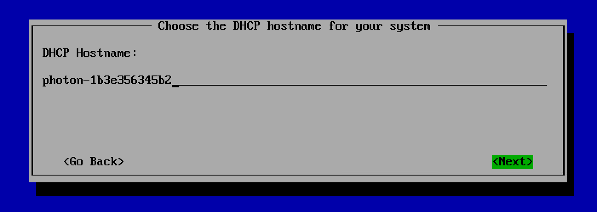
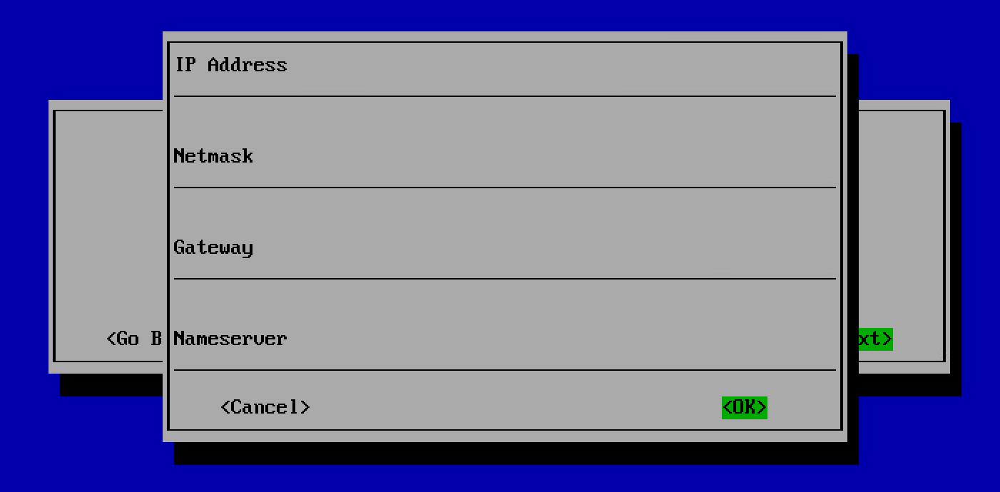

# Configuring the Network

##Prerequisites

Complete step 10 in the [Installing the ISO Image for Photon OS 3.0](installing-the-iso-image-for-photon-os-30.md) section.

##Procedure
1. From the **Network Configuration**, select one of the four options to configure your network.
 

1. Choose **Configure network automatically** and select **Next** to configure the network automatically.
1. To configure network automatically with the DHCP hostname, select **Configure network automatically with a DHCP hostname** and select **Next**. Enter the DHCP Hostname and select **Next**.

1. To configure the network manually, select **Configure Network manually**. In the window that appears, enter the IP Address, Netmask, Gateway and Nameserver and select **OK**.

1. If your network interface is directly connected to the VLAN trunk port, choose **YES** on the Configure the network screen.
. Enter the VLAN ID and select **Next**.

### Result
Your network is configured successfully.