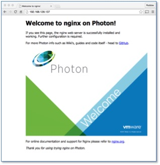

# Deploy a Containerized Application in Photon OS

Connect to the Photon instance by using SSH and to launch a web server by running it in Docker.

1. Connect with SSH

    Connect to the instance over SSH by specifying the private key (.pem) file and the user name for the Photon machine, which is `root`:
    
    	ssh -i ~/.ssh/mykeypair root@<public-ip-address-of-instance>
    
    For complete instructions, see [Connecting to Your Linux Instance Using SSH](http://docs.aws.amazon.com/AWSEC2/latest/UserGuide/AccessingInstancesLinux.html). 

1. Run Docker

    On the minimal version of Photon OS, the docker engine is enabled and running by default, which you can see by running the following command: 
    
    	systemctl status docker

1. Start the web server

    **Note**: Please make sure that the proper security policies have been enabled on the Amazon AWS side to enable traffic to port 80 on the VM. 
    
    Since Docker is running, you can run an application in a container--for example, the Nginx Web Server. This example uses the popular open source web server Nginx. The Nginx application has a customized VMware package that the Docker engine can download directly from the Docker Hub.
    
    To pull Nginx from its Docker Hub and start it, run the following command: 
    
    	docker run -p 80:80 vmwarecna/nginx
    
    The Nginx web server should be bound to the public DNS value for the instance of Photon OS, that is, the same address with which you connected over SSH. 

1. Test the web server

    On your local workstation, open a web browser and go to the the public address of the Photon OS instance running Docker. The following screen should appear, showing that the web server is active:
    
    
    
    Stop the Docker container by typing `Ctrl+c` in the SSH console through which you are connected to EC2. 
    
You can now run other containerized applications from the Docker Hub or your own containerized application on Photon OS in the Amazon cloud. 
