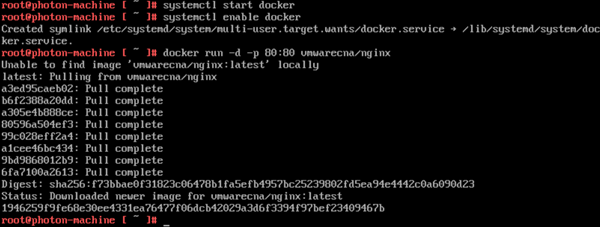
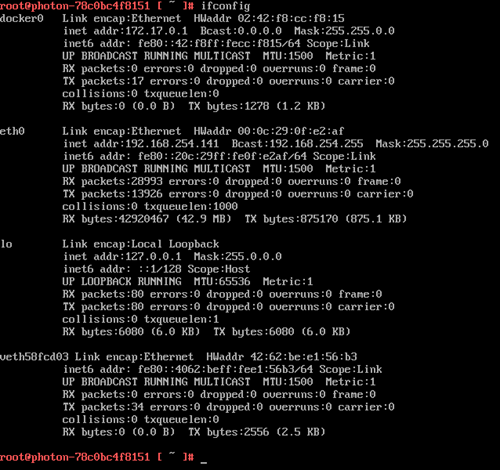
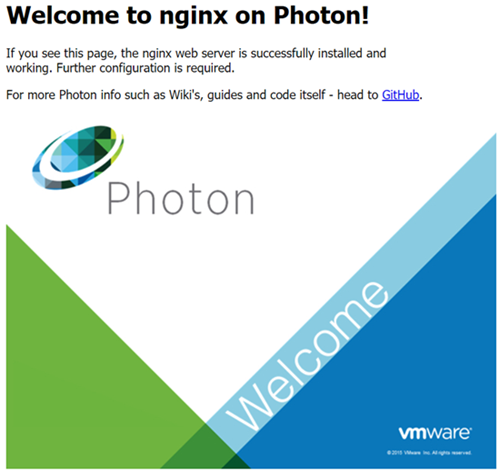

# Deploying a Containerized Application in Photon OS

Now that you have your container runtime environment up and running, you can easily deploy a containerized application. For this example, you will deploy the popular open source Web Server Nginx. The Nginx application has a customized VMware package that is published as a dockerfile and can be downloaded, directly, through the Docker module from the Docker Hub.

1. Run Docker

    To run Docker from the command prompt, enter the following command, which initializes the docker engine:
    
        systemctl start docker
    
    To ensure Docker daemon service runs on every subsequent VM reboot, enter the following command:
    
        systemctl enable docker

1. Run the Nginx Web Server

    Now the Docker daemon service is running, it is a simple task to "pull" and start the Nginx Web Server container from Docker Hub. To do this, type the following command:
    
        docker run -d -p 80:80 vmwarecna/nginx
    
    This pulls the Nginx Web Server files and appropriate dependent container filesystem layers required for this containerized application to run.
    
    
    
    After the **docker run**  process completes, you return to the command prompt. You now have a fully active website up and running in a container!

1. Test the Web Server

    To test that your Web Server is active, run the ifconfig command to get the IP address of the Photon OS Virtual Machine.
    
    
    
    The output displays a list of adapters that are connected to the virtual machine. Typically, the web server daemon will be bound on **eth0**.
    
    Start a browser on your host machine and enter the IP address of your Photon OS Virtual Machine. You should see a screen similar to the following example as confirmation that your web server is active.
    
    
    
    You can now run any other containerized application from Docker Hub or your own containerized application within Photon OS.

