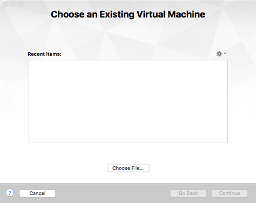
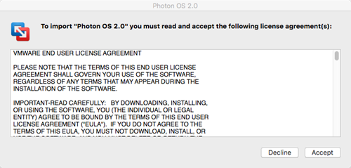
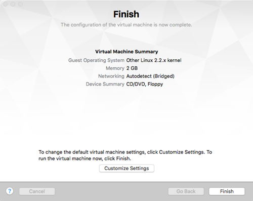
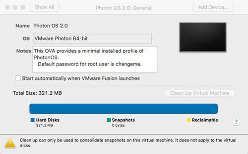
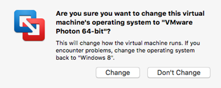
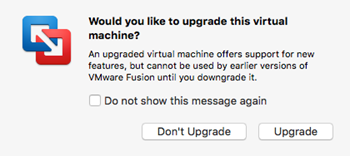
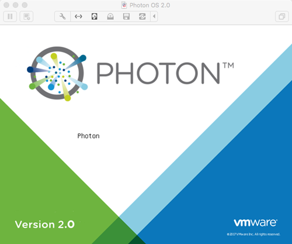
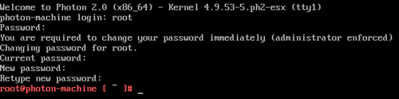

# Importing the OVA for Photon OS 3.0

Using the OVA is a fast and easy way to create a Photon OS VM on Fusion.

After you have downloaded the Photon OS OVA image (OVA with Hardware Version 11) into a folder of your choice, open VMware Fusion and perform the following steps:

1. Start the Import Process

    From the File menu, choose **Import …**. Fusion prompts you to choose an existing virtual machine.

    

    Choose the **Choose File …**  button to locate and select the Photon OS OVA, then choose **Continue**.

    

1. Specify the Name and Storage Location

    Provide the name and storage location for your Photon OS VM, then choose **Save**.
    
    
    
    Review the Photon OS License Agreement, then choose **Accept** to start the import process.
    
    

1. Configure VM Settings

    After the OVA is imported, Fusion displays a confirmation that the import has completed and a summary of the settings for your Photon OS VM. The following screen shot is an example (your settings may vary).
    
    
    
    **Important:** Choose **Customize Settings**  to change the operating system (as recognized by the hypervisor) for the newly imported VM.
    
    
    
    Choose **General**.
    
    Click the selection box next to **OS**, select **Linux** , and then select **VMware Photon 64-bit**.
    
    
    
    Close the settings window. Fusion prompts you to verify that you want to change the operating system.
    
    
    
    Click **Change**. Your Photon OS VM is ready to power on.

1. Power on the VM

    Power on the Photon OS VM. Fusion may ask you whether you want to upgrade this VM.
    
    
    
    How you respond depends on which hardware version (13 or 11) that you want to use. Upgrade if you need to use devices supported only in hardware version 13. Don't upgrade if you want to be compatible with older tools that are supported in hardware version 11.

1. Update Login Credentials

    
    
    After the VM is booted, Fusion prompts you to log in.
    
    **Note** : Because of limitations within OVA support on Fusion, it was necessary to specify a default password for the OVA option. However, all Photon OS instances that are created by importing the OVA will require an immediate password change upon login. The default account credentials are:
    
    | **Setting** | **Value** |
    | --- | --- |
    | Username | ``root`` |
    | Password | ``changeme`` |
    
    After you provide these credentials, Fusion prompts you to create a new password and type it a second time to verify it. For security, Photon OS forbids common dictionary words for the root password. Once logged in, you will see the shell prompt.
    
    
    
Once complete, proceed to [Deploying a Containerized Application in Photon OS](deploying-a-containerized-application-in-photon-os-fusion.md).