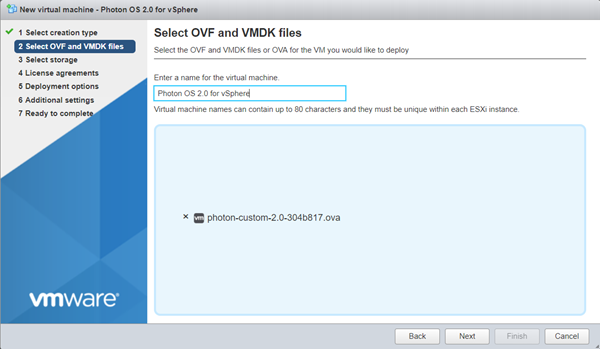
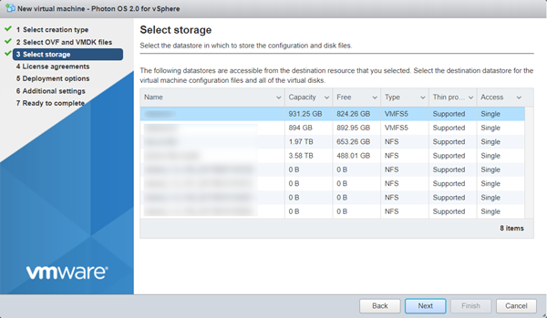
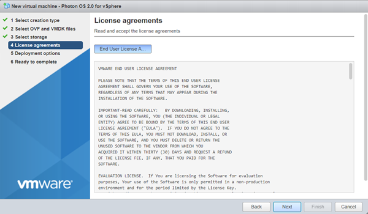
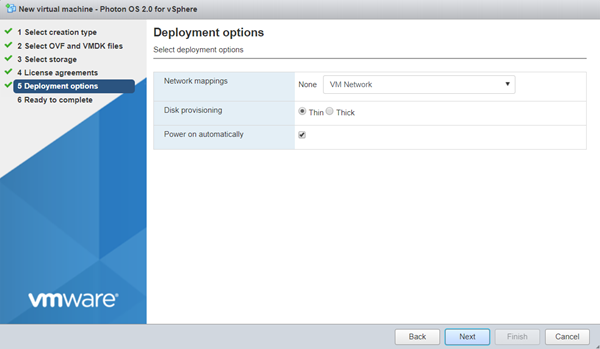
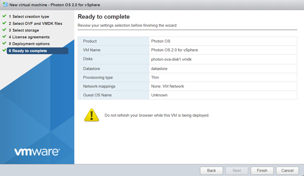
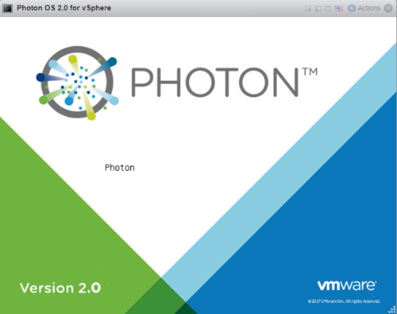
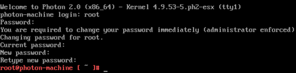

# Importing the OVA for Photon OS 3.0

Using the OVA is a fast and easy way to create a Photon OS VM on VMware vSphere.

After you have downloaded the OVA, log in to your vSphere environment and perform the following steps:

1. Start the Import Process

    From the Actions pull-down menu, choose **Create/Register VM**.
    
    
    
    In the Select creation type window, choose  **Deploy a virtual machine from an OVF or OVA file**.
    
    (images/vs-ova-new-vm-ova.png)
    
    Choose **Next**.

1. Select the OVA File

    Enter a name for the virtual machine, and select the OVA file.
    
    
    
    Choose **Next**.

1. Specify the Target Datastore

    From the Select storage screen, select the target datastore for your VM.
    
    
    
    Choose  **Next**.

1. Accept the License Agreement

    Read through the Photon OS License Agreement, and then choose **I Agree**.
    
    
    
    Choose **Next**.

1. Select Deployment Options

    Photon OS is provisioned with a maximum disk size. By default, Photon OS uses only the portion of disk space that it needs, usually much less that the entire disk size ( **Thin** client). If you want to pre-allocate the entire disk size (reserving it entirely for Photon OS instead), select **Thick**  instead.
       
    
        
    Choose **Next**.

1. Verify Deployment Settings

        
    
    
    Click **Finish**. vSphere uploads and validates your OVA. Depending on bandwidth, this operation might take a while.
    
    When finished, vShield powers up a new VM based on your selections.

1. Change Login Settings

    
    
    After the VM is booted, open the command window. vSphere prompts you to log in.
    
    **Note**: Because of limitations within OVA support on vSphere, it was necessary to specify a default password for the OVA option. However, all Photon OS instances that are created by importing the OVA require an immediate password change upon login. The default account credentials are:
    
    | **Setting** | **Value** |
    | --- | --- |
    | Username | ``root`` |
    | Password | ``changeme`` |

    After you provide these credentials, vSphere prompts you to create a new password and type it a second time to verify it.
    
    **Note:** For security, Photon OS forbids common dictionary words for the root password.  
    
    Once logged in, you will see the shell prompt.
    
    
    
    Once complete, proceed to [Deploying a Containerized Application in Photon OS](deploying-a-containerized-application-in-photon-os.md).

1. Export the VM as a Template (Optional)

    Consider converting this imported VM into a template (from the Actions menu, choose **Export** ) so that you have a master Photon OS instance that can be combined with vSphere Guest Customization to enable rapid provisioning of Photon OS instances.
    
    