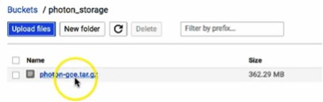
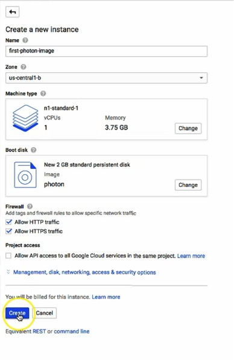

# Installing Photon OS on Google Compute Engine

After you download the Photon OS image for GCE, log into GCE and install Photon OS. 

Perform the following steps:

1. Create a New Bucket

Create a new bucket to store your Photon OS image for GCE.

1. Upload the Photon OS Image

While viewing the bucket that created, click the `Upload files` button, navigate to your Photon OS image and click the `Choose` button. 

When the upload finishes, you can see the Photon OS compressed image in the file list for the bucket that you created.

1. Create a New Image

To create a new image, click on `Images` in the `Compute` category in the left panel and then click on the `New Image` button. 

Enter a name for the image in the `Name` field and change the `Source` to `Cloud Storage file` using the pull-down menu. Then, in the `Cloud Storage file` field, enter the bucket name and filename as the path to the Photon OS image for GCE. In this example, where the bucket was named `photon_storage,` the path is as follows:
 
	`photon_storage/photon-gce-2.0-tar.gz`

The new image form autopopulates the `gs://` file path prefix.*

Click the `Create` button to create your image. You must be able to see the Images catalog and your Photon OS image at the top of the list. 

1. Create a New Instance

To create an instance, check the box next to the Photon OS image and click the `Create Instance` button. 

On the `Create a new instance` form, provide a name for this instance, confirm the zone into which this instance is to be deployed and, before clicking `Create,` check the `Allow HTTP traffic` and `Allow HTTPS traffic` options. 

**Note**: The firewall rules in this example are optional. You can configure the ports according to your requirements. 

When the instance is created you will be returned to your list of VM instances. If you click on the instance, the status page for the instance will allow you to SSH into your Photon OS environment using the SSH button at the top of the panel. 

At this point, your instance is running and you are ready to start the Docker engine and run a container workload. For more information, see [Deploying a Containerized Application in Photon OS](deploying-a-containerized-application-in-photon-os.md).