# Installing the ISO Image for Photon OS 3.0

After you have downloaded the latest Photon OS ISO image into a folder of your choice, open VMware Fusion.

1. Start the Installation Process

    From the File menu, choose  **New**.
    
    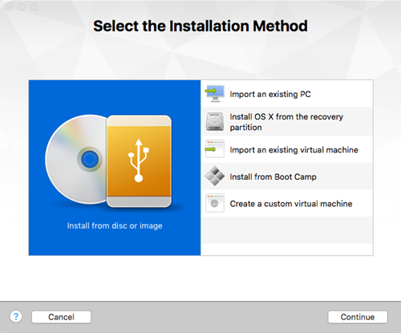
    
    From the Select the Installation Method dialog, select **Install from disc or image**, and then choose **Continue**.
    
    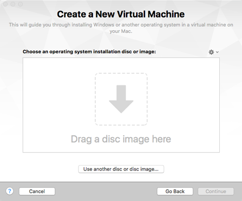

1. Select the ISO Image

    Drag a disc image onto the window or choose **Use another disc or disc image...**, choose the ISO file you want, and then choose **Continue**.
    
    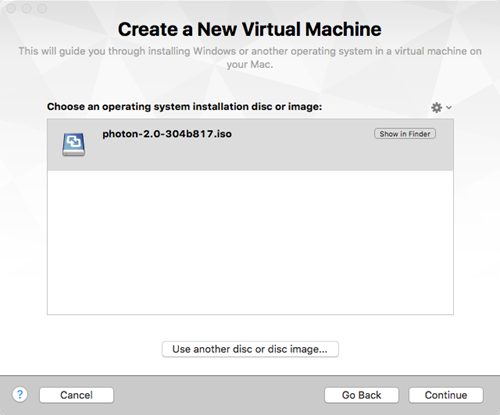

1. Select the Operating System

    On the Choose Operating System dialog, select **Linux**  in the left-hand column and **VMware Photon 64-bit**  in the right-hand column.
    
    

    Choose **Continue**.

1. Select the Virtual Disk (Optional)

    If you are using a Fusion version that is older than Fusion 8, you might see the following dialog.
    
    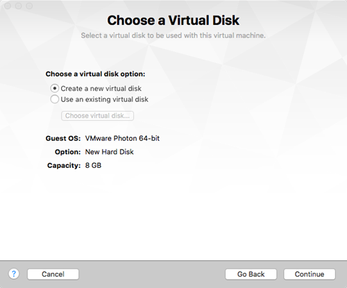
    
    If you see this dialog, unless you're installing into an existing machine, choose **Create a new virtual disk**  from the Choose a Virtual Disk dialog, and then choose **Continue**.
    
    **Note:** Fusion v8 and later automatically defaults to creating a new 8GB disk and formats it automatically. If you want to use an existing disk, or if you want to pre-allocate all 8GB, go into VM Settings, choose **Add Device**, and choose either **New Hard Disk** or **Existing Hard Disk**. Expand **Advanced options**  and configure whether you want to pre-allocate disk space (disabled by default) or split into multiple files (enabled by default).

1. Configure VM Settings

    **Important:** Before you finish creating the Photon OS Virtual Machine, we strongly recommend that you customize the virtual machine and remove any unwanted devices that are not needed for a container run-time environment.
    
    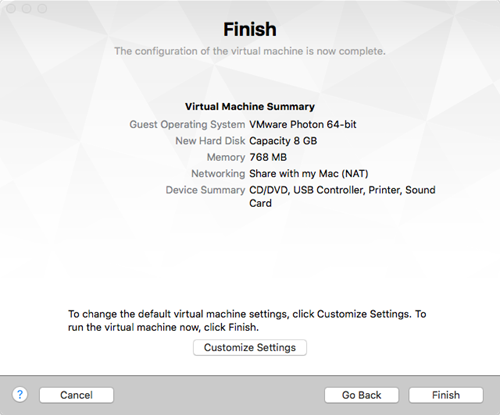
    
    To remove unnecessary devices, choose **Customize Settings**.
    
    First, choose a name for your Virtual Machine, along with the folder into which you create the Virtual Machine (or accept the default folder).
    
    
    
    Choose **Save**. The virtual machine will be created. The Settings screen allows you to customize virtual hardware for the new virtual machine. If it does not automatically appear, open **Settings** from the Virtual Machine menu bar.
    
    
    
    You can remove (recommended) the following components that are not used by Photon OS:
    
    - Select **Display** and ensure that the **Accelerate 3D Graphics** option is unchecked (it should be unchecked, by default). Select **Show All** to return to the VM Settings.
    - Select **CD/DVD (IDE)** and ensure that the **Connect CD/DVD Drive** box is checked (it should be checked by default). Select **Show All** to return to the VM Settings.
    - Select **Sound Card**, un-check the **Connect Sound Card** Option, and click **Remove Sound Card.** Choose **Remove** to confirm your action. Select **Show All** to return to the VM Settings.
    - Select **USB &amp; Bluetooth** and uncheck the **Share Bluetooth devices with Linux** setting. Select **Show All** to return to the VM Settings.
    - Select **Printer** and press the **Remove Printer Port** button in the bottom left hand corner. Choose **Remove** to confirm your action. Select **Show All** to return to the VM Settings.
    - Select **Camera** and press the **Remove Camera** button in the bottom left hand corner. Choose **Remove** to confirm your action. Select **Show All** to return to the VM Settings.
    - Select **Advanced** and ensure that the **Pass Power Status to VM** option is unchecked (it should be unchecked, by default). Select **Show All,** but do not close the VM Settings window.
    
    By default, Photon OS is configured with a disk size of 8GB. However, Photon OS uses only the portion of disk space it needs, usually much less that the entire disk size. If you want to pre-allocate the entire disk size (reserving it entirely for Photon OS instead), select **Hard Disk**, expand **Advanced options**, and check **Pre-allocate disk space** (by default, it is unchecked). Select **Show All** to return to the VM Settings.

1. Configure a Secure Boot (Optional)

    **Note:**  If you want to configure a secure boot for the Photon OS VM you created, edit its .vmx file  and add the following line:
    
    **firmware = "efi"**
    
    The EFI boot ensures that the ISO content is signed by VMware and that the entire stack is secure.
    
    After you have made the customizations you want, close the Virtual Machine Settings window. You are now ready to boot and begin the installation process.

1. Power On the VM

    Return to the Fusion main menu, select the Photon OS Virtual Machine, and click **Start Up** (you can also choose **Start Up** from the Virtual Machine menu).
    
    Fusion powers on the host and starts the installation. Within a few seconds, Fusion displays the Photon OS installer boot menu.
    
    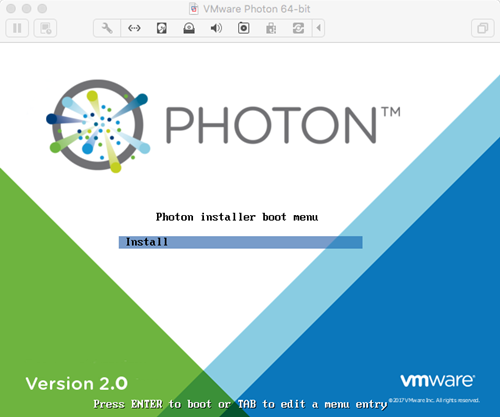
    
    Press the Enter key on your keyboard to start installing.
    
    
    
    Read the License Agreement and press the Enter key to accept.

1. Configure the Partition

    The Installer will detect one disk, which should be the 8GB volume configured as part of the virtual machine creation.
    
    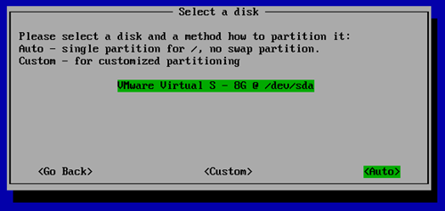
    
    Choose **Auto**  to have the installer automatically allocate the partition, or choose **Custom** if you want to configure individual partitions, and then press the Enter key.
    
    **Note:** If you choose **Custom**, the installer displays the following screen.
    
    
    
    For each custom partition, choose **Create New**  and specify the following information:
    
    
    
    **Size** - Preallocated size of this partition, in MB.
    
    **Type** - One of the following options:
    
    - **ext3** - ext3 file system
    - **ext4** - ext4 file system
    - **swap** - swap partition
    
    **Mountpoint** - Mount point for this partition.
    
    Choose **OK** and press the Enter key. When you are done defining custom partitions, choose **Next**  and press the Enter key.
    
    The installer prompts you to confirm that you want to erase the entire disk.
    
    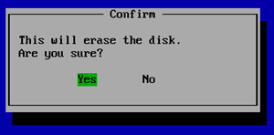
    
    Choose **Yes** and press the Enter key to accept and proceed with the installation.

1. Select an Installation Option

    After partitioning, the installer prompts you to select one of three installation options:
    
    
    
    Each install option provides a different run-time environment. Select the option that best meets your requirements.
    
    <table style="height: 170px;" border="1" cellspacing="0" cellpadding="10">
	<tbody>
	<tr>
	<td><b>Option</b></td>
	<td><b>Description</b></td>
	</tr>
	<tr>
	<td><b>Photon Minimal</b></td>
	<td>Photon Minimum is a very lightweight version of the container host runtime that is best suited for container management and hosting. There is sufficient packaging and functionality to allow most common operations around modifying existing containers, as well as being a highly performant and full-featured runtime.
</td>
	</tr>
	<tr>
	<td><b>Photon Full</b></td>
	<td>Photon Full includes several additional packages to enhance the authoring and packaging of containerized applications and/or system customization. For simply running containers, Photon Full will be overkill. Use Photon Full for developing and packaging the application that will be run as a container, as well as authoring the container, itself. For testing and validation purposes, Photon Full will include all components necessary to run containers.</td>
	</tr>
	<tr>
	<td><b>Photon OSTree Server<b></td>
	<td>This installation profile will create the server instance that will host the filesystem tree and managed definitions for rpm-ostree managed hosts created with the "Photon OSTree Host" installation profile. Most environments should need only one Photon OSTree Server instance to manage the state of the Photon OSTree Hosts. Use Photon OSTree Server when you are establishing a new repository and management node for Photon OS hosts.</td>
	</tr>
	</tbody>
	</table>
    
    **Note:** The option you choose determines the disk and memory resources required for your installation.
    
    Select the option you want and press the Enter key.

1. Select the Linux Kernel

    The installer prompts you to select the Linux kernel to install:
    
    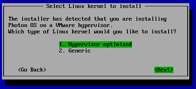
    
    - **Hypervisor optimized** means that any components that are not needed for running under a VMware hypervisor have been removed for faster boot times.
    - **Generic** means that all components are included.

1. Specify the Hostname

    The installer prompts you for a hostname and suggest a randomly generated, unique hostname that you can change if you want.
    
    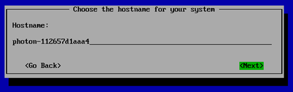
    
    Press the Enter key.

1. Specify the System root Password

    _Note: Photon OS will not permit commonly used dictionary words to be set as a root password._
    
    The installer prompts you to enter the system root password. Type the password, and then press the Enter key.
    
    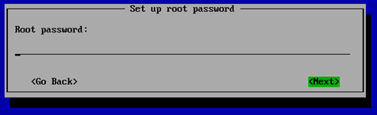
    
    Confirm the root password by typing it a second time.
    
    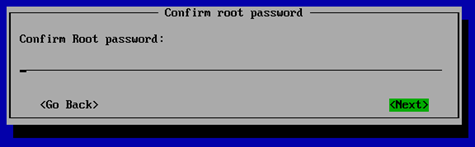
    
    Press the Enter key. The installer proceeds to install the software. Installation times will vary based on the system hardware and installation options you selected. Most installations complete in less than one minute.
    
    Once finished, the installer displays a confirmation message (which includes how long it took to install Photon OS) and prompts you to press a key on your keyboard to boot the new VM.
    
    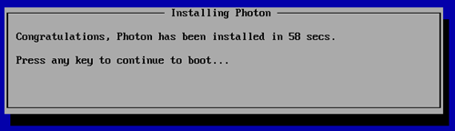

1. Reboot the VM and Log In

    Press any key on the keyboard and the virtual machine will reboot into Photon OS.
    
    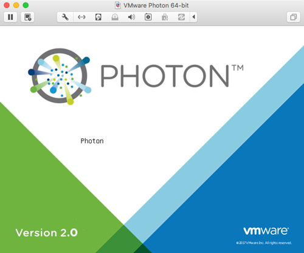
    
    As the initial boot process begins, the installer displays the Photon splash screen, and then a login prompt.
    
    At the login prompt, enter **root**  as the username and provide the password chosen during the installation.
    
    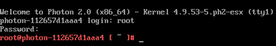
    
You can now use your container runtime environment and deploy a containerized application.
    
