# Installing the ISO Image for Photon OS 3.0

After you have downloaded the latest Photon OS ISO image into a folder of your choice, open VMware Workstation.

1. Start the Installation Process

    From the File menu, choose **New Virtual Machine**  to create a new virtual machine.
    
    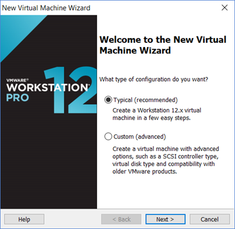
    
    Select **Typical** or **Custom**, and then choose **Next**. These instructions refer to a Typical installation.
    
    

1. Select the ISO Image

    Select **Installer disc image file (iso)**, choose **Browse** and select the Photon OS ISO file.
    
    

1. Select the Operating System

    Choose **Next**. Select the Guest operating system.
    
    For the Guest operating system, select **Linux**.
    
    Click the Version dropdown and select **VMware Photon 64-bit**  from the list.
    
    

1. Specify the VM Name and Location

    Choose **Next**. Specify a virtual machine name and location.
    
    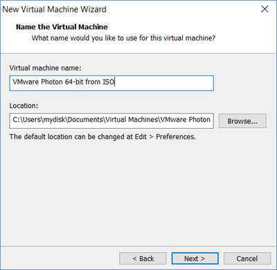

1. Specify Disk Options

    Choose **Next**. Specify the maximum disk size and whether you want to split the virtual disk into multiple files or store it as a single file.
    
    

1. Configure VM Settings

    Choose **Next**. Workstation displays a summary of your selections.
    
    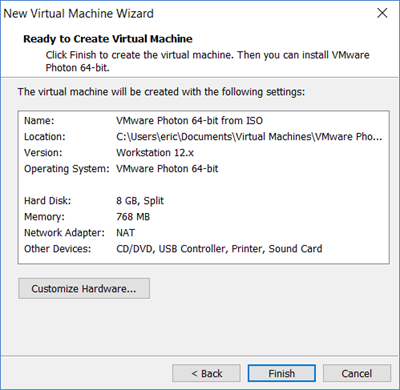
    
    **Important** : _Before_ you finish creating the Photon OS Virtual Machine, we strongly recommend that you customize the virtual machine and remove any unwanted devices that are not needed for a container run-time environment. To remove unnecessary devices, choose **Customize hardware**.
    
    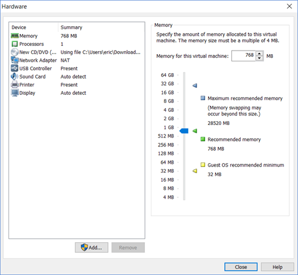
    
    Consider removing the following components, which are not used by Photon OS:
    
    - Select **Sound Card**, un-tick the **Connect at power on** option. Confirm your action and choose **Close** to return to the VM Settings by .
    - Select **USB Controller** and ensure that the **Share Bluetooth devices with the virtual machine** setting is unchecked (it should be unchecked, by default) and then choose **Close**.
    - Select **Display** and ensure that the **Accelerate 3D Graphics** option is unchecked (it should be unchecked, by default) and then choose **Close**.
    - At this stage we have now made all the necessary customizations and you are ready to select the Photon OS ISO image to boot and begin the installation process.
    - Choose  **Finish**.
    
    In Workstation, choose **Edit virtual machine settings**, select **CD/DVD (IDE)**, and verify that **Connect at power on** is selected.
    
    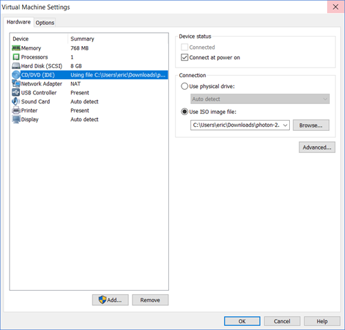

1. Configure a Secure Boot (Optional)

    **Note:**  If you want to configure a secure boot for the Photon OS VM, in Workstation, choose  **Edit virtual machine settings**, select  **Options**, choose **Advanced**, and select **Boot with EFI instead of BIOS**.
    
    
    
    The EFI boot ensures that the ISO content is signed by VMware and that the entire stack is secure.
    
    Choose **OK**.
    
    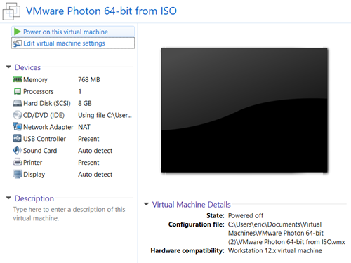

1. Power On the VM

    Choose **Power on this virtual machine**.
    
    When you see the Photon Installer boot menu, press Enter on your keyboard to start installing.
    
    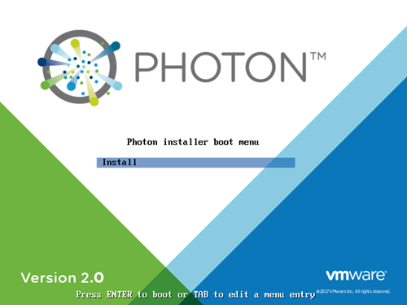
    
    Review the license agreement.
    
    
    
    Choose **Accept** and press Enter.

1. Configure the Partition

    The installer will detect one disk, which should be the 8GB volume configured as part of the virtual machine creation. Choose **Auto**  to have the installer automatically allocate the partition, or choose **Custom**  if you want to configure individual partitions, and then press the Enter key.
    
    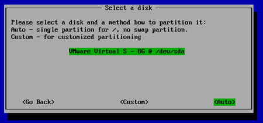
    
    **Note:**  If you choose Custom, the installer displays the following screen.
    
    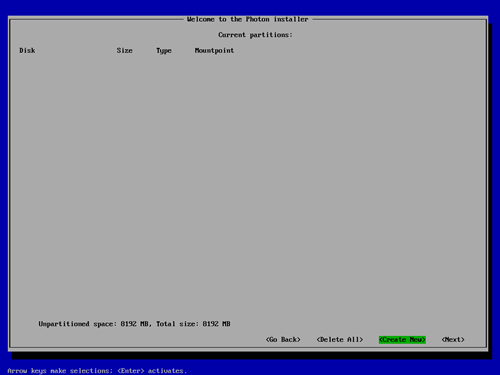
    
    For each custom partition, choose **Create New**  and specify the following information:
    
    
    
    **Size** - Preallocated size of this partition, in MB.
    
    **Type** - One of the following options:
    
    - **ext3** - ext3 file system
    - **ext4** - ext4 file system
    - **swap** - swap partition
    
    **Mountpoint** - Mount point for this partition.
    
    Choose **OK** and press the Enter key. When you are done defining custom partitions, choose **Next** and press the Enter key.
    
    The installer prompts you to confirm that you want to erase the entire disk. Choose  **Yes**  and press the Enter key.
    
    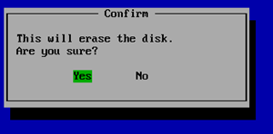

1. Select an Installation Option

    After partitioning the disk, the installer will prompt you to select an installation option.
    
    
    
    Each installation option provides a different run-time environment, depending on your requirements.
    
    <table style="height: 170px;" border="1" cellspacing="0" cellpadding="10">
	<tbody>
	<tr>
	<td><b>Option</b></td>
	<td><b>Description</b></td>
	</tr>
	<tr>
	<td><b>Photon Minimal</b></td>
	<td>Photon Minimum is a very lightweight version of the container host runtime that is best suited for container management and hosting. There is sufficient packaging and functionality to allow most common operations around modifying existing containers, as well as being a highly performant and full-featured runtime.
</td>
	</tr>
	<tr>
	<td><b>Photon Full</b></td>
	<td>Photon Full includes several additional packages to enhance the authoring and packaging of containerized applications and/or system customization. For simply running containers, Photon Full will be overkill. Use Photon Full for developing and packaging the application that will be run as a container, as well as authoring the container, itself. For testing and validation purposes, Photon Full will include all components necessary to run containers.</td>
	</tr>
	<tr>
	<td><b>Photon OSTree Server<b></td>
	<td>This installation profile will create the server instance that will host the filesystem tree and managed definitions for rpm-ostree managed hosts created with the "Photon OSTree Host" installation profile. Most environments should need only one Photon OSTree Server instance to manage the state of the Photon OSTree Hosts. Use Photon OSTree Server when you are establishing a new repository and management node for Photon OS hosts.</td>
	</tr>
	</tbody>
	</table>
    
    **Note:**  The option you choose determines the disk and memory resources required for your installation.
    
    Select the option you want and press the Enter key.

1. Select the Linux Kernel

    Select a Linux kernel to install.
    
    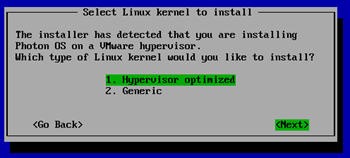
    
    - **Hypervisor optimized** means that any components that are not needed for running under a VMware hypervisor have been removed for faster boot times.
    - **Generic** means that all components are included.
    
    Choose **Next** and press the Enter key.

1. Specify the Hostname

    The installer prompts you for a hostname and suggest a randomly generated, unique hostname that you can change if you want.
    
    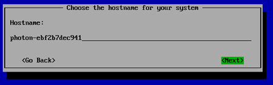
    
    Press the Enter key.

1. Specify the System root Password

    **_Note_** _: Photon OS will not permit commonly used dictionary words to be set as a root password._
    
    The installer prompts you to enter the system root password. Type the password and press the Enter key.
    
    
    
    The installer prompts you to confirm the root password by typing it a second time.
    
    
    
    Press the Enter key. The installer proceeds to install the software. Installation times will vary based on the system hardware and installation options you selected. Most installations complete in less than one minute.

1. Reboot the VM and Log In

    Once finished, the installer displays a confirmation message (which includes how long it took to install Photon OS) and prompts you to press a key on your keyboard to boot the new VM.
    
    
    
    Press any key on the keyboard and the virtual machine will reboot into Photon OS.
    
    As the initial boot process begins, the installer displays the Photon splash screen, and then a login prompt.
    
    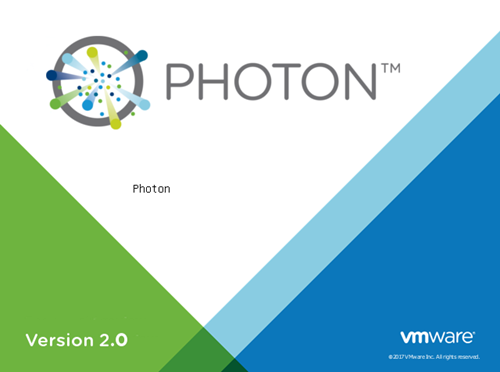
    
    At the login prompt, type **root**  as the username and provide the password chosen during the installation.
    
    

You can now use your container runtime environment and deploy a containerized application.
    
