# Installing the ISO Image for Photon OS 3.0

After you download the Photon OS ISO image into a folder of your choice, complete the following steps.

1. Upload the ISO Image
    
    Upload the ISO image to a datastore that is attached to the host on which you'll create the Photon OS virtual machine.

1. Create a new VM

    Log in to your vSphere environment. In the Virtual Machines window, choose **Create/Register VM**.
    
    On the Select creation type screen, select **Create a new virtual machine**.
    
    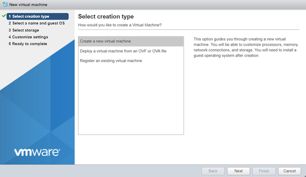
    
    Choose **Next**.

1. Configure VM Settings

    Specify a VM name.
    
    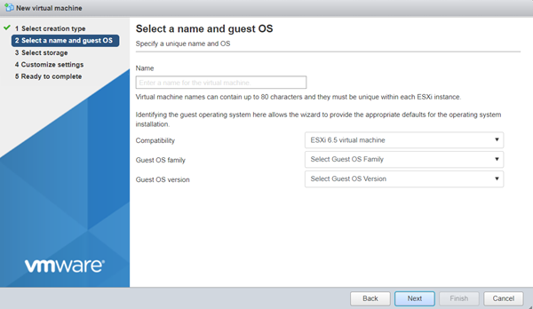
    
    Specify a guest operating system.
    
    - For Compatibility, select **ESXi 6.5**.
    - For Guest OS family, select **Linux**.
    - For Guest OS version, select **VMware Photon OS (64-bit)**.
    
    
    
    Choose  **Next**.

1. Select the Target Datastore

    Select the datastore where you want to store the VM.
    
    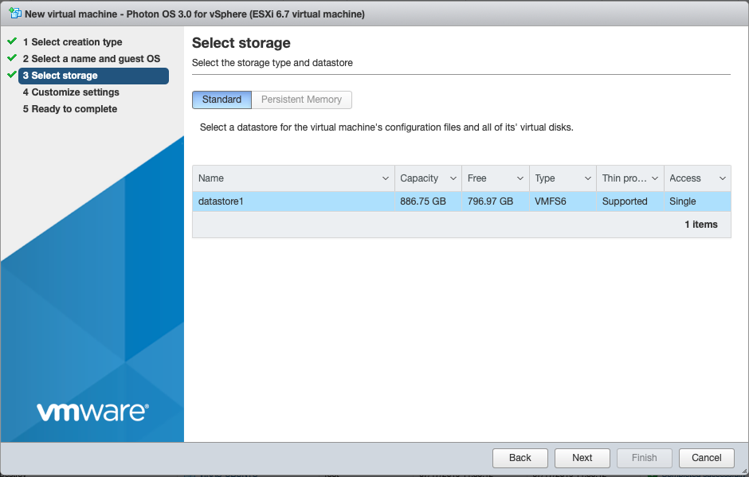
    
    Click **Next**.

1. Customize VM Settings

    Customize the virtual machine settings.
    
    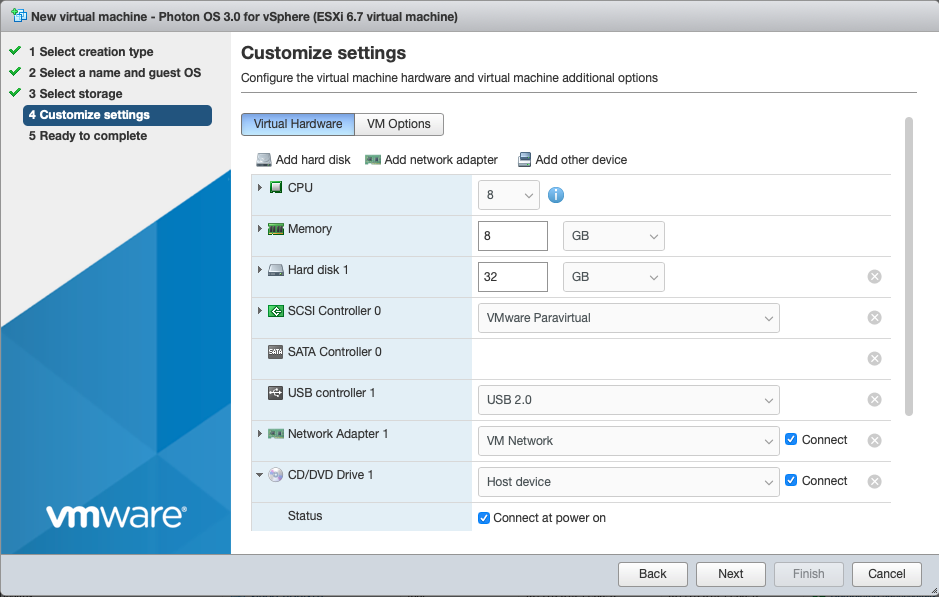
    
    For CD/DVD Drive 1, click the drop-down and select **Datastore ISO file**.
    
    In the Datastore browser, select the ISO that you want to import.
    
    Change other settings as applicable.
    
    - The recommended virtual hardware settings for your Photon VM are heavily dependent upon the container load you intend to run within Photon OS – more containers or more intensive containers will require you to adjust these settings for your application load. VMware suggests 2 vCPU, 1024MB memory, 20GB hard disk. Any unwanted devices should be removed. Be sure to mount the Photon OS ISO on the CD/DVD Drive and put a check in the box next to, Connect At Power On.
    - If you want to configure a secure boot for the Photon OS VM you created, choose the VM Options tab, expand Boot Options, and select EFI from the firmware drop-down.  An EFI boot ensures that the ISO content is signed by VMware and that the entire stack is secure.
    
    Choose **Next**.

1. Verify VM Settings

    The installer displays a summary of your selected settings.
    
    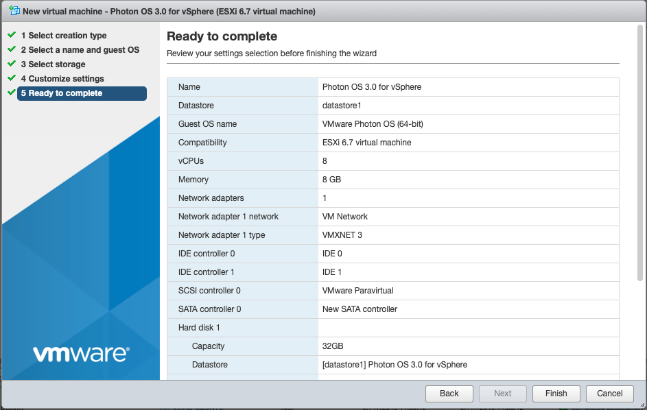
    
    Click **Finish**. vSphere creates the VM.

1. Power on the VM

    Select the VM and power it on.

    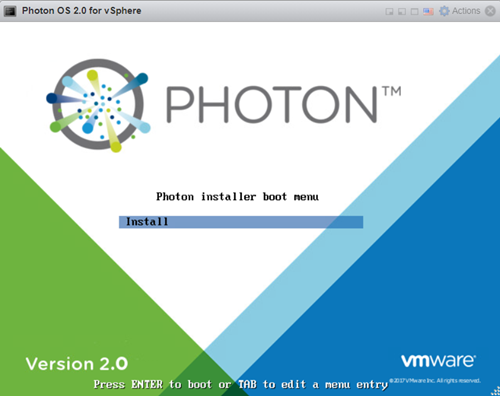
    
    When you see the Photon Installer boot menu, press Enter on your keyboard to start installing.

1. Accept the License Agreement

    Read the License Agreement and press the Enter key to accept.
    
    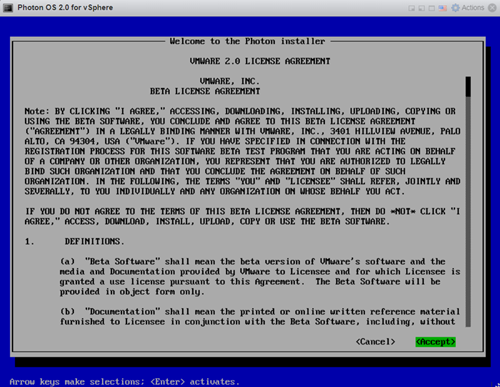

1. Configure the Partition

    The installer detects one disk, which should be the 16GB volume configured as part of the virtual machine creation. Choose **Auto**  to have the installer automatically allocate the partition, or choose **Custom**  if you want to configure individual partitions, and then press the Enter key.
    
    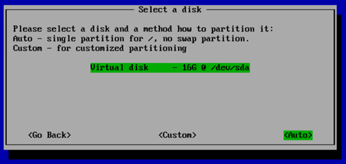
    
    **Note:**  If you choose Custom, the installer displays the following screen.
    
    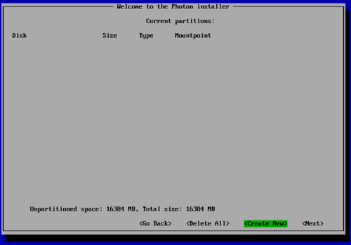
    
    For each custom partition, choose **Create New**  and specify the following information:
    
    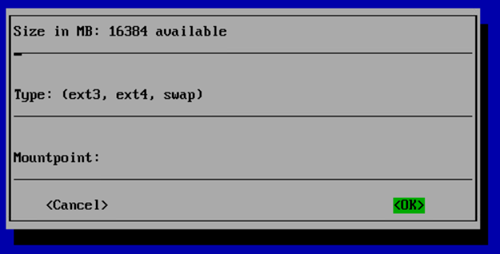
    
    **Size** - Preallocated size of this partition, in MB.
    
    **Type** - One of the following options:
    
    - **ext3** - ext3 file system
    - **ext4** - ext4 file system
    - **swap** - swap partition
    
    **Mountpoint** - Mount point for this partition.
    
    Choose **OK** and press the Enter key. When you are done defining custom partitions, choose **Next** and press the Enter key.
    
    The installer prompts you to confirm that you want to erase the entire disk.
    
    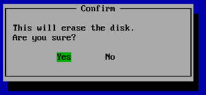
    
    Choose **Yes** and press the Enter key.

1. Select an Installation Option
    
    After partitioning the disk, the installer prompts you to select an installation option.
    
    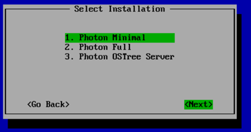
    
    Each install option provides a different run-time environment, depending on your requirements.
    
	  <table style="height: 170px;" border="1" cellspacing="0" cellpadding="10">
		<tbody>
		<tr>
		<td><b>Option</b></td>
		<td><b>Description</b></td>
		</tr>
		<tr>
		<td><b>Photon Minimal</b></td>
		<td>Photon Minimum is a very lightweight version of the container host runtime that is best suited for container management and hosting. There is sufficient packaging and functionality to allow most common operations around modifying existing containers, as well as being a highly performant and full-featured runtime.
</td>
		</tr>
		<tr>
		<td><b>Photon Full</b></td>
		<td>Photon Full includes several additional packages to enhance the authoring and packaging of containerized applications and/or system customization. For simply running containers, Photon Full will be overkill. Use Photon Full for developing and packaging the application that will be run as a container, as well as authoring the container, itself. For testing and validation purposes, Photon Full will include all components necessary to run containers.</td>
		</tr>
		<tr>
		<td><b>Photon OSTree Server<b></td>
		<td>This installation profile will create the server instance that will host the filesystem tree and managed definitions for rpm-ostree managed hosts created with the "Photon OSTree Host" installation profile. Most environments should need only one Photon OSTree Server instance to manage the state of the Photon OSTree Hosts. Use Photon OSTree Server when you are establishing a new repository and management node for Photon OS hosts.</td>
		</tr>
		</tbody>
		</table>
    
    **Note:**  The option you choose determines the disk and memory resources required for your installation.
    
    Select the option you want and press the Enter key.

1. Select the Linux Kernel

    Select a Linux kernel to install.
    
    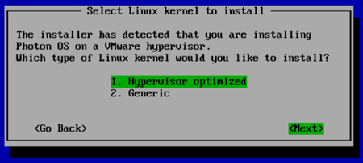
    
    - **Hypervisor**  optimized means that any components that are not needed for running under a VMware hypervisor have been removed for faster boot times.
    - **Generic**  means that all components are included.
    
    Choose **Next** and press the Enter key.

1. Specify the Hostname

    The installer prompts you for a hostname and suggest a randomly generated, unique hostname that you can change if you want.
    
    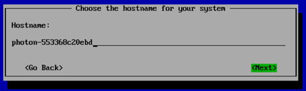
    
    Press the Enter key.

1. Specify the System root Password

    The installer prompts you to enter the system root password.
    
    _Note: Photon OS will not permit commonly used dictionary words to be set as a root password._
    
    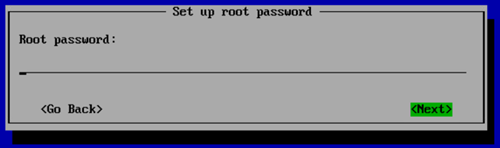
    
    Type a password and press the Enter key.
    
    The installer prompts you to confirm your root password by typing it a second time.
    
    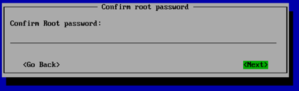
    
    **Note:** If you have trouble with unintentional repeated characters in the Remote Console, follow VMware KB 196 ( [http://kb.vmware.com/kb/196](http://kb.vmware.com/kb/196)) for a setting to apply to the virtual machine.
    
    Press the `Enter` key. The installer proceeds to install the software. Installation times will vary based on the system hardware and installation options you selected. Most installations complete in less than one minute.

1. Reboot the VM and Log In

    Once finished, the installer displays a confirmation message (which includes how long it took to install Photon OS) and prompts you to press a key on your keyboard to boot the new VM.
    
    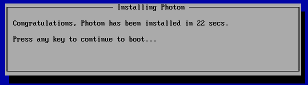
    
    As the initial boot process begins, the installer displays the Photon splash screen, and then a login prompt.
    
    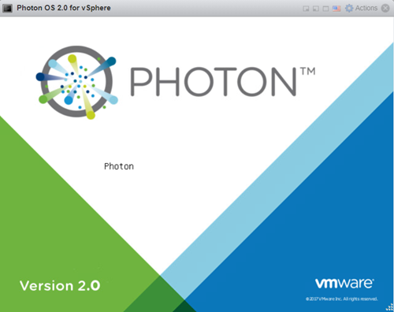
    
    At the login prompt, type **root**  as the username and provide the password chosen during the installation.
    
    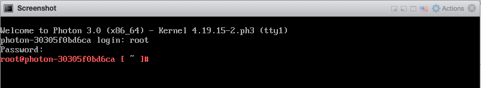
    
You can now use your container runtime environment and deploy a containerized application.