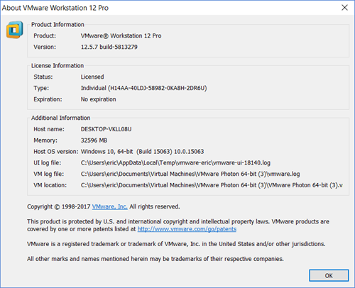

# Prerequisites for Running Photon OS on Workstation

Before you use Photon OS within Workstation, perform the following prerequisite tasks:

1. Verify that you have the following resources:

	<table style="height: 170px;" border="1" width="157" cellspacing="0" cellpadding="10">
	<tbody>
	<tr>
	<td><b>Resource</b></td>
	<td><b>Description</b></td>
	</tr>
	<tr>
	<td> VMware Workstation</td>
	<td>VMware Workstation must be installed (Workstation 10 or higher). The latest version is recommended.
</td>
	</tr>
	<tr>
	<td>Memory</td>
	<td> 2GB of free RAM (recommended) </td>
	</tr>
	<tr>
	<td>Storage</td>
	<td><b>Minimal Photon install</b>: 512MB of free space (minimum); <b>Full Photon install</b>: 4GB of free space (minimum); 8GB is recommended.</td>
	</tr>
	<tr>
	<td>Distribution File</td>
	<td>Photon OS ISO or OVA file downloaded from bintray (<a href="https://bintray.com/vmware/photon/">https://bintray.com/vmware/photon/</a>).</td>
	</tr>
	</tbody>
	</table>

	Resource requirements and recommendations vary depending on several factors, including the host environment (for example, VMware Workstation and VMware vSphere), the distribution file used (ISO or OVA), and the selected installation settings (for example, full or basic installation).

	**Note:**  The setup instructions in this guide use VMware Workstation Professional version 12.5.7.

	

1. Decide whether to use the OVA or ISO distribution to set up Photon OS.

    - **OVA import** : Because of the nature of an OVA, you're getting a pre-installed version of Photon OS. You can choose the hardware version you want (OVA with hardware version 13 or 11). The OVA benefits from a simple import process and some kernel tuning for VMware environments. However, because it's a pre-installed version, the set of packages that are installed are predetermined. Any additional packages that you need can be installed using tdnf.
    - **ISO install** : The ISO, on the other hand, allows for a more complete installation or automated installation via kickstart.

    To get Photon OS up and running quickly, use the OVA.
    
1. Download Photon OS. Go to the following Bintray URL and download the latest release of Photon OS:

    [https://bintray.com/vmware/photon/](https://bintray.com/vmware/photon/)
    
    For instructions, see [Downloading Photon OS](Downloading-Photon-OS.md).
