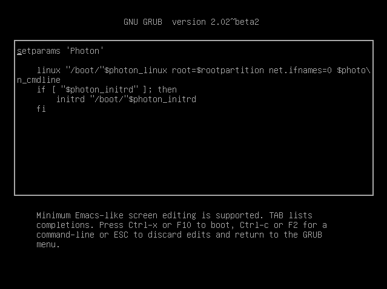

# Boot Process Overview

When a Photon OS machine boots, the BIOS initializes the hardware and uses a boot loader to start the kernel. After the kernel starts, `systemd` takes over and boots the rest of the operating system. 

The BIOS checks the memory and initializes the keyboard, the screen, and other peripherals. When the BIOS finds the first hard disk, the boot loader--GNU GRUB 2.02--takes over. From the hard disk, GNU GRUB loads the master boot record (MBR) and initializes the root partition of the random-access memory by using initrd. The device manager, udev, provides initrd with the drivers it needs to access the device containing the root file system. Here's what the GNU GRUB edit menu looks like in Photon OS with its default commands to load the boot record and initialize the RAM disk: 

  

At this point, the Linux kernel in Photon OS, which is kernel version 4.4.8, takes control. Systemd kicks in, initializes services in parallel, mounts the rest of the file system, and checks the file system for errors. 
