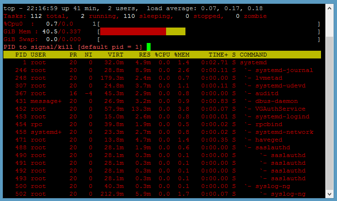

# Common Tools 

The following are some tools that you can use to troubleshoot:

-   [top](#top)
-   [ps](#ps)
-   [netstat](#netstat)
-   [find](#find)
-   [locate](#locate)
-   [df](#df)
-   [md5sum](#md5sum)
-   [sha256sum](#sha256sum)
-   [strace](#strace)
-   [file](#file)
-   [stat](#stat)
-   [watch](#watch)
-   [vmstat and fdisk](#vmstat-and-fdisk)
-   [lsof](#lsof)
-   [fuser](#fuser)
-   [ldd](#ldd)
-   [gdb](#gdb)

**Note**: Some of the examples in this section are marked as abridged with ellipsis (`...`).

## top

The `top` tool monitors system resources, workloads, and performance. It can unmask problems caused by processes or applications overconsuming CPUs, time, or RAM. 

To view a textual display of resource consumption, run the `top` command: 

	top

Use can use 'top' to kill a runaway or stalled process by typing `k` followed by its process ID (PID). 

If the percent of CPU utilization is consistently high with little idle time, there might be a runaway process overconsuming CPUs. Restarting the service might solve the problem. 

To troubleshoot an unknown issue, run Top in the background in batch mode to write its output to a file and collect data about performance:

	top d 120 b >> top120second.output

For a list of options that filter top output and other information, see the man page for `top`.

## ps

The `ps` tool shows the processes running on the machine. The `ps` tool derives flexibility and power from its options, all of which are covered in the tool's Photon OS man page:

	man ps

You can use the following options of `ps` for troubleshooting: 

- Show processes by user:
    
    `ps aux`

- Show processes and child processes by user:
    
    `ps auxf`
    
- Show processes containing the string `ssh`:
    `ps aux | grep ssh`
    
- Show processes and the command and options with which they were started:
    `ps auxww`

Example abridged output: 

	ps auxww
	USER        PID %CPU %MEM    VSZ   RSS TTY      STAT START   TIME COMMAND
	root          1  0.0  0.9  32724  3300 ?        Ss   07:51   0:32 /lib/systemd/systemd --switched-root --system --deserialize 22

## netstat

The `netstat` command can identify bottlenecks causing  performance issues. It lists network connections, listening sockets, port information, and interface statistics for different protocols. Examples: 

	netstat --statistics
	netstat --listening

## find

Use the `find` command to troubleshoot a Photon OS machine that has stopped working. The following command lists the files in the root directory that have changed in the past day: 

		find / -mtime -1 

See the `find` [manual](See https://www.gnu.org/software/findutils/manual/find.html). Take note of the security considerations listed in the `find` manual if you are using `find` to troubleshoot an appliance running on Photon OS. 

## locate

The `locate` command is a fast way to find files and directories you onlay have a keyword. This command is similar to `find` and part of the same `findutils` package preinstalled on the full version of Photon OS by default. It finds file names in the file names database. 

Before you can use `locate` accurately, update its database: 

	updatedb

Then run `locate` to quickly find a file, such as any file name containing `.network`, which can be helpful to see all the system's `.network` configuration files. The following is an abridged example: 

	locate .network
	/etc/dbus-1/system.d/org.freedesktop.network1.conf
	/etc/systemd/network/10-dhcp-en.network
	/usr/lib/systemd/network/80-container-host0.network
	/usr/lib/systemd/network/80-container-ve.network
	/usr/lib/systemd/system/busnames.target.wants/org.freedesktop.network1.busname
	/usr/lib/systemd/system/dbus-org.freedesktop.network1.service
	/usr/lib/systemd/system/org.freedesktop.network1.busnname
	/usr/share/dbus-1/system-services/org.freedesktop.network1.service

The `locate` command is also a quick way to see whether a troubleshooting tool is installed on Photon OS. Examples: 

	locate strace
	/usr/bin/strace
	/usr/bin/strace-graph
	/usr/bin/strace-log-merge
	/usr/share/man/man1/strace.1.gz
	/usr/share/vim/vim74/syntax/strace.vim

	locate traceroute

In this example, the `strace` tool is installed but `traceroute` is not. 

You can install `traceroute` from the Photon OS repository: 

	tdnf install traceroute

## df

The `df` command reports the disk space available on the file system. Running out of disk space can lead an application to fail and a quick check of the available space makes sense as an early troubleshooting step: 

	df -h

The `-h` option prints out the available and used space in human-readable sizes. After checking the space, you should also check the number of available inodes. Too few available inodes can lead to difficult-to-diagnose problems:

	df -i

## md5sum 

The `md5sum` tool calculates 128-bit RSA Data Security, Inc. MD5 Message Digest Algorithm hashes (a message digest, or digital signature, of a file) to uniquely identify a file and verify its integrity after file transfers, downloads, or disk errors when the security of the file is not in question. 

`md5sum` can help troubleshooting installation issues by verifying that the version of Photon OS being installed matches the version on the Bintray download page. If, for instance, bytes were dropped during the download, the checksums will not match. Try downloading it again.

## sha256sum

The `sha256sum` tool calculates the authenticity of a file to prevent tampering when security is a concern. Photon OS also includes `shasum`, `sha1sum`, `sha384sum`, and `sha512sum`. See the man pages for  `md3sum`, `sha256sum`, and the other SHA utilities. 

## strace

The `strace` utility follows system calls and signals as they are executed so that you can see what an application, command, or process is doing. `strace` can trace failed commands, identify where a process obtains its configuration, monitor file activity, and find the location of a crash. 

By tracing system calls, `strace` can help troubleshoot a broad range of problems, including issues with input-output, memory, interprocess communication, network usage, and application performance. 

For troubleshooting a problem that gives off few or no clues, the following command displays every system call: 

	strace ls -al

With strace commands, you can route the output to a file to make it easier to analyze: 

	strace -o output.txt ls -al

`strace` can reveal the files that an application tries to open with the `-eopen` option. This combination can help troubleshoot an application that is failing because it is missing files or being denied access to a file it needs. If, for example, you see "No such file or directory" in the results of `strace -eopen`, something might be wrong: 

	strace -eopen sshd
	open("/usr/lib/x86_64/libpam.so.0", O_RDONLY|O_CLOEXEC) = -1 ENOENT (No such file or directory)
	open("/usr/lib/libpam.so.0", O_RDONLY|O_CLOEXEC) = 3

The results above indicate that the first file is missing because it is found in the next line. In other cases, the application might be unable to open one of its configuration files or it might be reading the wrong one. If the results say "permission denied" for one of the files, check the permissions of the file with `ls -l` or `stat`.   

When troubleshooting with `strace`, you can include the process ID in its commands. Here's an example of how to find a process ID: 

	ps -ef | grep apache

You can then use `strace` to examine the file a process is working with: 

	strace -e trace=file -p 1719

A similar command can trace network traffic: 

	strace -p 812 -e trace=network

If an application is crashing, use `strace` to trace the application and then analyze what happens right before the application crashes.

You can also trace the child processes that an application spawns with the fork system call, and you can do so with `systemctl` commands that start a process to identify why an application crashes immediately or fails to start: 

	strace -f -o output.txt systemctl start httpd

Example: If `journalctl` is showing that networkd is failing, you can run strace to troubleshoot: 

	strace -o output.txt systemctl restart systemd-networkd

Then `grep` inside the results for something, such as _exit_ or _error_: 

	grep exit output.txt

If the results indicate `systemd-resolved` is going wrong, you can then strace it: 

	strace -f -o output.txt systemctl restart systemd-resolved

## file

The `file` command determines the file type, which can help troubleshoot problems when an application mistakes one type of file for another, leading it to errors. Example: 

	file /usr/sbin/sshd
	/usr/sbin/sshd: ELF 64-bit LSB shared object, x86-64, version 1 (SYSV), dynamically linked, interpreter /lib64/ld-linux-x86-64.so.2, for GNU/Linux 2.6.32, stripped

## stat

The `stat` command can help troubleshoot problems with files or the file system by showing the last date it was modified and other information. Example:  

	stat /dev/sda1
	File: '/dev/sda1'
	Size: 0               Blocks: 0          IO Block: 4096   block special file
	Device: 6h/6d   Inode: 6614        Links: 1     Device type: 8,1
	Access: (0660/brw-rw----)  Uid: (    0/    root)   Gid: (    8/    disk)
	Access: 2016-09-02 12:23:56.135999936 +0000
	Modify: 2016-09-02 12:23:52.879999981 +0000
	Change: 2016-09-02 12:23:52.879999981 +0000
	Birth: -

On Photon OS, `stat` is handy to show permissions for a file or directory in both their absolute octal notation and their read-write-execute abbreviation; truncated example: 

	chmod 777 tester.md
	stat tester.md
	  File: 'tester.md'
	  Size: 0               Blocks: 0          IO Block: 4096   regular empty file
	Device: 801h/2049d      Inode: 316385      Links: 1
	Access: (0777/-rwxrwxrwx)  Uid: (    0/    root)   Gid: (    0/    root)

## watch

The `watch` utility runs a command at regular intervals so you can observe how its output changes over time. `watch` can help dynamically monitor network links, routes, and other information when you are troubleshooting networking or performance issues. Examples: 

	watch -n0 --differences ss
	watch -n1 --differences ip route
	
The following is an example with a screenshot of the output. This command monitors the traffic on your network links. The highlighted numbers are updated every second so you can see the traffic fluctuating: 

	watch -n1 --differences ip -s link show up

  

## vmstat and fdisk

The `vmstat` tool displays statistics about virtual memory, processes, block input-output, disks, and CPU activity. This tool can help diagnose performance problems, especially system bottlenecks.  

Its output on a Photon OS virtual machine running in VMware Workstation 12 Pro without a heavy load looks like this: 

	vmstat
	procs -----------memory---------- ---swap-- -----io---- -system-- ------cpu-----
	 r  b   swpd   free   buff  cache   si   so    bi    bo   in   cs us sy id wa st
	 0  0      0   5980  72084 172488    0    0    27    44  106  294  1  0 98  1  0

These codes are explained in the `vmstat` man page. 

    - If `r`, the number of runnable processes, is higher than 10, the machine is under stress; consider intervening to reduce the number of processes or to distribute some of the processes to other machines. In other words, the machine has a bottleneck in executing processes.
    - If `cs`, the number of context switches per second, is really high, there may be too many jobs running on the machine.
    - If `in`, the number of interrupts per second, is relatively high, there might be a bottleneck for network or disk IO.

You can investigate disk IO further by using vmstat's `-d` option to report disk statistics. The following is an abridged example on a machine with little load: 

	vmstat -d
	disk- ------------reads------------ ------------writes----------- -----IO------
	       total merged sectors      ms  total merged sectors      ms    cur    sec
	ram0       0      0       0       0      0      0       0       0      0      0
	ram1       0      0       0       0      0      0       0       0      0      0
	loop0      0      0       0       0      0      0       0       0      0      0
	loop1      0      0       0       0      0      0       0       0      0      0
	sr0        0      0       0       0      0      0       0       0      0      0
	sda    22744    676  470604   12908  72888  24949  805224  127692      0    130

The `-D` option summarizes disk statistics:

	vmstat -D
	           26 disks
	            2 partitions
	        22744 total reads
	          676 merged reads
	       470604 read sectors
	        12908 milli reading
	        73040 writes
	        25001 merged writes
	       806872 written sectors
	       127808 milli writing
	            0 inprogress IO
	          130 milli spent IO

You can also get statistics about a partition. First, run the `fdisk -l` command to list the machine's devices. Then run `vmstat -p` with the name of a device to view its stats: 

	fdisk -l
	Disk /dev/ram0: 4 MiB, 4194304 bytes, 8192 sectors
	Units: sectors of 1 * 512 = 512 bytes
	Sector size (logical/physical): 512 bytes / 4096 bytes
	I/O size (minimum/optimal): 4096 bytes / 4096 bytes
	...
	Device        Start      End  Sectors Size Type
	/dev/sda1      2048 16771071 16769024   8G Linux filesystem
	/dev/sda2  16771072 16777182     6111   3M BIOS boot

	vmstat -p /dev/sda1
	sda1          reads   read sectors  writes    requested writes
	               22579     473306      78510     866088

See the `vmstat` man page for more options. 

## lsof

The `lsof` command lists open files. The tool's definition of an open file  includes directories, libraries, streams, domain sockets, and Internet sockets. THis enables it to identify the files a process is using. Because a Linux system like Photon OS uses files to do its work, you can run `lsof` as root to see how the system is using them and to see how an application works. 

If you cannot unmount a disk because it is in use, you can run `lsof` to identify the files on the disk that are being used. 

The following is an example that shows the processes that are using the root directory: 

	lsof /root
	COMMAND    PID USER   FD   TYPE DEVICE SIZE/OFF   NODE NAME
	bash       879 root  cwd    DIR    8,1     4096 262159 /root
	bash      1265 root  cwd    DIR    8,1     4096 262159 /root
	sftp-serv 1326 root  cwd    DIR    8,1     4096 262159 /root
	gdb       1351 root  cwd    DIR    8,1     4096 262159 /root
	bash      1395 root  cwd    DIR    8,1     4096 262159 /root
	lsof      1730 root  cwd    DIR    8,1     4096 262159 /root

You can do the same with an application or virtual appliance by running `lsof` with the user name or process ID of the app. The following example lists the open files used by the Apache HTTP Server:  

	lsof -u apache

Running the command with the `-i` option lists all the open network and Internet files, which can help troubleshoot network problems: 

	lsof -i

See the Unix socket addresses of a user like _zookeeper_: 

	lsof -u zookeeper -U

The following example shows the processes running on Ports 1 through 80:

	lsof -i TCP:1-80
	COMMAND  PID   USER   FD   TYPE DEVICE SIZE/OFF NODE NAME
	httpd    403   root    3u  IPv6  10733      0t0  TCP *:http (LISTEN)
	httpd    407 apache    3u  IPv6  10733      0t0  TCP *:http (LISTEN)
	httpd    408 apache    3u  IPv6  10733      0t0  TCP *:http (LISTEN)
	httpd    409 apache    3u  IPv6  10733      0t0  TCP *:http (LISTEN)
	sshd     820   root    3u  IPv4  11336      0t0  TCP *:ssh (LISTEN)
	sshd     820   root    4u  IPv6  11343      0t0  TCP *:ssh (LISTEN)
	sshd    1258   root    3u  IPv4  48040      0t0  TCP 198.51.100.143:ssh->198.51.100.1:49759 (ESTABLISHED)
	sshd    1319   root    3u  IPv4  50866      0t0  TCP 198.51.100.143:ssh->198.51.100.1:51054 (ESTABLISHED)
	sshd    1388   root    3u  IPv4  56438      0t0  TCP 198.51.100.143:ssh->198.51.100.1:60335 (ESTABLISHED)

You can also inspect the files opened by a process ID. The following example queries the files open by the systemd network service: 

	lsof -p 1917
	COMMAND    PID            USER   FD      TYPE             DEVICE SIZE/OFF   NODE NAME
	systemd-n 1917 systemd-network  cwd       DIR                8,1     4096      2 /
	systemd-n 1917 systemd-network  txt       REG                8,1   887896 272389 /usr/lib/systemd/systemd-networkd
	systemd-n 1917 systemd-network  mem       REG                8,1   270680 262267 /usr/lib/libnss_files-2.22.so
	systemd-n 1917 systemd-network    0r      CHR                1,3      0t0   5959 /dev/null
	systemd-n 1917 systemd-network    1u     unix 0x0000000000000000      0t0  45734 type=STREAM
	systemd-n 1917 systemd-network    3u  netlink                         0t0   6867 ROUTE
	systemd-n 1917 systemd-network    4u     unix 0x0000000000000000      0t0  45744 type=DGRAM
	systemd-n 1917 systemd-network    9u  netlink                         0t0  45754 KOBJECT_UEVENT
	systemd-n 1917 systemd-network   12u  a_inode               0,11        0   5955 [timerfd]
	systemd-n 1917 systemd-network   13u     IPv4             104292      0t0    UDP 198.51.100.143:bootpc

## fuser

The `fuser` command identifies the process IDs of processes using files or sockets. The term _process_ is, in this case, synonymous with _user_. To identify the process ID of a process using a socket, run `fuser` with its namespace option and specify `tcp` or `udp` and the name of the process or port. Examples: 

	fuser -n tcp ssh
	ssh/tcp:               940  1308
	fuser -n tcp http
	http/tcp:              592   594   595   596
	fuser -n tcp 80
	80/tcp:                592   594   595   596

## ldd

By revealing the shared libraries that a program depends on, `ldd` can help troubleshoot an application that is missing a library or finding the wrong one.

For example, if you get a "file not found" output, check the path to the library.  

	ldd /usr/sbin/sshd
    linux-vdso.so.1 (0x00007ffc0e3e3000)
    libpam.so.0 => (file not found)
    libcrypto.so.1.0.0 => /usr/lib/libcrypto.so.1.0.0 (0x00007f624e570000)

You can also use the `objdump` command to show dependencies for a program's object files; example:

	objdump -p /usr/sbin/sshd | grep NEEDED

## gdb

The `gdb` tool is the GNU debugger. It lets you see inside a program while it executes or when it crashes so that you can catch errors as they occur. The `gdb` tool is typically used to debug programs written in C and C++. On Photon OS, `gdb` can help you determine why an application crashed. See the man page for `gdb` for instructions on how to run it. 

For an extensive example on how to use `gdb` to troubleshoot Photon OS running on a VM when you cannot login to Photon OS, see the section on troubleshooting boot and logon problems. 

