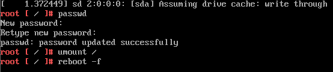

# Resetting a Lost Root Password

Perform the following steps to rest a lost password:

1. Restart the Photon OS machine or the virtual machine running Photon OS. 
    
    When the Photon OS splash screen appears as it restarts, type the letter `e` to go to the GNU GRUB edit menu quickly. Because Photon OS reboots so quickly, you won't have much time to type `e`. Remember that in vSphere and Workstation, you might have to give the console focus by clicking in its window before it will register input from the keyboard.

Second, in the GNU GRUB edit menu, go to the end of the line that starts with `linux`, add a space, and then add the following code exactly as it appears below:

	rw init=/bin/bash

After you add this code, the GNU GRUB edit menu should look exactly like this:

 

Now type `F10`.

At the command prompt, type `passwd` and then type (and re-enter) a new root password that conforms to the password complexity rules of Photon OS. Remember the password. 

Next, type the following command:

	umount /

Finally, type the following command. You must include the `-f` option to force a reboot; otherwise, the kernel enters a state of panic.

	reboot -f

This sequence of commands should look like this:

After the Photon OS machine reboots, log in with the new root password. 
